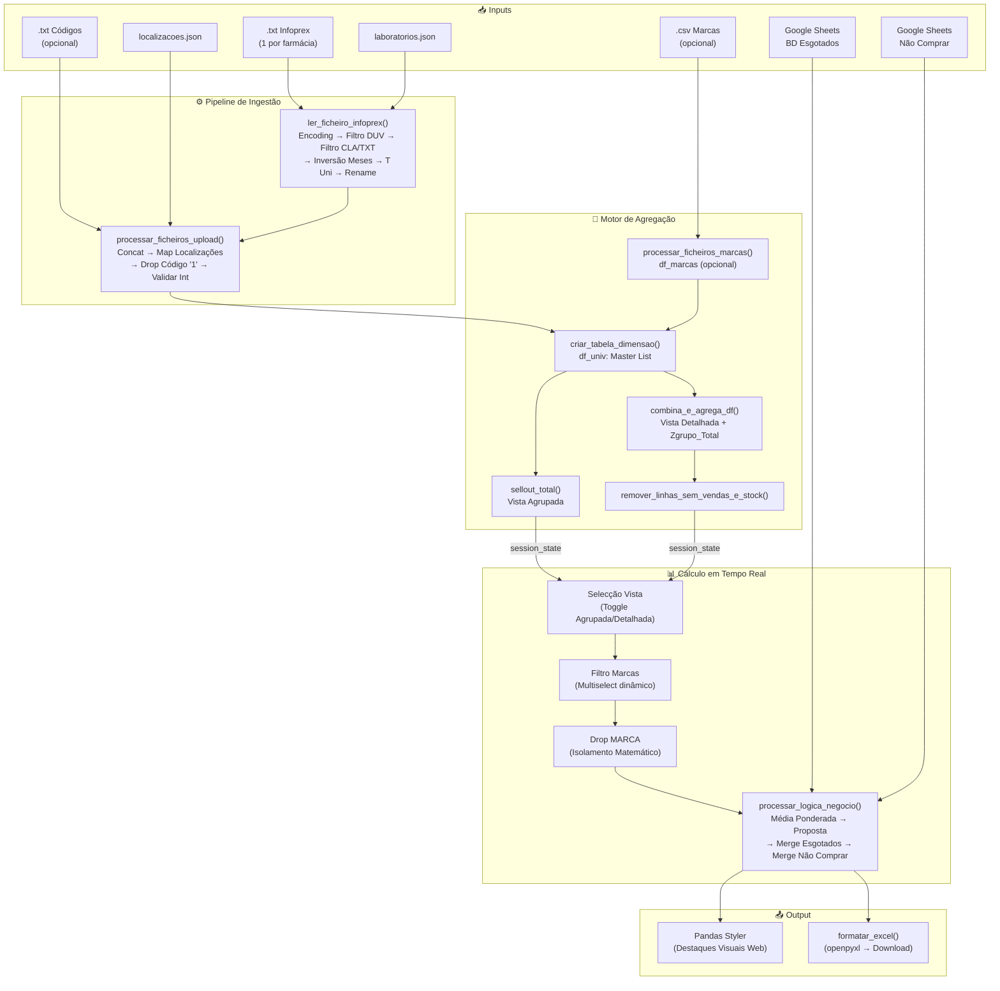

# PRD — Orders Master Infoprex (Reverse Engineering)

> **Versão:** 1.0 | **Data:** 2026-05-03 | **Método:** Engenharia Reversa de Código-Fonte  
> **Ficheiros Analisados:** `GEMINI.md`, `app.py`, `processar_infoprex.py`, `laboratorios.json`, `localizacoes.json`

---

## 1. Resumo Executivo

O **Orders Master Infoprex** é uma ferramenta interactiva de análise de dados, construída em Python com Streamlit, desenhada para a gestão de encomendas de inventário farmacêutico em redes de farmácias. O sistema agrega ficheiros de vendas (sell-out) exportados do **Sifarma** (sistema de gestão farmacêutico português, via o **Novo Módulo Infoprex**), consolida dados de múltiplas farmácias numa única vista, enriquece-os com informação externa de rupturas de stock (Infarmed) e listas de produtos a não comprar (Google Sheets), e gera propostas de encomenda inteligentes baseadas em média ponderada de vendas históricas.

O produto resolve uma necessidade operacional concreta: permitir que um gestor de rede farmacêutica visualize rapidamente o desempenho de vendas por produto/farmácia, identifique necessidades de reposição, e exporte um relatório Excel formatado e pronto para acção — tudo sem necessidade de conhecimentos técnicos.

---

## 2. Objectivos do Produto

1. **Consolidação Multi-Farmácia** — Agregar dados de sell-out de N farmácias num único ecrã, eliminando a necessidade de análise manual ficheiro a ficheiro.
2. **Previsão de Encomendas** — Gerar propostas de quantidade a encomendar com base em média ponderada de vendas dos últimos 4 meses, ajustável pelo utilizador.
3. **Consciência de Rupturas** — Integrar dados oficiais de rupturas (Infarmed) para ajustar automaticamente as propostas de encomenda quando um produto está em falta no mercado.
4. **Filtragem Inteligente** — Permitir foco cirúrgico por laboratório, por lista de códigos, ou por marca comercial.
5. **Sinalização Visual** — Destacar visualmente produtos em rutura, produtos a não comprar, e produtos com validade próxima, tanto no ecrã como no Excel exportado.
6. **Exportação Operacional** — Gerar ficheiros Excel formatados e prontos para utilização directa na operação de compras.

---

## 3. Âmbito e Exclusões

### Dentro do Âmbito
- Módulo de **Sell Out / Encomendas** (tab `📊 Encomendas (Sell Out)` no `app.py`).
- Pipeline de ingestão de ficheiros `.txt` do Infoprex.
- Toda a lógica de agregação, cálculo de propostas, formatação visual e exportação Excel.
- Ficheiros de configuração (`laboratorios.json`, `localizacoes.json`, `.env`).
- Integrações externas (BD Esgotados, Lista Não Comprar).

### Fora do Âmbito
- A componente de **Redistribuição Inteligente de Stocks** (`stockreorder.py`, `motor_redistribuicao.py`, `redistribuicao_v2.py` e o separador `🔄 Redistribuição Inteligente` no `app.py`) está **excluída** desta análise e não será mencionada novamente neste documento.

---

## 4. Arquitectura do Sistema

### 4.1 Diagrama de Fluxo de Dados (Mermaid)



### 4.2 Componentes e Ficheiros

| Ficheiro | Responsabilidade | Linhas |
|---|---|---|
| `app.py` | Aplicação principal: UI, agregação, cálculos, formatação, exportação | ~1050 |
| `processar_infoprex.py` | Módulo de ingestão e pré-processamento de ficheiros `.txt` | ~173 |
| `laboratorios.json` | Mapeamento laboratório → códigos CLA | ~37 |
| `localizacoes.json` | Mapeamento alias → nome curto de farmácia | ~6 |
| `.env` | Variáveis de ambiente (URLs confidenciais) | — |
| `requirements.txt` | Dependências Python | ~41 |

### 4.3 Dependências Externas e Integrações

| Dependência | Versão | Finalidade |
|---|---|---|
| `streamlit` | 1.56.0 | Framework de UI |
| `pandas` | 3.0.2 | Manipulação de dados |
| `openpyxl` | 3.1.5 | Leitura/escrita de Excel com formatação |
| `pyarrow` | 23.0.1 | Backend de DataFrame (compatibilidade colunas duplicadas) |
| `python-dotenv` | 1.2.2 | Carregamento de variáveis `.env` |
| `numpy` | 2.4.4 | Operações numéricas (via pandas) |
| `requests` | 2.33.1 | Requisições HTTP (Google Sheets) |

**Integrações Remotas:**
- **BD Esgotados** — Google Sheets/Excel remoto contendo dados de rupturas do Infarmed. URL em `DATABASE_URL` (`.env`). (`app.py → obter_base_dados_esgotados`)
- **Lista Não Comprar** — Google Sheets contendo produtos marcados para não encomendar por farmácia. URL em `GOOGLE_SHEETS` (`.env`). (`app.py → load_produtos_nao_comprar`)

---

## 5. Pipeline de Ingestão de Dados

### 5.1 Leitura de Ficheiros Infoprex (.txt)

Os ficheiros de entrada são exportações tabulares (TSV — tab-separated) do **Novo Módulo Infoprex do Sifarma**, o sistema de gestão farmacêutico utilizado em Portugal. Cada ficheiro `.txt` contém o histórico de vendas de **uma única farmácia**, com até 15 meses de dados (colunas `V0` a `V14`, onde `V0` é o mês mais recente). (`processar_infoprex.py → ler_ficheiro_infoprex`)

### 5.2 Estratégia de Encoding (Fallback Chain)

O sistema implementa uma cadeia de fallback de 3 níveis para codificação de caracteres: (`processar_infoprex.py → ler_ficheiro_infoprex`, linhas 79-91)

1. **`utf-16`** (Little Endian) — Codificação padrão dos exports Windows/Infoprex. Tentada primeiro.
2. **`utf-8`** — Fallback secundário.
3. **`latin1`** — Fallback terciário (ISO 8859-1).

Se as três falharem, é levantada uma `ValueError` com mensagem: *"Codificação não suportada ou ficheiro corrompido"*.

### 5.3 Optimização de Memória (usecols)

Para evitar carregar dezenas de colunas desnecessárias para memória, o sistema define uma lista-alvo de colunas e utiliza uma função lambda como argumento `usecols` do `pd.read_csv`. (`processar_infoprex.py → ler_ficheiro_infoprex`, linhas 73-77)

**Colunas carregadas:** `CPR`, `NOM`, `LOCALIZACAO`, `SAC`, `PVP`, `PCU`, `DUC`, `DTVAL`, `CLA`, `DUV`, `V0`–`V14`.

A função lambda `lambda x: x in colunas_alvo` garante que apenas colunas existentes no ficheiro são lidas, prevenindo `KeyError` em ficheiros com esquemas variáveis.

### 5.4 Filtragem de Localização (DUV)

Cada ficheiro Infoprex pode conter dados de múltiplas localizações (configuração interna do Sifarma). O sistema identifica a **farmácia principal** através da coluna `DUV` (Data da Última Venda): (`processar_infoprex.py → filtrar_localizacao`)

1. Converte `DUV` para `datetime` (formato `dd/mm/aaaa`), com `errors='coerce'` para tratar valores inválidos como `NaT`.
2. Encontra a data mais recente (`max`).
3. Identifica a `LOCALIZACAO` associada a essa data (usa `iloc[0]` em caso de empate).
4. Filtra a DataFrame inteira por essa localização.

**Edge Case:** Se nenhuma data válida existir, imprime um aviso e retorna a DataFrame completa sem filtrar.

### 5.5 Inversão Cronológica de Meses

No ficheiro original, `V0` é o mês mais recente e `V14` o mais antigo. O sistema inverte esta ordem para que as colunas fiquem dispostas **da esquerda (passado) para a direita (presente)**, simulando uma linha temporal natural: (`processar_infoprex.py → ler_ficheiro_infoprex`, linhas 124-130)

Ordem original: `[V0, V1, V2, ..., V14]`  
Ordem invertida: `[V14, V13, V12, ..., V0]`

### 5.6 Renomeação Dinâmica de Colunas de Vendas

Após a inversão, as colunas `V0`–`V14` são renomeadas para os nomes dos meses em português (JAN, FEV, MAR, ..., DEZ), calculados dinamicamente com base na data mais recente (`data_max`): (`processar_infoprex.py → ler_ficheiro_infoprex`, linhas 144-170)

Para cada coluna `Vi`, subtrai-se `i` meses a `data_max` usando `pd.DateOffset(months=i)`, e o mês resultante é mapeado via o dicionário `MESES_PT`.

### 5.7 Tratamento de Meses Duplicados (PyArrow)

Quando o histórico abrange mais de 12 meses, nomes de meses repetem-se (ex: dois meses de Janeiro). O sistema resolve isto adicionando um sufixo numérico (`.1`, `.2`, etc.) à segunda ocorrência, à semelhança do comportamento nativo do Pandas: (`processar_infoprex.py → ler_ficheiro_infoprex`, linhas 160-166)

Exemplo: `JAN` (primeiro), `JAN.1` (segundo).

Esta convenção garante compatibilidade com o backend PyArrow do Pandas 3.x, que não permite colunas com nomes duplicados.

### 5.8 Cálculo de T Uni (Total Unidades)

Após organizar as colunas de vendas, o sistema cria a coluna `T Uni` como a soma de todas as colunas de vendas presentes (`V0`–`V14`): (`processar_infoprex.py → ler_ficheiro_infoprex`, linha 133)

```
T Uni = Σ(V0 + V1 + ... + V14)
```

Esta coluna serve como:
- Indicador de actividade total do produto.
- Âncora posicional para o cálculo da média ponderada (os 4 meses para a média são localizados por posição relativa a `T Uni`).

### 5.9 Renomeação de Colunas Base (CPR→CÓDIGO, etc.)

As colunas do Infoprex são renomeadas para o vocabulário interno do sistema: (`processar_infoprex.py → ler_ficheiro_infoprex`, linhas 136-142)

| Infoprex (Original) | Sistema (Interno) |
|---|---|
| `CPR` | `CÓDIGO` |
| `NOM` | `DESIGNAÇÃO` |
| `SAC` | `STOCK` |
| `PCU` | `P.CUSTO` |

As colunas `PVP`, `DUC`, `DTVAL`, `CLA`, `LOCALIZACAO` mantêm os seus nomes originais.

---

## 6. Ficheiros de Configuração

### 6.1 laboratorios.json — Mapeamento CLA

Ficheiro JSON que mapeia **nomes comerciais de laboratórios** para listas de **códigos de classe (CLA)** — identificadores internos do Sifarma que classificam produtos por laboratório fabricante. (`app.py → carregar_laboratorios`)

**Estrutura:**
```json
{
    "NomeLaboratorio": ["CLA_1", "CLA_2", ...],
    ...
}
```

**Exemplo real:** `"Zentiva": ["50N", "36Q", "7625", "6596", "850"]`

O sistema contém actualmente **33 laboratórios** mapeados.

**Nota arquitectural:** Este ficheiro utiliza invalidação de cache por `mtime` (data de modificação do ficheiro), permitindo que actualizações (ex: via `git pull`) sejam reflectidas sem reiniciar a aplicação. (`app.py → get_file_modified_time`, `carregar_laboratorios`)

### 6.2 localizacoes.json — Aliases de Farmácias

Dicionário JSON que mapeia **termos de pesquisa** (substrings) para **nomes curtos** de farmácias. A correspondência é **case-insensitive** e procura a chave como substring do nome original da farmácia no Infoprex. (`app.py → mapear_localizacao`)

**Estrutura actual:**
```json
{
    "NOVA da vila": "GUIA",
    "ilha": "Ilha",
    "Colmeias": "colmeias",
    "Souto": "Souto"
}
```

**Comportamento:** Se o nome original da farmácia contiver `"ilha"` (case-insensitive), é substituído por `"Ilha"` (em Title Case via `.title()`). Se nenhuma chave corresponder, o nome original é devolvido em Title Case.

**Nota:** O valor definido no JSON é posteriormente convertido para Title Case pela função `mapear_localizacao`. Isto significa que `"colmeias"` no JSON será apresentado como `"Colmeias"`.

### 6.3 .env — Variáveis de Ambiente

Ficheiro de configuração confidencial (excluído do controlo de versão via `.gitignore`) que contém: (`app.py`, linhas 17-19)

| Variável | Finalidade |
|---|---|
| `DATABASE_URL` | URL da Google Sheet/Excel com dados de rupturas (Infarmed) |
| `GOOGLE_SHEETS` | URL da Google Sheet com lista de produtos a não comprar |

Ambas são carregadas via `python-dotenv` no arranque da aplicação. Se ausentes, o sistema emite avisos na sidebar mas continua a funcionar sem as integrações.

---

## 7. Sistema de Filtragem Multi-Nível

O sistema implementa uma cascata de filtros aplicados em momentos distintos do pipeline, optimizando memória ao filtrar o mais cedo possível.

### 7.1 Prioridade: Ficheiro TXT de Códigos

Se o utilizador carregar um ficheiro `.txt` com códigos (um por linha), este filtro tem **prioridade máxima** e sobrepõe-se a qualquer selecção de laboratórios. (`processar_infoprex.py → ler_ficheiro_infoprex`, linhas 104-106)

**Extracção de códigos** (`processar_infoprex.py → extrair_codigos_txt`):
- Suporta tanto `UploadedFile` do Streamlit como paths de ficheiro.
- Descodifica conteúdo como UTF-8.
- Filtra apenas linhas contendo exclusivamente dígitos (`isdigit()`), ignorando cabeçalhos textuais e linhas em branco.
- A correspondência é feita em lowercase com strip.

### 7.2 Secundário: Selecção de Laboratórios (CLA)

Se não houver ficheiro TXT, o sistema utiliza os códigos CLA dos laboratórios seleccionados no multiselect da sidebar. Para cada laboratório seleccionado, os códigos CLA associados são agregados numa lista única. A filtragem compara a coluna `CLA` do ficheiro Infoprex contra esta lista (case-insensitive, com strip). (`processar_infoprex.py → ler_ficheiro_infoprex`, linhas 108-110; `app.py → processar_ficheiros_upload`, linhas 234-237)

### 7.3 Eliminação de Códigos Locais (prefixo "1")

Após a concatenação de todos os ficheiros, o sistema elimina todos os produtos cujo `CÓDIGO` comece pelo dígito `"1"`. Estes são códigos internos/locais de farmácia, sem relevância para análise de grupo. (`app.py → processar_ficheiros_upload`, linhas 266-269)

A verificação é feita convertendo `CÓDIGO` para string, aplicando `strip()` e `str.startswith('1')`.

### 7.4 Validação e Conversão de Códigos para Inteiro

Após a eliminação de códigos locais, o sistema tenta converter todos os códigos para tipo inteiro: (`app.py → processar_ficheiros_upload`, linhas 274-287)

1. Cria coluna temporária `CÓDIGO_NUM` via `pd.to_numeric(errors='coerce')`.
2. Identifica linhas com `NaN` (códigos não numéricos).
3. Regista os códigos inválidos numa lista para exibição ao utilizador.
4. Remove as linhas inválidas e aplica o tipo `int` à coluna `CÓDIGO`.
5. Elimina a coluna temporária `CÓDIGO_NUM`.

Os códigos inválidos são apresentados ao utilizador como aviso amarelo na interface. (`app.py → main`, linhas 886-888)

### 7.5 Filtro Anti-Zombies (Stock=0 e T Uni=0)

Produtos sem stock **E** sem vendas totais são considerados "zombies" e são removidos. Este filtro é aplicado em dois momentos distintos: (`app.py → sellout_total`, linhas 300-302; `app.py → combina_e_agrega_df`, linhas 355-357)

**Condição de remoção:** `STOCK == 0 AND T Uni == 0`

**Nota:** Na vista detalhada existe um segundo passe de limpeza — a função `remover_linhas_sem_vendas_e_stock` verifica se a linha `Zgrupo_Total` de um código tem `STOCK=0` e `T Uni=0`. Se sim, remove o código **inteiro** (todas as farmácias + total), evitando que produtos sem actividade global persistam. (`app.py → remover_linhas_sem_vendas_e_stock`, linhas 406-413)

---

## 8. Motor de Agregação

### 8.1 Tabela Dimensão (Master List de Produtos)

O sistema cria uma tabela mestre (`df_univ`) que padroniza as designações de produtos, garantindo que o mesmo produto tenha sempre o mesmo nome independentemente de variações nos ficheiros de origem: (`app.py → criar_tabela_dimensao`, linhas 145-160)

1. Extrai as colunas `CÓDIGO` e `DESIGNAÇÃO` da DataFrame consolidada.
2. Aplica `limpar_designacao()` a cada designação.
3. Remove duplicados por `CÓDIGO` (mantém a primeira ocorrência).

Esta tabela é depois utilizada via `merge` (por `CÓDIGO`) para reintroduzir designações padronizadas nas vistas agrupada e detalhada.

### 8.2 Limpeza de Designações (acentos, asteriscos, Title Case)

A função `limpar_designacao()` normaliza nomes de produtos: (`app.py → limpar_designacao`, linhas 133-142)

1. **Remoção de acentos:** Decompõe caracteres Unicode (NFD) e remove marcas de acentuação (categoria `Mn`).
2. **Remoção de asteriscos:** Substitui `*` por string vazia.
3. **Title Case:** Converte para capitalização de título.
4. **Strip:** Remove espaços em branco nas extremidades.

**Justificação:** A remoção de acentos garante ordenação alfabética correcta (evita que "Á" fique após "Z") e a Title Case padroniza visualmente.

### 8.3 Vista Agrupada (sellout_total)

Produz uma única linha por produto com os totais consolidados de todas as farmácias: (`app.py → sellout_total`, linhas 298-350)

1. Aplica filtro anti-zombies.
2. Define colunas não-somáveis: `CÓDIGO`, `DESIGNAÇÃO`, `LOCALIZACAO`, `PVP`, `P.CUSTO`, `DUC`, `DTVAL`, `CLA`.
3. Agrupa por `CÓDIGO` e soma todas as colunas numéricas restantes (vendas mensais, STOCK, T Uni).
4. Calcula `PVP_Médio` e `P.CUSTO_Médio` como média aritmética por código.
5. Junta a designação padronizada via merge com `df_univ`.
6. Reordena colunas: `CÓDIGO`, `DESIGNAÇÃO`, `PVP_Médio`, `P.CUSTO_Médio`, [vendas...], `STOCK`, `T Uni`.
7. Ordena por `DESIGNAÇÃO` (ascendente), depois `CÓDIGO` (ascendente).

### 8.4 Vista Detalhada (combina_e_agrega_df + Zgrupo_Total)

Produz linhas individuais por farmácia para cada produto, acrescentando uma linha de total por código identificada como `Zgrupo_Total`: (`app.py → combina_e_agrega_df`, linhas 353-403)

1. Aplica filtro anti-zombies às linhas individuais.
2. Cria a linha de total (soma por `CÓDIGO`) com `LOCALIZACAO = 'Zgrupo_Total'`.
3. Calcula PVP e P.CUSTO como médias para a linha de total.
4. Concatena linhas individuais + linhas de total.
5. Reintroduz designações padronizadas via merge.
6. Ordena por `DESIGNAÇÃO` → `CÓDIGO` → `LOCALIZACAO` (ascendente).

**Nota sobre `Zgrupo_Total`:** O prefixo "Z" garante que, na ordenação alfabética por `LOCALIZACAO`, a linha de total fica **sempre como última** dentro de cada grupo de produto. (`app.py → combina_e_agrega_df`, linha 379)

Após construção, aplica-se `remover_linhas_sem_vendas_e_stock()` para eliminar produtos globalmente inactivos. (`app.py → main`, linhas 821-822)

Na main, a coluna `PVP` é renomeada para `PVP_Médio` no resultado detalhado (`app.py → main`, linhas 823-824), mas a coluna `P.CUSTO` **não** é renomeada (mantém-se como `P.CUSTO`).

### 8.5 Cálculo de Médias de PVP e P.CUSTO

Em ambas as vistas, PVP e P.CUSTO são calculados como **média aritmética simples** por código (`.mean().round(2)`), não como média ponderada por volume. (`app.py → sellout_total`, linhas 314-320; `app.py → combina_e_agrega_df`, linhas 369-372)

### 8.6 Reordenação de Colunas

Ambas as vistas reordenam as colunas para que a estrutura final seja: (`app.py → sellout_total`, linhas 336-344; `app.py → combina_e_agrega_df`, linhas 394-400)

`CÓDIGO` → `DESIGNAÇÃO` → `PVP_Médio` / `P.CUSTO_Médio` → [Meses de vendas...] → `STOCK` → `T Uni`

### 8.7 Ordenação Estrita (DESIGNAÇÃO → CÓDIGO → LOCALIZACAO)

- **Vista Agrupada:** Ordena por `DESIGNAÇÃO` (ASC), `CÓDIGO` (ASC). (`app.py → sellout_total`, linhas 347-348)
- **Vista Detalhada:** Ordena por `DESIGNAÇÃO` (ASC), `CÓDIGO` (ASC), `LOCALIZACAO` (ASC). (`app.py → combina_e_agrega_df`, linha 403)

---

## 9. Sistema de Marcas (Filtro Dinâmico)

### 9.1 Ingestão de CSVs de Marcas (Infoprex_SIMPLES.csv)

O sistema aceita opcionalmente ficheiros CSV do tipo `Infoprex_SIMPLES.csv` para enriquecer os dados com informação de marca comercial: (`app.py → processar_ficheiros_marcas`, linhas 187-221)

- **Separador:** `;` (ponto e vírgula).
- **Colunas lidas:** Estritamente `COD` e `MARCA` (via `usecols`).
- **Limpeza:** Remove marcas vazias, `nan`, `NaN`, `None`. Converte `COD` para inteiro. Remove duplicados por `COD` (mantém primeiro).
- **Tolerância a erros:** `on_bad_lines='skip'` ignora linhas malformadas.

### 9.2 Merge com Tabela Dimensão

Se marcas estiverem disponíveis, são incorporadas na tabela dimensão (`df_univ`) via merge `left` por `CÓDIGO`↔`COD`. Se não forem carregadas, a coluna `MARCA` é preenchida com `pd.NA`. (`app.py → main`, linhas 807-814)

### 9.3 Isolamento Matemático (Drop Preventivo)

A coluna `MARCA` é utilizada **exclusivamente** para filtragem visual e é removida (`drop`) **antes** de qualquer cálculo de indexação ou envio para UI/Excel. Isto garante impacto zero nos cálculos de média ponderada e propostas. (`app.py → main`, linhas 921-923)

### 9.4 Widget Multiselect com Key Dinâmica

O multiselect de marcas utiliza uma `key` dinâmica que incorpora os nomes dos laboratórios seleccionados. Isto força o Streamlit a recriar o widget quando os labs mudam, evitando a persistência de opções obsoletas de um processamento anterior. (`app.py → main`, linhas 862-873)

```python
multiselect_key = "marcas_multiselect"
if st.session_state.last_labs:
    multiselect_key += "_" + "_".join(st.session_state.last_labs)
```

O valor `default` é definido como todas as marcas disponíveis, mostrando tudo por defeito.

### 9.5 Extracção de Opções da df_base_agrupada (não da df_univ)

As opções do dropdown de marcas são extraídas da `df_base_agrupada` (já filtrada por anti-zombies) em vez da `df_univ` (master list não filtrada). Isto garante que apenas marcas com produtos "activos" apareçam, evitando selecções que resultem em tabelas vazias. (`app.py → main`, linhas 855-860)

---

## 10. Lógica de Cálculo de Propostas

### 10.1 Média Ponderada — Pesos [0.4, 0.3, 0.2, 0.1]

A média ponderada de vendas é calculada sobre 4 meses com pesos decrescentes que privilegiam os meses mais recentes: (`app.py → processar_logica_negocio`, linha 458)

```
Média = (Vendas_M1 × 0.4) + (Vendas_M2 × 0.3) + (Vendas_M3 × 0.2) + (Vendas_M4 × 0.1)
```

Onde `M1` é o mês mais recente do conjunto seleccionado e `M4` o mais antigo.

O cálculo utiliza `DataFrame.dot(pesos)` para eficiência vectorizada.

### 10.2 Toggle: Mês Actual vs. Mês Anterior

O toggle `"Média Ponderada com Base no mês ANTERIOR?"` controla quais 4 meses são utilizados: (`app.py → main`, linhas 878, 928-933)

- **Desactivado (mês actual):** Usa os 4 meses imediatamente antes de `T Uni` → índices `[idx_tuni-1, idx_tuni-2, idx_tuni-3, idx_tuni-4]`.
- **Activado (mês anterior):** Salta o mês mais recente e usa os 4 seguintes → índices `[idx_tuni-2, idx_tuni-3, idx_tuni-4, idx_tuni-5]`.

**Justificação:** O mês corrente pode estar incompleto (dados parciais). O toggle permite ao utilizador basear a previsão em meses completos.

### 10.3 Indexação Relativa (posição de T Uni)

Os meses para a média **não** são seleccionados por nome (ex: "JAN", "FEV") mas por **posição relativa** à coluna `T Uni`. Esta abordagem torna o sistema agnóstico ao nome dos meses e funciona independentemente da data de exportação. (`app.py → main`, linhas 926-936)

```python
colunas_totais = list(df_selecionada.columns)
idx_tuni = colunas_totais.index('T Uni')
```

### 10.4 Fórmula Base: (Média × Meses) − Stock

Para produtos **sem rutura** reportada: (`app.py → processar_logica_negocio`, linhas 459-460)

```
Proposta = round((Média × Meses_Previsão) − Stock, 0)
```

Onde:
- `Média` = Média ponderada calculada em §10.1.
- `Meses_Previsão` = Valor definido pelo utilizador (1.0 a 4.0, step 0.1).
- `Stock` = Stock actual do produto (ou soma de todas as farmácias na vista agrupada).

O resultado é convertido para `int` (arredondamento a zero casas decimais).

### 10.5 Fórmula com Rutura: ((Média / 30) × TimeDelta) − Stock

Para produtos **com rutura** reportada na BD de Esgotados (quando `TimeDelta` não é nulo), a proposta é substituída por: (`app.py → calcular_proposta_esgotados`, linhas 431-438)

```
Proposta = round(((Média / 30) × TimeDelta) − Stock, 0)
```

Onde:
- `Média / 30` = Venda média diária estimada.
- `TimeDelta` = Número de dias entre a data corrente e a data prevista de reposição.
- `Stock` = Stock actual.

**Lógica:** Se o produto só estará disponível daqui a X dias, a proposta estima quanto se venderia nesse período e subtrai o stock existente.

**Nota:** Esta fórmula **sobrescreve** a proposta base apenas para linhas onde `TimeDelta` está preenchido. As restantes linhas mantêm a proposta base.

### 10.6 Slider de Meses a Prever (1.0 a 4.0, step 0.1)

O utilizador controla a profundidade da previsão através de um `number_input`: (`app.py → main`, linhas 906-907)

- **Mínimo:** 1.0
- **Máximo:** 4.0
- **Step:** 0.1
- **Valor por defeito:** 1.0
- **Formato:** `%.1f`

---

## 11. Integrações Externas

### 11.1 Base de Dados de Esgotados (Infarmed/Google Sheets)

#### 11.1.1 Colunas Lidas e Transformações

O sistema carrega uma Google Sheet/Excel remoto com dados oficiais de rupturas do Infarmed: (`app.py → obter_base_dados_esgotados`, linhas 71-104)

**Colunas extraídas:** `Número de registo`, `Nome do medicamento`, `Data de início de rutura`, `Data prevista para reposição`, `TimeDelta`, `Data da Consulta`.

**Transformações:**
- `Número de registo` → convertido para `str`.
- `TimeDelta` → convertido para numérico.
- `Data da Consulta` → truncada a 10 caracteres para exibição.

**Cache:** `@st.cache_data` com `TTL=3600` (1 hora) e spinner personalizado.

#### 11.1.2 Cálculo Dinâmico de TimeDelta (dia corrente vs. data reposição)

O `TimeDelta` original da sheet é **substituído** por um cálculo dinâmico: (`app.py → obter_base_dados_esgotados`, linhas 94-99)

```
TimeDelta = (Data prevista para reposição − Data actual).days
```

**Justificação:** O valor original na sheet pode estar desactualizado. O recálculo garante que a proposta reflecte sempre a distância temporal real ao momento da consulta.

#### 11.1.3 Formatação de Datas (DIR, DPR)

Após o merge com os dados de sell-out, as colunas de datas são: (`app.py → processar_logica_negocio`, linhas 483-491)
- Formatadas para `dd-mm-aaaa`.
- Renomeadas: `Data de início de rutura` → `DIR`, `Data prevista para reposição` → `DPR`.
- `TimeDelta` é removida do output final.

### 11.2 Lista de Produtos a Não Comprar (Google Sheets)

#### 11.2.1 Merge por Código + Localização (Detalhada) vs. apenas Código (Agrupada)

A estratégia de merge difere conforme a vista: (`app.py → processar_logica_negocio`, linhas 498-519)

- **Vista Detalhada (`agrupado=False`):** Merge por `CÓDIGO` + `LOCALIZACAO` ↔ `CNP` + `FARMACIA`. Um produto pode estar marcado como "não comprar" apenas numa farmácia específica.
- **Vista Agrupada (`agrupado=True`):** Merge apenas por `CÓDIGO` ↔ `CNP` (ignora farmácia). Mostra a data mais recente de qualquer farmácia.

#### 11.2.2 Deduplicação e Ordenação por Data

A lista de não-comprar é pré-processada: (`app.py → load_produtos_nao_comprar`, linhas 107-126)

1. `FARMACIA` é mapeada via `localizacoes.json` para nomes padronizados.
2. `CNP` convertido para `str`.
3. `DATA` convertida para datetime (formato `dd-mm-aaaa`).
4. Ordenada por `CNP`, `FARMACIA`, `DATA` (descendente por data).
5. Deduplicada por `CNP` + `FARMACIA`, mantendo o registo mais recente (`keep='first'`).

Na vista agrupada, uma segunda deduplicação é aplicada inline: apenas por `CNP`, mantendo a data mais recente globalmente. (`app.py → processar_logica_negocio`, linhas 503-504)

#### 11.2.3 Geração da Coluna DATA_OBS

O merge gera a coluna `DATA_OBS` (renomeada de `DATA`). Se preenchida (not null), indica que o produto está na lista de não-comprar e activa a formatação visual a roxo (§12.2). As colunas auxiliares (`CNP`, `FARMACIA`, `CÓDIGO_STR`) são removidas após o merge.

---

## 12. Regras de Formatação Visual

O sistema implementa 4 regras de destaque visual, aplicadas tanto na renderização web (via `Pandas Styler`) como na exportação Excel (via `openpyxl`). As regras são avaliadas **por linha** e podem coexistir (um produto pode ser "não comprar" E ter DTVAL próxima).

### Tabela Resumo de Formatação

| # | Condição | Cor de Fundo | Cor de Texto | Bold | Âmbito | Prioridade |
|---|---|---|---|---|---|---|
| 1 | `LOCALIZACAO ∈ {Zgrupo_Total, ZGrupo_Total}` | `#000000` (Preto) | `#FFFFFF` (Branco) | ✅ | Toda a linha | Máxima (retorna imediatamente) |
| 2 | `DATA_OBS` não nulo | `#E6D5F5` (Roxo claro) | `#000000` (Preto) | ❌ | Coluna 0 até `T Uni` (inclusivé) | Alta |
| 3 | `DIR` não nulo | `#FF0000` (Vermelho) | `#FFFFFF` (Branco) | ✅ | Apenas célula `Proposta` | Alta |
| 4 | `DTVAL` ≤ 4 meses do presente | `#FFA500` (Laranja) | `#000000` (Preto) | ✅ | Apenas célula `DTVAL` | Normal |

### 12.1 Linha Zgrupo_Total — Fundo Preto, Letra Branca, Bold

Quando `LOCALIZACAO` é `'Zgrupo_Total'` ou `'ZGrupo_Total'` (ambas variantes verificadas), toda a linha recebe fundo preto, texto branco e negrito. A função retorna imediatamente — nenhuma outra regra é avaliada. (`app.py → aplicar_destaques`, linhas 529-531; `app.py → formatar_excel`, linhas 596-600)

### 12.2 Produtos Não Comprar — Fundo Roxo (#E6D5F5) até coluna T Uni

Se `DATA_OBS` estiver preenchido, todas as células desde a coluna 0 até à coluna `T Uni` (inclusivé) recebem fundo roxo claro (`#E6D5F5`) com texto preto. As colunas após `T Uni` (Proposta, datas, etc.) não são afectadas. (`app.py → aplicar_destaques`, linhas 533-537; `app.py → formatar_excel`, linhas 601-606)

### 12.3 Produtos em Rutura — Célula Proposta a Vermelho (#FF0000)

Se `DIR` (Data de Início de Rutura) estiver preenchido, a célula `Proposta` recebe fundo vermelho com texto branco e negrito. (`app.py → aplicar_destaques`, linhas 539-542; `app.py → formatar_excel`, linhas 607-610)

### 12.4 Validade Próxima (≤4 meses) — Célula DTVAL a Laranja (#FFA500)

Se a coluna `DTVAL` contiver uma data no formato `MM/AAAA` e a diferença para o mês actual for **≤ 4 meses**, a célula `DTVAL` recebe fundo laranja, texto preto e negrito. (`app.py → aplicar_destaques`, linhas 544-557; `app.py → formatar_excel`, linhas 611-627)

**Cálculo da diferença:**
```
diff_meses = (Ano_Validade − Ano_Actual) × 12 + (Mês_Validade − Mês_Actual)
```

**Edge Case:** Se o parsing da data falhar (formato inesperado, valor não numérico), o sistema silencia o erro via `except: pass`. (`app.py → aplicar_destaques`, linhas 558-559)

### 12.5 Paridade Web ↔ Excel (Styler vs. openpyxl)

As mesmas 4 regras de formatação são implementadas **duas vezes**: uma para o Pandas Styler (renderização web, `aplicar_destaques`) e outra para openpyxl (exportação Excel, `formatar_excel`). A lógica e as cores são idênticas, garantindo que o Excel descarregado reproduz fielmente o que o utilizador vê no ecrã.

---

## 13. Exportação Excel

### 13.1 Remoção de Colunas Auxiliares (CLA, MARCA)

Antes da exportação, o sistema remove colunas que são internas ou temporárias: (`app.py → main`, linhas 921-923, 952)

- `MARCA` — Removida antes do cálculo (§9.3).
- `CLA` — Removida na renderização web via `df_view = df_final.drop(columns=['CLA'], errors='ignore')`.

A coluna `DUC` (Data Última Compra) é mantida no output, embora não seja utilizada na lógica de sell-out.

### 13.2 Formatação com openpyxl (Fonts + Fills)

A função `formatar_excel()` recebe a DataFrame final, escreve-a para Excel em memória (`BytesIO`), reabre com `openpyxl`, e aplica as 4 regras de formatação visual (§12) célula a célula: (`app.py → formatar_excel`, linhas 564-632)

**Definições de estilo utilizadas:**
- `font_total`: Bold, cor branca (`FFFFFF`).
- `fill_total`: Fundo preto (`000000`).
- `fill_roxo`: Fundo `E6D5F5`.
- `font_roxo`: Cor preta (`000000`).
- `fill_vermelho`: Fundo `FF0000`.
- `font_vermelho`: Bold, cor branca.
- `fill_laranja`: Fundo `FFA500`.
- `font_laranja`: Bold, cor preta.

O processamento itera todas as linhas (a partir da linha 2, ignorando o cabeçalho) e localiza as colunas-alvo por nome via o array de headers.

### 13.3 Nome do Ficheiro e MIME Type

- **Nome:** `Sell_Out_GRUPO.xlsx` (`app.py → main`, linha 962)
- **MIME Type:** `application/vnd.openxmlformats-officedocument.spreadsheetml.sheet`

---

## 14. Interface de Utilizador (UI/UX)

### 14.1 Layout e Configuração da Página

A aplicação configura a página com: (`app.py`, linhas 22-27)
- **Título:** "Orders Master Infoprex"
- **Ícone:** 📦
- **Layout:** `wide` (ocupação total do ecrã)
- **Sidebar:** Expandida por defeito

Definição global de formato de floats: `pd.options.display.float_format = '{:.2f}'.format` (`app.py`, linha 29)

### 14.2 Sidebar — Estrutura dos 4 Blocos de Upload/Filtro

A sidebar é organizada em 4 secções hierárquicas: (`app.py → render_sidebar`, linhas 639-693)

1. **"1. Filtrar por Laboratório"** — Multiselect com laboratórios ordenados alfabeticamente, sem selecção por defeito.
2. **"2. Filtrar por Códigos (Prioridade)"** — File uploader para `.txt`. Nota informativa indica que sobrepõe o filtro de laboratórios.
3. **"3. Dados Base (Infoprex)"** — File uploader para múltiplos `.txt`, aceita upload simultâneo.
4. **"4. Base de Marcas (Opcional)"** — File uploader para múltiplos `.csv`.

**Botão de acção:** "🚀 Processar Dados" — tipo `primary`, `width='stretch'`.

Cada secção inclui texto explicativo em `<small>` via `unsafe_allow_html=True`.

### 14.3 Banner de Data de Consulta BD Rupturas

No topo da página principal, um banner estilizado com CSS inline (gradiente, sombra, bordas arredondadas) exibe a data da última consulta à BD de Rupturas do Infarmed. (`app.py → main`, linhas 738-759)

Se a BD não estiver acessível, exibe: *"Não foi possível carregar a INFO"*.

### 14.4 Expander de Documentação

Um `st.expander` contém documentação inline completa do sistema, incluindo formatos de ficheiros suportados, workflow de utilização, e instruções de configuração. (`app.py → render_documentacao`, linhas 696-721; `app.py → main`, linhas 762-763)

### 14.5 Expander de Códigos CLA Seleccionados

Um segundo `st.expander` exibe os códigos CLA associados a cada laboratório seleccionado, permitindo ao utilizador verificar que filtros estão activos. Se nenhum laboratório estiver seleccionado, exibe uma mensagem informativa. (`app.py → main`, linhas 843-851)

### 14.6 Toggle de Vista (Agrupada vs. Detalhada)

O toggle `"Ver Detalhe de Sell Out?"` alterna entre: (`app.py → main`, linhas 901)
- **Desactivado:** Vista agrupada (1 linha por código, totais do grupo).
- **Activado:** Vista detalhada (linhas por farmácia + Zgrupo_Total).

### 14.7 Detecção de Filtros Obsoletos (Alerta Amarelo)

O sistema detecta se o utilizador alterou filtros na sidebar (laboratórios ou ficheiro TXT) sem clicar em "Processar Dados". Compara os filtros actuais com os últimos aplicados (`last_labs`, `last_txt_name`) e exibe um aviso amarelo: *"⚠️ Filtros Modificados! Os dados apresentados abaixo encontram-se desatualizados."* (`app.py → main`, linhas 880-882)

### 14.8 Exibição de Erros e Avisos de Segurança

O sistema exibe: (`app.py → main`, linhas 884-888)
- **Erros de ficheiro** (`❌`): Ficheiros que falharam a leitura (encoding, estrutura inválida).
- **Avisos de códigos inválidos** (`⚠️`): Códigos que não puderam ser convertidos para inteiro.
- **Aviso de dados vazios**: Se nenhum dado válido restar após filtragem.
- **Mensagem de sucesso** (`✅`): Total de linhas processadas com sucesso.

---

## 15. Gestão de Estado (session_state)

### 15.1 Variáveis Persistidas

O sistema mantém as seguintes variáveis em `st.session_state`: (`app.py → main`, linhas 766-777)

| Variável | Tipo | Finalidade |
|---|---|---|
| `df_base_agrupada` | DataFrame | Vista agrupada pré-computada |
| `df_base_detalhada` | DataFrame | Vista detalhada pré-computada |
| `df_univ` | DataFrame | Tabela dimensão (master list + marcas) |
| `erros_ficheiros` | List[str] | Erros ocorridos no último processamento |
| `codigos_invalidos` | List | Códigos que falharam conversão para int |
| `last_labs` | List/None | Laboratórios da última execução |
| `last_txt_name` | str/None | Nome do ficheiro TXT da última execução |

### 15.2 Separação: Agregação Pesada vs. Cálculo em Tempo Real

A arquitectura separa deliberadamente dois momentos:

1. **Agregação Pesada** (ao clicar "Processar Dados"): Leitura de ficheiros, concatenação, filtragem, criação de tabela dimensão, computação das duas vistas. Resultado guardado em `session_state`.
2. **Cálculo em Tempo Real** (ao mudar toggle/slider): Selecção da vista, filtro de marcas, drop MARCA, cálculo de média ponderada e proposta, merge com dados externos. Executado instantaneamente sobre os DataFrames em sessão.

Esta separação evita releituras de ficheiros desnecessárias.

### 15.3 Cache Strategy (@st.cache_data, TTL, show_spinner)

| Função | Decorator | TTL | Spinner |
|---|---|---|---|
| `carregar_localizacoes` | `@st.cache_data` | ∞ | Não |
| `carregar_laboratorios` | `@st.cache_data` | ∞ (invalidado por mtime) | Não |
| `obter_base_dados_esgotados` | `@st.cache_data` | 3600s | "🔄 A carregar dados da base de dados de Esgotados..." |
| `load_produtos_nao_comprar` | `@st.cache_data` | 3600s | "🔄 A carregar lista de Produtos a Não Comprar..." |
| `processar_ficheiros_marcas` | `@st.cache_data` | ∞ | Não |
| `processar_ficheiros_upload` | `@st.cache_data` | ∞ | Não |

### 15.4 Invalidação de Cache por mtime (laboratorios.json)

O ficheiro `laboratorios.json` utiliza a data de modificação do ficheiro (`os.path.getmtime`) como parâmetro da cache. Quando o ficheiro é alterado (ex: via git), o `mtime` muda, invalidando a cache automaticamente. (`app.py → get_file_modified_time`, `carregar_laboratorios`)

**Nota:** O ficheiro `localizacoes.json` **não** utiliza esta estratégia — a sua cache nunca é invalidada sem reiniciar a aplicação.

---

## 16. Performance e Limites

### 16.1 styler.render.max_elements (1.000.000)

O limite padrão do Pandas Styler para renderização de CSS é elevado para 1.000.000 de elementos, evitando cortes em DataFrames grandes: (`app.py`, linha 32)

```python
pd.set_option("styler.render.max_elements", 1000000)
```

### 16.2 Uso de usecols para Redução de I/O

Tanto na leitura dos ficheiros Infoprex (`.txt`) como dos CSVs de marcas, o sistema utiliza `usecols` para restringir as colunas carregadas do disco. Isto reduz significativamente o consumo de memória e o tempo de leitura em ficheiros com dezenas de colunas.

### 16.3 Impacto de Ficheiros Massivos

O sistema não implementa paginação ou amostragem. Para portefólios muito grandes (milhares de produtos × múltiplas farmácias), o Pandas Styler pode tornar-se lento na renderização web, mesmo com o limite elevado. O Excel é gerado em memória (`BytesIO`), o que pode consumir RAM significativa para DataFrames muito grandes.

---

## 17. Tratamento de Erros e Resiliência

### 17.1 Validação Estrutural de Ficheiros (CPR, DUV)

Após a leitura, o sistema verifica se as colunas `CPR` e `DUV` existem. Se não existirem, levanta `ValueError` com mensagem amigável sugerindo que o utilizador carregou o ficheiro errado. (`processar_infoprex.py → ler_ficheiro_infoprex`, linhas 94-95)

### 17.2 Fallback de Encoding

A cadeia de 3 encodings (§5.2) é implementada via try/except aninhados, garantindo resiliência contra variações de codificação entre versões do Sifarma e sistemas operativos.

### 17.3 Try/Except Granular por Ficheiro

O processamento de múltiplos ficheiros itera individualmente e captura erros por ficheiro, permitindo que ficheiros válidos sejam processados mesmo que outros falhem. Os erros são acumulados e apresentados ao utilizador. (`app.py → processar_ficheiros_upload`, linhas 246-256)

### 17.4 Erros Amigáveis vs. Crashs Silenciosos

- **Erros amigáveis:** Ficheiro errado, encoding inválido, ausência de dados, códigos inválidos — todos apresentados com mensagens descritivas.
- **Crashs silenciosos:** O parsing de `DTVAL` (validade) utiliza `except: pass` sem logging, o que pode mascarar formatos inesperados. Os erros das BDs externas são impressos via `print()` para a consola mas não exibidos na UI.

---

## 18. Análise Crítica — O que está BEM ✅

1. **Desacoplamento de estado inteligente.** A separação entre agregação pesada (ao clicar botão) e cálculo em tempo real (ao mover toggle/slider) evita releituras de ficheiros e proporciona uma experiência fluida. É a decisão arquitectural mais acertada do projecto. (`app.py → main`, linhas 782-833 vs. 896-964)

2. **Optimização de memória via `usecols`.** A leitura selectiva de colunas reduz drasticamente o consumo de memória em ficheiros Infoprex que podem ter dezenas de colunas irrelevantes. A utilização de uma lambda como `usecols` é particularmente elegante por ser tolerante a esquemas variáveis. (`processar_infoprex.py`, linhas 73-77)

3. **Tabela Dimensão (df_univ) para padronização.** O padrão de criar uma master list separada e reintroduzi-la via merge resolve o problema real de variações ortográficas entre farmácias para o mesmo produto. É um padrão clássico de data warehousing aplicado correctamente. (`app.py → criar_tabela_dimensao`)

4. **Isolamento matemático do filtro de marcas.** O drop da coluna MARCA antes de qualquer cálculo de indexação é uma precaução excelente que evita uma classe inteira de bugs posicionais. (`app.py → main`, linhas 921-923)

5. **Key dinâmica no multiselect de marcas.** Resolve um problema real do Streamlit (persistência de opções de um processamento anterior) de forma simples e eficaz. (`app.py → main`, linhas 862-866)

6. **Encoding fallback chain de 3 níveis.** Cobre a vasta maioria dos cenários reais de codificação de ficheiros Windows/Infoprex sem forçar o utilizador a converter manualmente. (`processar_infoprex.py`, linhas 79-91)

7. **Filtro de códigos TXT com prioridade.** A hierarquia clara (TXT > CLA > nenhum) dá ao utilizador flexibilidade máxima sem ambiguidade. (`processar_infoprex.py`, linhas 104-110)

8. **Paridade visual Web ↔ Excel.** A duplicação intencional das regras de formatação (Styler + openpyxl) garante que o Excel exportado é fiel ao que o utilizador vê no ecrã — essencial para confiança operacional. (`app.py → aplicar_destaques` + `formatar_excel`)

9. **Invalidação de cache por mtime.** Para `laboratorios.json`, garante que alterações ao ficheiro de configuração (ex: via deploy ou git) são reflectidas sem reiniciar a app. (`app.py → get_file_modified_time`)

10. **Fórmula dual de proposta (normal vs. rutura).** A distinção entre cenários com e sem rutura é um insight de negócio valioso que evita sobre-encomendas de produtos indisponíveis e sub-encomendas de produtos a serem repostos. (`app.py → processar_logica_negocio` + `calcular_proposta_esgotados`)

11. **Deduplicação inteligente da lista Não Comprar.** A ordenação por data descendente + `keep='first'` garante que o registo mais recente prevalece, sem necessidade de lógica complexa. (`app.py → load_produtos_nao_comprar`, linhas 119-122)

12. **Truque do prefixo "Z" para ordenação.** Usar `Zgrupo_Total` como nome de localização garante a posição final na ordenação alfabética sem necessidade de lógica de ordenação customizada. (`app.py → combina_e_agrega_df`, linha 379)

---

## 19. Análise Crítica — Lacunas e Fragilidades ⚠️

1. **Código morto.** As funções `unir_sell_out_com_esgotados` (linha 420) e `unir_df_na_comprar_a_df_clean` (linha 441) estão definidas no `app.py` mas **nunca são invocadas**. A lógica equivalente está inline em `processar_logica_negocio`. Isto cria confusão e risco de manutenção divergente.

2. **Arquitectura monolítica.** O `app.py` tem ~1050 linhas e mistura UI, lógica de negócio, agregação, formatação e exportação. Não há separação em módulos (ex: `aggregation.py`, `formatting.py`, `export.py`). Isto dificulta testes unitários e manutenção.

3. **Inconsistência na renomeação de P.CUSTO.** Na vista agrupada, a coluna é renomeada para `P.CUSTO_Médio`. Na vista detalhada, mantém-se como `P.CUSTO`. O formatador CSS tenta formatar ambas (`P.CUSTO_Médio` e `P.CUSTO`), mas a inconsistência pode confundir o utilizador e impactar o output Excel.

4. **`localizacoes.json` sem invalidação de cache.** Ao contrário de `laboratorios.json`, alterações a este ficheiro só são reflectidas após reiniciar a aplicação. Não há paridade na estratégia de cache.

5. **`except: pass` silencioso na validação DTVAL.** O parsing de datas de validade (formato `MM/AAAA`) falha silenciosamente se o formato for inesperado. Sem logging, é impossível diagnosticar porque é que a formatação a laranja não está a ser aplicada. (`app.py → aplicar_destaques`, linhas 558-559; `formatar_excel`, linhas 626-627)

6. **Ausência de logging.** O sistema utiliza `print()` para debug (ex: `processar_infoprex.py`, linhas 22, 29-30; `app.py`, linhas 103, 125). Não existe sistema de logging com níveis (INFO, WARNING, ERROR), timestamps ou output para ficheiro.

7. **Ausência de testes automatizados.** O directório `tests/` existe mas não foi verificado o conteúdo. Funções críticas como `calcular_proposta_esgotados`, `limpar_designacao`, `filtrar_localizacao` e `mapear_localizacao` operam sem cobertura de testes automatizados verificável.

8. **DUC carregada mas não utilizada.** A coluna `DUC` (Data da Última Compra) é lida do ficheiro Infoprex, sobrevive a todo o pipeline, e aparece no output final — mas não é utilizada em nenhum cálculo ou regra de negócio na componente de sell-out. Consome memória e espaço visual sem acrescentar valor.

9. **Sem validação de duplicação de ficheiros.** O sistema não verifica se o utilizador carregou o mesmo ficheiro duas vezes ou dois ficheiros da mesma farmácia. Isto resultaria em dados duplicados e propostas inflacionadas.

10. **Propostas podem ser negativas.** A fórmula `(Média × Meses) − Stock` pode produzir valores negativos (quando o stock excede a previsão de consumo). O sistema não trata este caso — valores negativos são apresentados e exportados sem qualquer flag ou zeragem.

11. **PVP e P.CUSTO como média aritmética simples.** Para a linha `Zgrupo_Total`, os preços são calculados como média simples entre farmácias, não ponderada por volume. Isto pode distorcer o preço médio se uma farmácia com preço muito diferente tiver volume negligenciável.

12. **Formato hardcoded para datas da lista Não Comprar.** O formato `'%d-%m-%Y'` está hardcoded (`app.py`, linha 118). Se a Google Sheet mudar o formato de datas, a leitura falha silenciosamente.

13. **Sem paginação ou virtualização.** Para portefólios muito grandes (>5000 linhas), a renderização do Pandas Styler pode ser lenta e o browser pode ficar sobrecarregado com o HTML gerado.

14. **Toggle de média no nível global.** O toggle "Média com base no mês anterior" é renderizado acima das tabs e aplica-se a ambas (sell-out e redistribuição). Deveria estar contido dentro da tab relevante para evitar acoplamento de UI.

---

## 20. Roadmap de Evolução — Versão 2.0 🚀

### 20.1 Melhorias de Arquitectura

1. **Problema Actual:** `app.py` monolítico com ~1050 linhas. → **Solução Proposta:** Modularizar em `core/ingestion.py`, `core/aggregation.py`, `core/proposals.py`, `core/formatting.py`, `core/export.py`, `ui/sidebar.py`, `ui/tabs.py`. → **Impacto Esperado:** Testabilidade, manutenção independente, redução de conflitos git. → **Prioridade: P1**

2. **Problema Actual:** Código morto (`unir_sell_out_com_esgotados`, `unir_df_na_comprar_a_df_clean`). → **Solução Proposta:** Remover funções não invocadas. → **Impacto Esperado:** Redução de confusão e risco de divergência. → **Prioridade: P1**

3. **Problema Actual:** `localizacoes.json` sem invalidação de cache por mtime. → **Solução Proposta:** Aplicar o mesmo padrão de `get_file_modified_time` já usado para `laboratorios.json`. → **Impacto Esperado:** Paridade de comportamento entre ficheiros de configuração. → **Prioridade: P2**

### 20.2 Melhorias de Lógica de Negócio

4. **Problema Actual:** Propostas podem ser negativas sem qualquer indicação. → **Solução Proposta:** Aplicar `max(0, proposta)` ou flag visual (ex: célula a cinzento) para propostas negativas/zero. → **Impacto Esperado:** Clareza operacional — o utilizador sabe que não precisa de encomendar. → **Prioridade: P1**

5. **Problema Actual:** PVP/P.CUSTO calculados como média simples (não ponderada por volume). → **Solução Proposta:** Calcular como média ponderada por `T Uni` ou `STOCK`. → **Impacto Esperado:** Preços médios mais representativos da realidade comercial. → **Prioridade: P2**

6. **Problema Actual:** Sem validação de duplicação de farmácias nos uploads. → **Solução Proposta:** Após `filtrar_localizacao`, verificar se a mesma `LOCALIZACAO` já existe na lista de DataFrames. Alertar e descartar duplicados. → **Impacto Esperado:** Prevenção de dados inflacionados e propostas erradas. → **Prioridade: P1**

7. **Problema Actual:** Coluna `DUC` carregada mas não utilizada no sell-out. → **Solução Proposta:** Remover da lista `colunas_alvo` em `processar_infoprex.py` ou, alternativamente, utilizá-la para flag de "produto recente" na interface. → **Impacto Esperado:** Redução de consumo de memória ou enriquecimento informativo. → **Prioridade: P3**

8. **Problema Actual:** Inconsistência de renomeação `P.CUSTO` vs. `P.CUSTO_Médio` entre vistas. → **Solução Proposta:** Renomear para `P.CUSTO_Médio` em ambas as vistas, tal como já acontece com `PVP_Médio`. → **Impacto Esperado:** Consistência de nomenclatura e formatação. → **Prioridade: P2**

### 20.3 Melhorias de UI/UX

9. **Problema Actual:** Toggle global de média afecta ambas as tabs. → **Solução Proposta:** Mover o toggle para dentro de cada tab, com chaves `session_state` independentes. → **Impacto Esperado:** Isolamento de configurações por módulo. → **Prioridade: P2**

10. **Problema Actual:** Sem indicação visual de qual farmácia pertence cada ficheiro carregado. → **Solução Proposta:** Após processamento, exibir uma tabela resumo (farmácia ↔ ficheiro ↔ nº produtos ↔ data mais recente). → **Impacto Esperado:** Transparência e confiança nos dados carregados. → **Prioridade: P2**

11. **Problema Actual:** Sem barra de progresso no processamento multi-ficheiro. → **Solução Proposta:** Substituir o `st.spinner` por `st.progress` com actualização por ficheiro. → **Impacto Esperado:** Feedback visual ao utilizador durante carregamentos longos. → **Prioridade: P3**

### 20.4 Melhorias de Performance

12. **Problema Actual:** Pandas Styler lento para >5000 linhas. → **Solução Proposta:** Implementar paginação no `st.dataframe` ou renderizar apenas as primeiras N linhas com opção de expandir. → **Impacto Esperado:** Responsividade garantida para portefólios grandes. → **Prioridade: P2**

13. **Problema Actual:** Excel gerado em memória pode consumir muita RAM. → **Solução Proposta:** Considerar streaming com `openpyxl` write-only mode ou `xlsxwriter`. → **Impacto Esperado:** Redução de pico de memória na exportação. → **Prioridade: P3**

### 20.5 Melhorias de Testabilidade e CI/CD

14. **Problema Actual:** Sem testes automatizados verificáveis. → **Solução Proposta:** Criar suite de testes com `pytest` cobrindo: `limpar_designacao`, `mapear_localizacao`, `filtrar_localizacao`, `extrair_codigos_txt`, `calcular_proposta_esgotados`, `sellout_total`, `combina_e_agrega_df`. → **Impacto Esperado:** Confiança em refactorings e prevenção de regressões. → **Prioridade: P1**

15. **Problema Actual:** Sem linting ou formatação automática. → **Solução Proposta:** Configurar `ruff` ou `flake8` + `black` com regras PEP8, aspas simples obrigatórias. → **Impacto Esperado:** Consistência de código e detecção precoce de problemas. → **Prioridade: P2**

### 20.6 Melhorias de Segurança e Configuração

16. **Problema Actual:** `print()` para debug sem sistema de logging. → **Solução Proposta:** Implementar `logging` standard com níveis configuráveis e output para ficheiro rotativo. → **Impacto Esperado:** Diagnóstico de problemas em produção sem perda de informação. → **Prioridade: P1**

17. **Problema Actual:** `except: pass` silencia erros de parsing DTVAL. → **Solução Proposta:** Substituir por `except Exception as e: logging.warning(f'DTVAL parse error: {e}')`. → **Impacto Esperado:** Visibilidade sobre formatos de data inesperados. → **Prioridade: P2**

18. **Problema Actual:** Formato de data da lista Não Comprar hardcoded (`%d-%m-%Y`). → **Solução Proposta:** Usar `pd.to_datetime` com `infer_datetime_format=True` ou aceitar múltiplos formatos. → **Impacto Esperado:** Resiliência contra alterações no formato da Google Sheet. → **Prioridade: P3**

### 20.7 Renomeação de Zgrupo_Total para "Grupo"

**Problema Actual:** A localização `Zgrupo_Total` é uma convenção técnica (prefixo "Z" para ordenação) exposta directamente ao utilizador final, tanto no ecrã como no Excel exportado. Embora funcional, é esteticamente pobre e pouco intuitiva.

**Solução Proposta:** Manter `Zgrupo_Total` como valor interno durante todo o pipeline de processamento (garantindo a ordenação correcta), e substituir por `"Grupo"` apenas nos dois pontos finais de output:

**Viabilidade: ✅ Viável.** A substituição é de baixo risco porque ocorre após toda a lógica de ordenação e filtragem.

**Passos de implementação:**

1. **Renderização Web** — Após `processar_logica_negocio` e antes do `st.dataframe`, criar uma cópia de exibição:
   ```python
   df_display = df_final.copy()
   if 'LOCALIZACAO' in df_display.columns:
       df_display['LOCALIZACAO'] = df_display['LOCALIZACAO'].replace(
           {'Zgrupo_Total': 'Grupo', 'ZGrupo_Total': 'Grupo'}
       )
   ```

2. **Função `aplicar_destaques`** — Actualizar a condição para verificar também `'Grupo'`:
   ```python
   if localizacao in ['ZGrupo_Total', 'Zgrupo_Total', 'Grupo']:
   ```

3. **Exportação Excel** — A mesma substituição deve ser aplicada ao `df_view` antes de chamar `formatar_excel()`.

4. **Função `formatar_excel`** — Actualizar a condição no loop de formatação:
   ```python
   if col_localizacao and row[col_localizacao - 1].value in ['ZGrupo_Total', 'Zgrupo_Total', 'Grupo']:
   ```

5. **`remover_linhas_sem_vendas_e_stock`** — Esta função **não** deve ser alterada, pois opera antes da renomeação e precisa do valor original `Zgrupo_Total`.

6. **`combina_e_agrega_df`** — Esta função **não** deve ser alterada, pois o valor `Zgrupo_Total` é essencial para a ordenação. A renomeação ocorre **apenas** na camada de apresentação.

**Impacto Esperado:** Melhoria estética significativa sem risco funcional. O utilizador vê "Grupo" em vez de "Zgrupo_Total" — mais limpo e profissional.

**Prioridade: P2** (melhoria visual sem impacto em cálculos)

---

*Documento gerado por engenharia reversa a partir do código-fonte em 2026-05-03. Ficheiros analisados: `GEMINI.md` (115 linhas), `app.py` (1050 linhas), `processar_infoprex.py` (173 linhas), `laboratorios.json` (37 linhas), `localizacoes.json` (6 linhas).*
