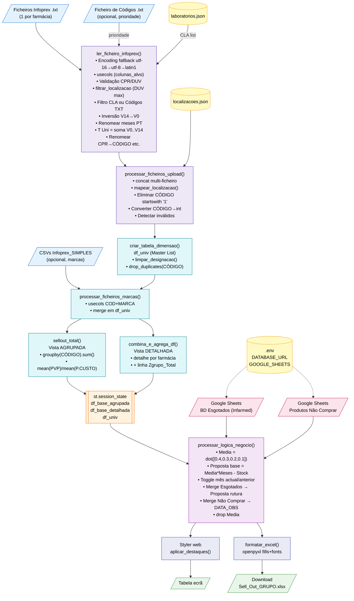

# PRD — Orders Master Infoprex (Reverse Engineering)

> **Documento produzido por engenharia reversa do código-fonte.**
> Âmbito: componente de **Sell Out / Encomendas**.
> Exclusão explícita: toda a componente de Redistribuição de Stocks.
> Versão de referência: `app.py` (1049 linhas) + `processar_infoprex.py` (172 linhas) + ficheiros de configuração.

---

## 1. Resumo Executivo

O **Orders Master Infoprex** é uma aplicação web interna, desenvolvida em **Streamlit** (Python), que automatiza a preparação de propostas de encomenda farmacêutica para uma rede de múltiplas farmácias. Consome ficheiros de vendas `.txt` exportados do **novo módulo Infoprex do Sifarma** (software de gestão de farmácia) e produz, em segundos, uma tabela consolidada com sugestões de quantidade a encomendar por produto.

O sistema parte de dezenas de milhares de linhas de vendas mensais (até 15 meses de histórico por produto, por farmácia) e aplica uma cadeia de transformações: filtragem por laboratório ou por lista de códigos, deduplicação, normalização de designações, agregação por código e por localização, cálculo de médias ponderadas e determinação da proposta de compra. Integra duas fontes externas via Google Sheets — **base de dados de produtos esgotados (Infarmed)** e **lista de produtos a não comprar** — que modulam tanto a fórmula da proposta como a formatação visual (realces a vermelho e roxo).

A ferramenta foi desenhada segundo o princípio de **desacoplamento de estado**: a agregação pesada (I/O + groupby + merges) é executada apenas quando o utilizador clica em "Processar Dados"; todos os restantes ajustes (toggle mês actual/anterior, slider de meses a prever, filtro de marcas) recalculam instantaneamente em memória sobre as DataFrames guardadas em `session_state`. O output final é renderizado em ecrã com formatação condicional (Pandas `Styler`) e exportável para Excel (`.xlsx`) com paridade visual estrita (cores e bold reproduzidos via `openpyxl`).

---

## 2. Objectivos do Produto

**Objectivo primário:**
Substituir o processo manual e propenso a erros de consolidação de vendas entre múltiplas farmácias por um pipeline determinístico, auditável e rápido que produza propostas de encomenda prontas a enviar ao fornecedor.

**Objectivos secundários observáveis no código:**

1. **Consolidação multi-farmácia** — Unir num único dataset os ficheiros Infoprex de várias lojas, apresentando simultaneamente o detalhe por loja e o total do grupo (linha `Zgrupo_Total`).
2. **Filtragem flexível de portefólio** — Permitir focar a análise num subconjunto de produtos via laboratório (CLA) ou via lista explícita de códigos (ficheiro `.txt`).
3. **Cálculo automatizado de proposta** — Aplicar médias ponderadas sobre 4 meses de vendas e calcular a quantidade a comprar em função de meses de cobertura desejados e stock actual.
4. **Gestão de ruturas reais** — Cruzar com a BD oficial de esgotados do Infarmed (via Google Sheets) e ajustar a fórmula quando um produto está em rutura, calculando a compra proporcional ao *time delta* até à reposição prevista.
5. **Prevenção de compras indesejadas** — Sinalizar visualmente (roxo) produtos presentes numa lista de "não comprar" partilhada pela equipa.
6. **Alerta sobre validades curtas** — Destacar (laranja) produtos com validade `≤ 4 meses` para evitar ruptura por caducidade.
7. **Zero perda de paridade visual** — Garantir que o Excel exportado reproduz fielmente as cores e o bold visíveis no ecrã.
8. **Escalabilidade por configuração externa** — Novos laboratórios e novos aliases de farmácias são acrescentados editando `laboratorios.json` e `localizacoes.json` sem tocar no código Python.

---

## 3. Âmbito e Exclusões

### 3.1 Dentro de Âmbito

- Ingestão de ficheiros Infoprex `.txt` (`processar_infoprex.py`).
- Pipeline de pré-processamento, filtragem e agregação (`app.py`).
- Cálculo de médias ponderadas e propostas de encomenda.
- Integração com Google Sheets de Esgotados e de Produtos a Não Comprar.
- Filtro dinâmico por marca via CSVs `Infoprex_SIMPLES.csv`.
- Formatação visual web (Styler) e Excel (openpyxl).
- UI Streamlit completa (sidebar + separador "Encomendas (Sell Out)").

### 3.2 Fora de Âmbito (Exclusão Estrita)

Por determinação do prompt de engenharia reversa, **toda a componente de Redistribuição Inteligente de Stocks está excluída**. Concretamente, são ignorados neste PRD:

- Ficheiros `stockreorder.py`, `motor_redistribuicao.py`, `redistribuicao_v2.py`.
- O separador `tab_redistribuicao` da interface (`app.py` linhas 969–1045).
- Todas as regras de negócio associadas (imunidade DUC, histerese de cobertura, Destino_Forte, etc.).

Estas componentes não voltam a ser mencionadas no restante documento.

---

## 4. Arquitectura do Sistema

### 4.1 Diagrama de Fluxo de Dados (Mermaid)



### 4.2 Componentes e Ficheiros

| Ficheiro | Responsabilidade | Observações |
|---|---|---|
| `app.py` (1049 linhas) | Orquestração Streamlit, UI, agregação, lógica de negócio, formatação, exportação | Contém `main()`, `render_sidebar()`, motores de agregação (`sellout_total`, `combina_e_agrega_df`), `processar_logica_negocio()`, `aplicar_destaques()`, `formatar_excel()`. |
| `processar_infoprex.py` (172 linhas) | Ingestão e pré-processamento dos `.txt` Infoprex | Expõe `ler_ficheiro_infoprex()`, `extrair_codigos_txt()`, `filtrar_localizacao()`. Define dicionário `MESES_PT`. |
| `laboratorios.json` | Mapeamento `Nome Laboratório → [códigos CLA]` | 35 laboratórios mapeados (ver §6.1). |
| `localizacoes.json` | Aliases de farmácias (termos de pesquisa → nome curto) | Apenas 4 entradas actuais (ver §6.2). |
| `.env` | URLs confidenciais das Google Sheets externas | `DATABASE_URL` (Esgotados), `GOOGLE_SHEETS` (Não Comprar). |

### 4.3 Dependências Externas e Integrações

**Dependências Python** (inferidas de `import`):
- `streamlit` — framework UI (`st.set_page_config`, `st.cache_data`, `st.session_state`, widgets).
- `pandas` — manipulação de dados.
- `openpyxl` — geração Excel com formatação (`load_workbook`, `Font`, `PatternFill`).
- `python-dotenv` (`load_dotenv`) — leitura de `.env`.
- `unicodedata` (stdlib) — normalização/remoção de acentos.
- `json`, `os`, `io`, `datetime` — utilitários stdlib.

**Integrações externas (runtime):**
- **Google Sheets publicadas como XLSX** — acessadas directamente por URL via `pd.read_excel(URL)`. Ambas carregadas com TTL de 3600s (`@st.cache_data(ttl=3600)`).
  - `DATABASE_URL` → BD de medicamentos esgotados do Infarmed.
  - `GOOGLE_SHEETS` → lista colaborativa de produtos a não comprar.

**Integrações externas (upload pelo utilizador):**
- Ficheiros `.txt` do Infoprex (Sifarma) — tab-separated, encoding tipicamente UTF-16 LE.
- Ficheiro `.txt` opcional com códigos (um por linha).
- Ficheiros `.csv` opcionais `Infoprex_SIMPLES.csv` (separador `;`) com colunas `COD` e `MARCA`.

---

## 5. Pipeline de Ingestão de Dados

Toda a fase de ingestão está concentrada em `processar_infoprex.py → ler_ficheiro_infoprex()` (invocado a partir de `app.py → processar_ficheiros_upload()`). O pipeline aplica transformações numa ordem estrita que é crítica para a correcção dos resultados.

### 5.1 Leitura de Ficheiros Infoprex (.txt)

Os ficheiros Infoprex são exportações tab-separated do Sifarma ("Novo Módulo Infoprex"). Cada ficheiro contém as vendas de **uma farmácia**. A leitura é feita com `pd.read_csv(sep='\t', …)` (`processar_infoprex.py → ler_ficheiro_infoprex`, linhas 81–91).

**Colunas alvo lidas** (`colunas_alvo`, linha 74):
- **Base:** `CPR`, `NOM`, `LOCALIZACAO`, `SAC`, `PVP`, `PCU`, `DUC`, `DTVAL`, `CLA`, `DUV`.
- **Vendas mensais:** `V0`, `V1`, …, `V14` (15 meses, `V0` = mais recente, `V14` = mais antigo).

Todas as outras colunas do ficheiro original são ignoradas por `usecols` (ver §5.3).

### 5.2 Estratégia de Encoding (Fallback Chain)

O sistema tenta três codificações por ordem (`processar_infoprex.py → ler_ficheiro_infoprex`, linhas 80–91):

1. **`utf-16`** — codificação nativa de exports do Windows/Sifarma (Little Endian com BOM).
2. **`utf-8`** — fallback para exports mais modernos ou editados.
3. **`latin1`** — último recurso para ficheiros legados.

Se todas as três falharem, é lançada `ValueError("Codificação não suportada ou ficheiro corrompido.")`.

### 5.3 Optimização de Memória (usecols)

Para evitar carregar dezenas de colunas irrelevantes que o Infoprex exporta (tipicamente 50+ colunas por ficheiro), o código define:

```python
colunas_alvo = ['CPR','NOM','LOCALIZACAO','SAC','PVP','PCU','DUC','DTVAL','CLA','DUV'] \
             + [f'V{i}' for i in range(15)]
usecols_func = lambda x: x in colunas_alvo
```

(`processar_infoprex.py`, linhas 73–77).

O `lambda` é passado a `pd.read_csv(usecols=…)` de modo que o Pandas descarta ao nível do parser as colunas fora do alvo. Isto:
- **Reduz I/O de disco** (o CSV é gigante — ficheiros de 20-40 MB).
- **Reduz uso de RAM** — sem isto, um grupo de 5 farmácias × 40MB × 50 cols não caberia bem em memória.
- **Previne `KeyError`** — se uma coluna não existir num ficheiro específico (ex: `DUC` ausente num export), o lambda tolera-o graciosamente.

### 5.4 Filtragem de Localização (DUV)

**Problema de negócio:** um ficheiro Infoprex pode conter dados de múltiplas localizações residuais (histórico de movimentações). O que interessa é o conjunto de registos da **localização onde ocorreu a venda mais recente** (= a farmácia "dona" do ficheiro).

**Implementação** (`processar_infoprex.py → filtrar_localizacao`, linhas 9–35):

1. Converte `DUV` (Data Última Venda) para datetime: `pd.to_datetime(format='%d/%m/%Y', errors='coerce')`. Valores inválidos → `NaT`.
2. Calcula `data_mais_recente = df['DUV'].max()` (ignora `NaT` automaticamente).
3. Se todas as datas forem `NaT`, imprime aviso e devolve a DataFrame tal como está (sem filtrar).
4. Identifica a `localizacao_alvo` = valor da coluna `LOCALIZACAO` na primeira linha cuja `DUV == data_mais_recente`.
5. Filtra: `df[df['LOCALIZACAO'] == localizacao_alvo]`.
6. Devolve `(df_filtrada, data_mais_recente)`. A `data_max` é essencial para a renomeação dinâmica de meses (§5.6).

### 5.5 Inversão Cronológica de Meses

**Problema de negócio:** o Infoprex exporta vendas como `V0, V1, …, V14`, em que `V0` é o mês **mais recente** e `V14` o mais antigo. Para leitura humana natural (passado → presente da esquerda para a direita), é necessário inverter.

**Implementação** (`processar_infoprex.py`, linhas 124–130):

```python
vendas_presentes = [col for col in colunas_vendas if col in df_filtrada.columns]
vendas_invertidas = vendas_presentes[::-1]  # [V14, V13, ..., V1, V0]
df_filtrada = df_filtrada[base_presentes + vendas_invertidas]
```

Resultado: após este passo, a coluna mais à esquerda corresponde ao mês mais antigo e a mais à direita (antes de `T Uni`) ao mês mais recente.

### 5.6 Renomeação Dinâmica de Colunas de Vendas

As colunas `V0..V14` são renomeadas para **abreviaturas portuguesas de mês** (`JAN, FEV, MAR, …`) calculadas dinamicamente a partir da `DUV` máxima.

**Algoritmo** (`processar_infoprex.py`, linhas 145–170):

1. Define o dicionário `MESES_PT = {1:'JAN', 2:'FEV', …, 12:'DEZ'}` (linhas 4–7).
2. Itera por `vendas_invertidas` (i.e., de `V14` para `V0`).
3. Para cada `V{i}`, calcula `mes_alvo = data_max - pd.DateOffset(months=i)` e obtém `MESES_PT[mes_alvo.month]`.
4. Regista o novo nome em `rename_dict`.

**Exemplo:** se `data_max` = `15/04/2026`:
- `V0` → `ABR`, `V1` → `MAR`, `V2` → `FEV`, …, `V11` → `MAI`, `V12` → `ABR`, `V13` → `MAR`, `V14` → `FEV`.

Note-se que com 15 meses de histórico existem colisões (o mesmo mês repete-se, como `ABR` para `V0` e `V12`). Este caso é tratado em §5.7.

### 5.7 Tratamento de Meses Duplicados (PyArrow)

**Problema:** Pandas não tolera colunas com nomes duplicados em vários contextos (Styler, PyArrow, merge). A partir de 12 meses aparecem colisões inevitáveis no histórico.

**Solução** (`processar_infoprex.py`, linhas 146–168) — reproduz a convenção nativa do Pandas para nomes duplicados:

```python
meses_vistos = {}
for col_v in vendas_invertidas:
    ...
    if nome_mes in meses_vistos:
        meses_vistos[nome_mes] += 1
        novo_nome = f"{nome_mes}.{meses_vistos[nome_mes]}"
    else:
        meses_vistos[nome_mes] = 0
        novo_nome = nome_mes
```

**Consequência:** a primeira ocorrência (mês mais antigo, do lado esquerdo) fica com o nome puro (`ABR`) e as seguintes recebem sufixo (`ABR.1`, `ABR.2`). Este comportamento garante **compatibilidade com PyArrow** (backend usado pelo Streamlit para serializar DataFrames na UI).

### 5.8 Cálculo de T Uni (Total Unidades)

Após a inversão e antes da renomeação de meses, é criada a coluna `T Uni` (`processar_infoprex.py`, linha 133):

```python
df_filtrada['T Uni'] = df_filtrada[vendas_presentes].sum(axis=1)
```

**Semântica:** total de unidades vendidas ao longo dos até 15 meses de histórico disponíveis para aquele produto naquela farmácia. É uma coluna crítica porque:
- Serve de **âncora posicional** para os cálculos de média ponderada (ver §10.3). O código nunca referencia as colunas de mês pelo nome — usa sempre `idx_tuni - N`.
- É usada no filtro anti-zombies (§7.5).
- Delimita o âmbito da formatação roxa (§12.2).

### 5.9 Renomeação de Colunas Base (CPR→CÓDIGO, etc.)

Após T Uni, as colunas base são renomeadas para o vocabulário interno do sistema (`processar_infoprex.py`, linhas 136–142):

| Nome Infoprex | Nome Interno | Significado |
|---|---|---|
| `CPR` | `CÓDIGO` | Código Nacional do Produto (CNP). |
| `NOM` | `DESIGNAÇÃO` | Nome comercial do produto. |
| `SAC` | `STOCK` | Stock actual disponível (Stock Actual em Casa). |
| `PCU` | `P.CUSTO` | Preço de custo. |

As colunas `PVP`, `DUC` (Data Última Compra), `DTVAL` (Data Validade), `CLA` (Classe/Laboratório), `LOCALIZACAO` mantêm o nome original.

**Nota:** a coluna `DUV` (Data Última Venda) é **consumida e descartada** durante `filtrar_localizacao()` — ela não aparece na DataFrame devolvida, porque não consta de `colunas_base` na linha 117.

---

## 6. Ficheiros de Configuração

### 6.1 laboratorios.json — Mapeamento CLA

Dicionário plano `{nome_laboratorio: [lista_de_codigos_CLA]}` carregado por `app.py → carregar_laboratorios()` (linhas 170–184).

**Conteúdo actual:** 35 laboratórios mapeados. Exemplo:

```json
{
    "Atral": ["32", "35998", "5277"],
    "Alfasigma": ["7572", "3345"],
    "Mylan": ["137", "2651", "2953", "6403", "2577", "1416", "36907", ...],
    "KRKA": ["75A", "19P", "1546", "31984", "2164", "34027", "A75", ...],
    "Zentiva": ["50N", "36Q", "7625", "6596", "850"]
}
```

**Características observáveis:**
- **Códigos alfanuméricos permitidos** — vários CLAs contêm letras (`21E`, `40K`, `22N`, `38K`, `75A`, `45H`, `37Z`, `50N`, `36Q`, `19P`, `A62`, `62A`, `25Y`, `A75`). A comparação é feita como string em `lower-case` (`processar_infoprex.py`, linhas 109–110).
- **Duplicados silenciosos** — Elanco tem `"4629"` listado duas vezes; KRKA tem `"75A"` duas vezes. Não causa erro porque o filtro usa `isin()`, mas é indicativo de manutenção manual sem validação.
- **Sobreposição entre laboratórios** — Cooper e Mylan partilham `"1416"`. Se o utilizador seleccionar ambos, produtos com `CLA=1416` aparecem apenas uma vez (graças a `isin()`); se seleccionar só um, o produto é atribuído ao que foi seleccionado. Pode causar ambiguidade de atribuição (ver §19).
- **Formato convencional** — nomes de laboratório em Title Case (ou `PascalCase` como `PierreFabre`, `LifeScan`). Underscore usado para subcategorias (`Jaba_OTC`).

### 6.2 localizacoes.json — Aliases de Farmácias

Dicionário `{termo_pesquisa: alias_curto}` carregado por `app.py → carregar_localizacoes()` (linhas 39–49).

**Conteúdo actual:**

```json
{
    "NOVA da vila": "GUIA",
    "ilha": "Ilha",
    "Colmeias": "colmeias",
    "Souto": "Souto"
}
```

**Lógica de aplicação** (`app.py → mapear_localizacao`, linhas 52–64):

1. Converte o nome original da localização para minúsculas.
2. Itera pelas chaves do dicionário; se uma chave (em minúsculas) está **contida** dentro do nome (`in`, substring match), devolve o valor associado em **Title Case** (`.title()`).
3. Se nenhuma chave bate, devolve o nome original em Title Case.

**Consequências:**
- Funciona case-insensitive na busca mas **força Title Case no output**, independentemente do que está no JSON. Ex: `"colmeias"` no JSON → saída `"Colmeias"`; `"GUIA"` no JSON → saída `"Guia"`.
- O match por substring é frágil: `"ilha"` bate em qualquer nome que contenha essas 4 letras (ex: hipotético `"Farmácia Vilha"` daria falso positivo).
- Aplicado em dois pontos: durante o processamento base (`processar_ficheiros_upload`, linha 263) e na lista "Não Comprar" (`load_produtos_nao_comprar`, linha 115) para permitir o merge por `LOCALIZACAO`.

### 6.3 .env — Variáveis de Ambiente

Carregado via `python-dotenv → load_dotenv()` no topo de `app.py` (linha 17). Expõe:

| Variável | Uso | Lida em |
|---|---|---|
| `DATABASE_URL` | URL pública da Google Sheet com a BD de medicamentos esgotados do Infarmed (formato `pub?output=xlsx`). | `obter_base_dados_esgotados()` (linha 82). |
| `GOOGLE_SHEETS` | URL pública da Google Sheet colaborativa de produtos a não comprar. | `load_produtos_nao_comprar()` (linha 114). |

**Notas de segurança:**
- As URLs são "publicadas na Web" (read-only, sem autenticação) — não são secretos criptográficos, mas expôr estas ligações dá acesso total aos dados. Manter em `.env` e fora do VCS é a escolha correcta.
- Se alguma das variáveis não estiver definida, a função cache correspondente devolve DataFrame vazio (e, no caso de `DATABASE_URL`, mostra `st.sidebar.warning`).

---

## 7. Sistema de Filtragem Multi-Nível

A filtragem é aplicada em cascata, a maior parte **antes** de os dados completos entrarem em memória. Cada nível é mutuamente exclusivo com o seguinte ou complementar.

### 7.1 Prioridade: Ficheiro TXT de Códigos

**Fonte:** `app.py → render_sidebar()` (linhas 657–661) — upload opcional.

**Leitura:** `processar_infoprex.py → extrair_codigos_txt()` (linhas 37–61):
- Aceita tanto `UploadedFile` do Streamlit (via `getvalue().decode("utf-8")`) como caminhos de ficheiro em disco.
- Lê linha a linha.
- **Filtra estritamente linhas que sejam apenas dígitos** (`linha_limpa.isdigit()`). Isto elimina automaticamente cabeçalhos (ex: `"CNP"`), comentários, linhas em branco e qualquer lixo textual.

**Aplicação** (`processar_infoprex.py → ler_ficheiro_infoprex`, linhas 103–106):
```python
if lista_codigos is not None and len(lista_codigos) > 0:
    lista_codigos_str = [str(c).strip().lower() for c in lista_codigos]
    df = df[df['CPR'].astype(str).str.strip().str.lower().isin(lista_codigos_str)]
```

**Regra de prioridade:** se este filtro está activo, o filtro por laboratórios é **ignorado** (ramo `if/elif`, linhas 104–110). Documentado visualmente ao utilizador na sidebar ("Ignorado se usar txt abaixo") e no expander de documentação (linha 706).

### 7.2 Secundário: Selecção de Laboratórios (CLA)

**Fonte:** `st.multiselect` em `render_sidebar()` (linhas 650–655) populado com as chaves de `laboratorios.json`.

**Construção da lista de CLAs** (`app.py → processar_ficheiros_upload`, linhas 234–237):
```python
lista_cla = []
if labs_selecionados and _dicionario_labs:
    for lab in labs_selecionados:
        lista_cla.extend(_dicionario_labs.get(lab, []))
```

Laboratórios inexistentes no dicionário retornam `[]` silenciosamente (uso de `.get()` com default).

**Aplicação** (`processar_infoprex.py`, linhas 108–110):
```python
elif lista_cla is not None and len(lista_cla) > 0:
    lista_cla_str = [str(c).strip().lower() for c in lista_cla]
    df = df[df['CLA'].astype(str).str.strip().str.lower().isin(lista_cla_str)]
```

**Nota importante:** este filtro apenas corre se `lista_codigos` estiver vazia (§7.1 tem prioridade absoluta). Se ambos estiverem vazios, **nenhum filtro é aplicado** e todo o portefólio é carregado.

### 7.3 Eliminação de Códigos Locais (prefixo "1")

**Regra de negócio:** na convenção farmacêutica, códigos de produto começados por `"1"` são produtos "locais" — códigos internos atribuídos pela farmácia para artigos não-registados no sistema nacional (CNP). Estes devem ser sempre excluídos da análise de encomendas.

**Implementação** (`app.py → processar_ficheiros_upload`, linhas 266–269):
```python
mask_local = df_final['CÓDIGO'].astype(str).str.strip().str.startswith('1')
df_final = df_final[~mask_local].copy()
```

Aplicado **após o `concat` multi-ficheiro** e **antes** da conversão para inteiro. Documentado ao utilizador no expander de ajuda (linha 705): *"Códigos de farmácia locais (iniciados por 1) são automaticamente descartados."*

### 7.4 Validação e Conversão de Códigos para Inteiro

Após §7.3, o código é convertido para `int` — garantia arquitectural de que todas as operações a jusante trabalham com inteiros (e não strings).

**Implementação** (`app.py → processar_ficheiros_upload`, linhas 275–287):

1. `pd.to_numeric(df['CÓDIGO'], errors='coerce')` → valores não-numéricos viram `NaN`.
2. Identifica máscara `mask_invalid = df['CÓDIGO_NUM'].isna()`.
3. **Coleta os códigos inválidos** (`codigos_invalidos = df.loc[mask_invalid, 'CÓDIGO'].unique().tolist()`) — serão mostrados ao utilizador como aviso amarelo (§14.8, `app.py` linhas 886–888).
4. Remove as linhas inválidas e converte a coluna para `int`.
5. Apaga a coluna auxiliar `CÓDIGO_NUM`.

**Edge case tratado:** alfanuméricos (ex: `"A1234"`) são capturados aqui mesmo que passem pelo filtro do prefixo `"1"`.

### 7.5 Filtro Anti-Zombies (Stock=0 e T Uni=0)

**Regra de negócio:** um produto sem stock e sem vendas no histórico é um "zombie" (esqueleto no catálogo) — não tem valor analítico para propostas de encomenda.

**Implementação** (ambos os motores de agregação, `app.py`):
- `sellout_total()`, linhas 300–302:
  ```python
  filtro = (dataframe_combinada['STOCK'] != 0) | (dataframe_combinada['T Uni'] != 0)
  dataframe_combinada = dataframe_combinada[filtro].copy()
  ```
- `combina_e_agrega_df()`, linhas 355–357 — filtro idêntico.

**Camada adicional pós-agregação** — `remover_linhas_sem_vendas_e_stock()` (linhas 406–413):
- Identifica códigos cuja **linha Zgrupo_Total** tem `STOCK=0 AND T Uni=0`.
- Remove **todas as linhas** (detalhe por farmácia + total) desse código.
- Esta segunda passagem captura casos em que individualmente algumas farmácias não são zombies mas o agregado do grupo é irrelevante (por exemplo, stock residual numa única loja com zero vendas em toda a rede).

---

## 8. Motor de Agregação

Após o pipeline de ingestão, a DataFrame consolidada entra em dois motores paralelos que produzem as duas vistas pré-computadas guardadas em `session_state` (ver §15).

### 8.1 Tabela Dimensão (Master List de Produtos)

**Função:** `app.py → criar_tabela_dimensao()` (linhas 145–160).

**Propósito:** produzir a fonte única e canónica de `(CÓDIGO → DESIGNAÇÃO)` para todo o sistema. Necessário porque:
- O mesmo produto pode aparecer em várias farmácias com designações ligeiramente diferentes (acentos, asteriscos, maiúsculas/minúsculas).
- Se não houver uma designação canónica, o `groupby(CÓDIGO)` produz resultados correctos numericamente mas a junção da designação fica incoerente (uma farmácia pode ter `"Ben-U-Ron*"` e outra `"ben u ron"`).

**Pipeline:**
1. Extrai apenas `['CÓDIGO', 'DESIGNAÇÃO']`.
2. Aplica `limpar_designacao()` (ver §8.2) a cada designação.
3. `drop_duplicates(subset=['CÓDIGO'], keep='first')` — fica com a primeira designação limpa encontrada.
4. Reset index e devolve.

### 8.2 Limpeza de Designações (acentos, asteriscos, Title Case)

**Função:** `app.py → limpar_designacao()` (linhas 133–142).

**Transformações aplicadas:**
1. Se não for string, força conversão via `str()`.
2. **Remoção de acentos** via Unicode NFD + filtragem de categoria `Mn` (marks, nonspacing):
   ```python
   texto_limpo = ''.join(c for c in unicodedata.normalize('NFD', texto)
                         if unicodedata.category(c) != 'Mn')
   ```
   Ex: `"ÁçúcaR"` → `"AcucaR"`.
3. **Remoção de asteriscos** (`*`) — convenção Sifarma para marcar produtos com alguma particularidade (ex: genéricos ou sem stock oficial).
4. `.strip().title()` — apara espaços e aplica Title Case.

**Resultado:** `"BEN-U-RON* 500mg"` → `"Ben-U-Ron 500Mg"`.

### 8.3 Vista Agrupada (sellout_total)

**Função:** `app.py → sellout_total()` (linhas 298–350).

**Objectivo:** uma linha por produto para todo o grupo de farmácias. Usada como vista "executiva".

**Passos:**
1. Aplica filtro anti-zombies (§7.5).
2. Define `colunas_nao_somar = ['CÓDIGO','DESIGNAÇÃO','LOCALIZACAO','PVP','P.CUSTO','DUC','DTVAL','CLA']` — tudo o resto (i.e. meses + `T Uni` + `STOCK`) é somado.
3. `groupby('CÓDIGO')[colunas_agregar].sum()` — agregação central.
4. Calcula `PVP_Médio` e `P.CUSTO_Médio` via `groupby('CÓDIGO')[col].mean().round(2)` (ver §8.5).
5. Faz merge com a tabela dimensão para acoplar `DESIGNAÇÃO` canónica.
6. Força `.str.title()` numa segunda passagem.
7. Renomeia `PVP` → `PVP_Médio` e `P.CUSTO` → `P.CUSTO_Médio`.
8. Reordena colunas (§8.6).
9. Ordena por `[DESIGNAÇÃO, CÓDIGO]` ascendente.

**Colunas não propagadas (perdidas pela agregação):** `DUC`, `DTVAL`, `CLA`, `LOCALIZACAO`. Justificação:
- `LOCALIZACAO` — não faz sentido numa vista agregada multi-loja.
- `DUC`, `DTVAL` — são por-loja; agregar perderia semântica.
- `CLA` — é sempre a mesma por código (mas o código tecnicamente não a propaga).

### 8.4 Vista Detalhada (combina_e_agrega_df + Zgrupo_Total)

**Função:** `app.py → combina_e_agrega_df()` (linhas 353–403).

**Objectivo:** preservar o detalhe por farmácia **e adicionar** uma linha de totais por código (rotulada `LOCALIZACAO = 'Zgrupo_Total'`).

**Passos:**
1. Filtro anti-zombies (§7.5).
2. Agrega (soma) o mesmo conjunto de colunas que `sellout_total`.
3. Atribui à linha agregada `LOCALIZACAO = 'Zgrupo_Total'` (linha 379).
4. Remove `DESIGNAÇÃO` da DataFrame original (para evitar conflito ao concatenar com a agregada que ainda não tem designação canónica).
5. `pd.concat([dataframe_combinada, grouped_df])` — **junta detalhe + totais na mesma DataFrame**.
6. Faz merge com `df_master_produtos` para repor a `DESIGNAÇÃO` limpa.
7. Reordena colunas (§8.6) e ordena (§8.7).

**Porquê o prefixo `Z`?** — Decisão puramente cosmética/ordenativa. Como a ordenação estrita é ascendente por `LOCALIZACAO`, começar o nome por `"Z"` garante que a linha de total aparece sempre em **último lugar** dentro de cada grupo `(DESIGNAÇÃO, CÓDIGO)`. Ver discussão de evolução em §20.7.

**Regra secundária pós-agregação:** `remover_linhas_sem_vendas_e_stock()` é chamado imediatamente depois (linha 821–822) para purgar grupos completos em que o total é zombie (§7.5).

### 8.5 Cálculo de Médias de PVP e P.CUSTO

Ambos os motores calculam a média aritmética simples de `PVP` e `P.CUSTO` por código, sem ponderação por unidades vendidas:

```python
pvp_medio_df = dataframe_combinada.groupby('CÓDIGO')['PVP'].mean().round(2).reset_index()
pcusto_medio_df = dataframe_combinada.groupby('CÓDIGO')['P.CUSTO'].mean().round(2).reset_index()
```

(`sellout_total`, linhas 315–320 | `combina_e_agrega_df`, linhas 369–372).

**Atenção técnica:** é uma **média não ponderada**. Farmácias com grande volume de vendas pesam o mesmo que farmácias com volume residual. Para o PVP isto é raramente problemático (preços são semelhantes), mas para `P.CUSTO` pode mascarar acordos diferenciados por loja. Ver §19.

**Detalhe de renomeação divergente:**
- Na vista agrupada, `PVP` é renomeado para `PVP_Médio` dentro do próprio motor (linha 332–333).
- Na vista detalhada, o motor **não** faz essa renomeação — é feita a posteriori em `main()` (linha 823–824): `df_detalhada = df_detalhada.rename(columns={'PVP': 'PVP_Médio'})`. A coluna `P.CUSTO` mantém o nome original na vista detalhada.

### 8.6 Reordenação de Colunas

Depois do merge com a tabela dimensão, as colunas adicionadas ficam no fim da DataFrame. A reordenação garante que a leitura humana começa sempre por `CÓDIGO, DESIGNAÇÃO`:

**Vista Agrupada** (linhas 336–344):
```python
# Inserir nesta ordem: [0]=CÓDIGO, [1]=DESIGNAÇÃO, [2]=PVP_Médio, [3]=P.CUSTO_Médio, ...meses, T Uni
colunas.insert(1, col_designacao)
colunas.insert(2, col_pvp)
colunas.insert(3, col_pcusto)
```

**Vista Detalhada** (linhas 395–400):
```python
cols.remove('DESIGNAÇÃO')
cols.insert(1, 'DESIGNAÇÃO')
```

### 8.7 Ordenação Estrita (DESIGNAÇÃO → CÓDIGO → LOCALIZACAO)

**Vista Agrupada** (linha 347–348):
```python
grouped_df.sort_values(by=['DESIGNAÇÃO', 'CÓDIGO'], ascending=[True, True])
```

**Vista Detalhada** (linha 403):
```python
.sort_values(by=['DESIGNAÇÃO', 'CÓDIGO', 'LOCALIZACAO'], ascending=[True, True, True])
```

**Consequências:**
- Produtos com a mesma designação ficam agrupados visualmente (importante porque o mesmo princípio activo pode ter CNPs diferentes).
- Dentro de cada `(DESIGNAÇÃO, CÓDIGO)`, as farmácias aparecem em ordem alfabética e a linha `Zgrupo_Total` (prefixo `Z`) cai sempre no fim.
- A ordenação é feita **antes** da aplicação da lógica de negócio (§10) — portanto a ordem visual reflecte sempre a hierarquia designativa, independentemente do valor calculado da proposta.

---

## 9. Sistema de Marcas (Filtro Dinâmico)

### 9.1 Ingestão de CSVs de Marcas (Infoprex_SIMPLES.csv)

**Função:** `app.py → processar_ficheiros_marcas()` (linhas 187–221). Invocada dentro do handler de processamento (linha 807).

**Características:**
- Aceita múltiplos ficheiros em simultâneo (`accept_multiple_files=True`, sidebar).
- Lê apenas duas colunas (`usecols=['COD', 'MARCA']`) — optimização de I/O idêntica à do Infoprex.
- Separador `;` (convenção CSV europeu).
- `on_bad_lines='skip'` — tolera linhas malformadas sem crashar.
- `dtype={'COD': str, 'MARCA': str}` — força strings na leitura.

**Pipeline de limpeza:**
1. `concat` de todos os ficheiros.
2. `strip()` e substituição de strings vazias / `'nan'` / `'None'` por `pd.NA`.
3. `dropna(subset=['MARCA'])` — remove linhas sem marca.
4. Converte `COD` para numérico e remove os que não convertem.
5. Converte `COD` para `int`.
6. `drop_duplicates(subset=['COD'], keep='first')` — um código → uma marca (a primeira vista).

**Cache:** `@st.cache_data(show_spinner=False)` — é barato, corre silenciosamente.

### 9.2 Merge com Tabela Dimensão

**Local:** `app.py → main()`, linhas 807–814.

```python
df_marcas = processar_ficheiros_marcas(opcoes_sidebar['ficheiros_marcas'])
if not df_marcas.empty:
    df_univ = pd.merge(df_univ, df_marcas, left_on='CÓDIGO', right_on='COD', how='left')
    df_univ.drop(columns=['COD'], inplace=True)
else:
    df_univ['MARCA'] = pd.NA
```

**Lógica:**
- A coluna `MARCA` é sempre criada na `df_univ`, mesmo quando não há CSVs carregados (garantia de schema consistente).
- Left join sobre o CÓDIGO: produtos sem correspondência ficam com `MARCA = NaN`.

**Propagação:** como a `df_univ` alimenta ambos os motores via `merge(df_master_produtos)`, a coluna `MARCA` aparece automaticamente em `df_base_agrupada` e em `df_base_detalhada`.

### 9.3 Isolamento Matemático (Drop Preventivo)

**Princípio crítico:** a `MARCA` é **metadata**, não dado de negócio. Se permanecesse durante o cálculo da média ponderada, alteraria o índice posicional da coluna `T Uni` e portanto o cálculo da proposta.

**Implementação** (`app.py`, linhas 921–923 para encomendas):

```python
# Aplicar filtro
if marcas_selecionadas and 'MARCA' in df_selecionada.columns:
    df_selecionada = df_selecionada[df_selecionada['MARCA'].isin(marcas_selecionadas)].copy()

# Drop IMEDIATO
if 'MARCA' in df_selecionada.columns:
    df_selecionada = df_selecionada.drop(columns=['MARCA'])
```

**Ordem crítica:** o filtro é aplicado **antes** do drop. Se fosse ao contrário, não haveria coluna para filtrar. O drop acontece antes de:
- Encontrar `idx_tuni = colunas_totais.index('T Uni')` (linha 927).
- Alimentar `processar_logica_negocio()`.
- Renderizar a tabela ou gerar o Excel.

Resultado: o utilizador final nunca vê a coluna `MARCA`; ela só existe para propósitos de filtragem UI.

### 9.4 Widget Multiselect com Key Dinâmica

**Local:** `app.py → main()`, linhas 862–873.

```python
multiselect_key = "marcas_multiselect"
if st.session_state.last_labs:
    multiselect_key += "_" + "_".join(st.session_state.last_labs)

marcas_selecionadas = st.multiselect(
    "🏷️ Filtrar por Marca:",
    options=marcas_disponiveis,
    default=marcas_disponiveis,    # Todas seleccionadas por defeito
    placeholder="Selecione uma ou mais marcas para filtrar os resultados abaixo...",
    key=multiselect_key
)
```

**Porquê chave dinâmica?** O Streamlit memoriza o estado de widgets pela sua `key`. Se o utilizador trocasse de laboratório, as marcas seleccionadas antes (que já não existem no novo portefólio) manter-se-iam "pegajosas" no estado interno, causando bugs visuais ou filtros inesperadamente vazios. Ao compor a key com `last_labs`, cada troca de laboratórios gera um widget "novo" do ponto de vista do Streamlit, com estado limpo.

**Default:** todas as marcas seleccionadas — o filtro "não filtra" por defeito, apenas serve de mecanismo de desseleção.

### 9.5 Extracção de Opções da df_base_agrupada (não da df_univ)

**Local:** `app.py → main()`, linhas 855–860.

```python
if 'df_base_agrupada' in st.session_state and not st.session_state.df_base_agrupada.empty \
   and 'MARCA' in st.session_state.df_base_agrupada.columns:
    marcas_disponiveis = st.session_state.df_base_agrupada['MARCA'].dropna().unique().tolist()
    marcas_disponiveis = sorted([str(m) for m in marcas_disponiveis if str(m).strip()])
```

**Decisão arquitectural crítica:** as opções vêm da `df_base_agrupada` (dataset **já filtrado** pelos critérios de labs/codigos e pelo filtro anti-zombies) e **não** da `df_univ` (master list completa).

**Porquê?**
- Se as opções viessem da `df_univ`, o utilizador poderia seleccionar marcas que existem no catálogo mas **não têm produtos activos** no portefólio actual filtrado.
- Resultado: a tabela abaixo viria vazia após o filtro, causando confusão.
- Ao limitar o dropdown a marcas que têm **pelo menos um produto válido visível**, garante-se que qualquer selecção produz resultados.

Esta decisão é explicitamente documentada no `gemini.MD` como decisão arquitectural (linha 56 do gemini.MD).

---

## 10. Lógica de Cálculo de Propostas

Toda a lógica de negócio para o cálculo de propostas está concentrada em `app.py → processar_logica_negocio()` (linhas 451–524). É executada **em tempo real** a cada rerun do Streamlit (sem cache) sobre as DataFrames guardadas em `session_state`.

### 10.1 Média Ponderada — Pesos [0.4, 0.3, 0.2, 0.1]

**Fórmula:**

$$
\text{Media} = \sum_{i=1}^{4} w_i \cdot V_{t-i}
$$

onde $w = [0.4,\ 0.3,\ 0.2,\ 0.1]$ e $V_{t-i}$ representa as vendas do $i$-ésimo mês anterior ao "mês de referência" (ver §10.2).

**Implementação** (`app.py`, linha 458):
```python
df['Media'] = df[cols_selecionadas].dot(pesos)
```

O `.dot()` do Pandas faz o produto escalar vectorizado linha-a-linha — equivalente a `sum(col_i * peso_i)` mas muitos passos mais rápido.

**Propriedades dos pesos:**
- Soma = 1.0 (média ponderada verdadeira, não acumulado).
- Monotonicamente decrescentes — o mês mais recente pesa 4x mais que o mês mais antigo do quadrimestre.
- Hardcoded em `app.py` linha 944 (chamada ao motor) e repetidos na chamada do separador de redistribuição (fora de âmbito deste PRD).

### 10.2 Toggle: Mês Actual vs. Mês Anterior

**UI:** `st.toggle("Média Ponderada com Base no mês ANTERIOR?")` (`app.py` linha 878).

**Semântica de negócio:** o "mês actual" ainda está em curso (vendas incompletas). Para propostas de encomenda conservadoras, o utilizador pode querer ignorar o mês corrente e basear a média nos 4 meses **completos** anteriores.

**Implementação** (`app.py`, linhas 928–933):
```python
idx_tuni = colunas_totais.index('T Uni')
if anterior:
    indice_colunas = [idx_tuni-2, idx_tuni-3, idx_tuni-4, idx_tuni-5]
else:
    indice_colunas = [idx_tuni-1, idx_tuni-2, idx_tuni-3, idx_tuni-4]
```

| Toggle | Janela de 4 meses usada | Descrição |
|---|---|---|
| **OFF** (default) | `[T Uni -1, -2, -3, -4]` | Os 4 meses imediatamente anteriores a `T Uni`. O mais recente é o "mês actual completo exportado". |
| **ON** | `[T Uni -2, -3, -4, -5]` | Salta o mês mais recente e usa os 4 meses anteriores a esse. |

### 10.3 Indexação Relativa (posição de T Uni)

**Princípio arquitectural:** o código **nunca** referencia os meses pelo nome (`"ABR"`, `"MAI"`, …). Usa sempre a posição da coluna `T Uni` como âncora e aplica offsets negativos.

**Razão:** o nome dos meses é dinâmico (§5.6) — depende da `DUV` máxima. Um ficheiro extraído em Abril dá nomes diferentes de um extraído em Maio. Usar nomes obrigaria a lógica a recomputar os nomes esperados; usar posição relativa é invariante.

**Exemplo prático:** se a sequência de colunas na vista agrupada é
`[CÓDIGO, DESIGNAÇÃO, PVP_Médio, P.CUSTO_Médio, FEV, MAR, ABR, MAI, JUN, JUL, AGO, SET, OUT, NOV, DEZ, JAN, FEV.1, MAR.1, ABR.1, T Uni, STOCK, DUC, DTVAL, CLA]`, então:
- `idx_tuni = 19`.
- Com toggle OFF → índices `[18, 17, 16, 15]` = `[ABR.1, MAR.1, FEV.1, JAN]`.
- Com toggle ON → índices `[17, 16, 15, 14]` = `[MAR.1, FEV.1, JAN, DEZ]`.

**Dependência frágil:** para isto funcionar, é obrigatório que todas as colunas entre `T Uni - 5` e `T Uni - 1` sejam efectivamente colunas de vendas. Qualquer adição de metadata (como `MARCA`) **antes** do drop preventivo partiria o cálculo — daí a criticidade do §9.3.

### 10.4 Fórmula Base: (Média × Meses) − Stock

**Semântica:** quantos meses de cobertura queremos ter em stock × média mensal esperada, menos o que já temos.

**Fórmula:**

$$
\text{Proposta} = \text{round}\left(\text{Media} \times \text{Meses\_Previsão} - \text{STOCK}\right) \in \mathbb{Z}
$$

**Implementação** (`app.py`, linha 459–460):
```python
df['Proposta'] = (df['Media'] * valor_previsao - df['STOCK']).round(0).astype(int)
```

**Variáveis:**
- `Media`: resultado de §10.1.
- `valor_previsao`: valor do slider "Meses a prever" (float, 1.0–4.0, step 0.1, default 1.0 — ver §10.6).
- `STOCK`: coluna do próprio produto/linha (unidades actuais em casa).

**Interpretação de valores:**
- `Proposta > 0` → comprar essa quantidade.
- `Proposta = 0` → não é necessário comprar (stock cobre a projecção exacta).
- `Proposta < 0` → **excesso de stock** face à previsão. O sistema mantém o valor negativo (não faz clamp a zero), deixando a decisão ao utilizador.

### 10.5 Fórmula com Rutura: ((Média / 30) × TimeDelta) − Stock

**Contexto:** quando um produto consta da BD de esgotados do Infarmed, sabemos que está em rutura e temos uma **data prevista de reposição**. Neste caso, não faz sentido pedir cobertura plena dos N meses — só precisamos de cobrir o período até o produto voltar a ficar disponível.

**Fórmula:**

$$
\text{Proposta}_{\text{rutura}} = \text{round}\left(\frac{\text{Media}}{30} \times \text{TimeDelta} - \text{STOCK}\right) \in \mathbb{Z}
$$

onde `TimeDelta = (Data_Prevista_Reposição − Hoje).days` (ver §11.1.2).

**Implementação** (`app.py → calcular_proposta_esgotados`, linhas 431–438):
```python
df[col_timedelta] = pd.to_numeric(df[col_timedelta], errors='coerce')
mask = df[col_timedelta].notna()
df.loc[mask, col_proposta] = (
    (df.loc[mask, col_media] / 30) * df.loc[mask, col_timedelta] - df.loc[mask, col_stock]
).round(0).astype(int)
```

**Só sobrescreve quando** `TimeDelta` não é nulo (i.e., quando o produto está efectivamente na lista de esgotados — merge left).

**Semântica da fórmula:** `Media/30` = vendas diárias médias estimadas (assume mês de 30 dias); multiplicado por dias até reposição dá o consumo esperado no intervalo; subtrai stock actual para determinar quanto falta.

**Edge cases:**
- `TimeDelta < 0` (data de reposição já passou) → proposta fica **menor ou negativa** (consumo "já devia ter sido feito"), efectivamente sugerindo não comprar. Comportamento passivo, não há clamp.
- `TimeDelta` muito pequeno (poucos dias) → proposta próxima de `-STOCK`.

### 10.6 Slider de Meses a Prever (1.0 a 4.0, step 0.1)

**UI:** `st.number_input` (não é slider — é input numérico) (`app.py` linhas 905–908).

**Nota importante:** o título desta secção no prompt indica `1.0 a 6.0`, mas no código actual o máximo é `4.0`:

```python
valor = st.number_input(
    label="Meses a prever", label_visibility="collapsed",
    min_value=1.0, max_value=4.0, value=1.0, step=0.1, format="%.1f",
    key="input_meses_encomenda"
)
```

**Parâmetros observados:**
- `min_value = 1.0`, `max_value = 4.0`, `step = 0.1`, `default = 1.0`.
- Formato: 1 casa decimal (`"%.1f"`).

Esta discrepância entre o prompt e o código é notada aqui por transparência. O documento reflete o comportamento **real** do código.

**Feedback visual:** `st.write(f"A Preparar encomenda para {valor:.1f} Meses")` confirma imediatamente a escolha ao utilizador.

---

## 11. Integrações Externas

### 11.1 Base de Dados de Esgotados (Infarmed/Google Sheets)

#### 11.1.1 Colunas Lidas e Transformações

**Função:** `app.py → obter_base_dados_esgotados()` (linhas 71–104). Cacheada com `@st.cache_data(ttl=3600, show_spinner=...)`.

**Fonte:** URL público (`DATABASE_URL` em `.env`) de uma Google Sheet publicada como XLSX.

**Colunas seleccionadas** (linhas 83–85):
```python
colunas = ['Número de registo', 'Nome do medicamento',
           'Data de início de rutura', 'Data prevista para reposição',
           'TimeDelta', 'Data da Consulta']
```

**Transformações:**
1. `Número de registo` → `astype(str)` (linha 87–88) — é o CNP que será cruzado com `CÓDIGO`.
2. `TimeDelta` → `pd.to_numeric(errors='coerce')` (linha 89–90) — captura o valor original para histórico.
3. `Data da Consulta` → extraído o primeiro valor, `[:10]` para formato YYYY-MM-DD (linha 92).
4. `Data prevista para reposição` → `pd.to_datetime()` (linha 95–96).

#### 11.1.2 Cálculo Dinâmico de TimeDelta (dia corrente vs. data reposição)

**Passo crítico** (linhas 97–99):
```python
hoje = pd.Timestamp(datetime.now().date())
df_esgotados['TimeDelta'] = (df_esgotados['Data prevista para reposição'] - hoje).dt.days
```

**Porquê recalcular:** a Google Sheet contém um `TimeDelta` original (provavelmente calculado na data de criação/consulta da BD). Mas à medida que o tempo passa, esse valor fica desactualizado. O sistema **ignora o valor original** e recalcula-o usando a data corrente no momento da execução.

**Consequência:**
- Se `Data prevista reposição > hoje` → `TimeDelta > 0` → fórmula rutura aplica (§10.5).
- Se `Data prevista reposição ≤ hoje` → `TimeDelta ≤ 0` → fórmula produz valor baixo/negativo (comportamento passivo: "provavelmente já está reposto").
- Se a data é `NaT` → `TimeDelta` fica `NaT/NaN` → máscara em `calcular_proposta_esgotados()` (`mask = df[col_timedelta].notna()`) falha para essa linha → **mantém a proposta base** (§10.4), não aplica fórmula rutura.

#### 11.1.3 Formatação de Datas (DIR, DPR)

Após o merge com a DataFrame de sell out (`processar_logica_negocio`, linhas 483–491):

1. Converte as datas para string formatada `'%d-%m-%Y'` (formato português).
2. Renomeia:
   - `Data de início de rutura` → `DIR`.
   - `Data prevista para reposição` → `DPR`.
3. A coluna `TimeDelta` é **removida** após o cálculo (linhas 492–493): `df.drop(columns='TimeDelta')`.

**Consequência visual:** o utilizador vê apenas `DIR` e `DPR` como datas legíveis em formato europeu. O `TimeDelta` (numérico) não aparece na tabela final — é apenas instrumento interno de cálculo.

### 11.2 Lista de Produtos a Não Comprar (Google Sheets)

#### 11.2.1 Merge por Código + Localização (Detalhada) vs. apenas Código (Agrupada)

**Função:** `app.py → load_produtos_nao_comprar()` (linhas 107–126). Cacheada com `@st.cache_data(ttl=3600)`.

**Schema esperado da Google Sheet:**
- `CNP` (código do produto).
- `FARMACIA` (nome da farmácia).
- `DATA` (data em que o produto foi marcado como "não comprar" para aquela farmácia, formato `%d-%m-%Y`).

**Aplicação dupla** (`app.py → processar_logica_negocio`, linhas 499–517):

Parâmetro `agrupado` controla dois comportamentos distintos:

```python
if agrupado:  # Vista AGRUPADA
    df_nc_unique = df_nao_comprar[['CNP', 'DATA']] \
        .sort_values('DATA', ascending=False) \
        .drop_duplicates(subset=['CNP'], keep='first')
    df = df.merge(df_nc_unique, left_on='CÓDIGO_STR', right_on='CNP', how='left')
else:  # Vista DETALHADA
    df = df.merge(df_nao_comprar,
                  left_on=['CÓDIGO_STR', 'LOCALIZACAO'],
                  right_on=['CNP', 'FARMACIA'], how='left')
```

**Semântica de negócio:**
- **Vista Detalhada (por farmácia):** o produto pode estar marcado "não comprar" apenas para uma loja específica. O merge por `(Código, Loja)` garante que outras lojas não herdam o marcador.
- **Vista Agrupada (total grupo):** não há conceito de loja. Se o produto estiver marcado "não comprar" em **qualquer** farmácia, a vista agregada mostra esse marcador (com a `DATA` mais recente).

A chamada passa `agrupado=not on` (linha 946) — `on=True` significa "ver detalhe", portanto `agrupado=False`.

#### 11.2.2 Deduplicação e Ordenação por Data

**Na leitura inicial** (`load_produtos_nao_comprar`, linhas 119–122):
```python
nc_df = nc_df.sort_values(by=['CNP', 'FARMACIA', 'DATA'], ascending=[True, True, False])
nc_df = nc_df.drop_duplicates(subset=['CNP', 'FARMACIA'], keep='first').reset_index(drop=True)
```

**Regra:** se o mesmo `(CNP, FARMACIA)` aparece múltiplas vezes na sheet, fica apenas a linha com a data mais recente. Previne que registos históricos antigos obscureçam o estado actual.

#### 11.2.3 Geração da Coluna DATA_OBS

Após o merge, a coluna `DATA` é renomeada para `DATA_OBS` (`processar_logica_negocio`, linhas 507 e 513):
```python
df.rename(columns={'DATA': 'DATA_OBS'}, inplace=True)
```

**Importância:** `DATA_OBS` é a **coluna sinal** usada pela função de formatação visual:
- `pd.notna(linha['DATA_OBS'])` → pinta a linha de roxo (§12.2).
- Colunas auxiliares do merge (`CNP`, `FARMACIA`, `CÓDIGO_STR`) são todas removidas pós-merge (linhas 508–509, 514–517) para manter o schema limpo.

---

## 12. Regras de Formatação Visual

A formatação é aplicada em duas instâncias paralelas com objectivos distintos mas regras equivalentes:

- **Web (Pandas Styler):** `app.py → aplicar_destaques()` (linhas 527–561).
- **Excel (openpyxl):** `app.py → formatar_excel()` (linhas 564–632).

### 12.1 Linha Zgrupo_Total — Fundo Preto, Letra Branca, Bold

**Web** (linhas 530–531):
```python
if localizacao in ['ZGrupo_Total', 'Zgrupo_Total']:
    return ['background-color: black; font-weight: bold; color: white'] * len(linha)
```

**Excel** (linhas 596–600):
```python
if col_localizacao and row[col_localizacao - 1].value in ['ZGrupo_Total', 'Zgrupo_Total']:
    for cell in row:
        cell.font = font_total      # bold + FFFFFF
        cell.fill = fill_total      # #000000
    continue
```

**Observação:** ambas as implementações toleram duas grafias (`ZGrupo_Total` e `Zgrupo_Total`), apesar de o código em `combina_e_agrega_df()` (linha 379) só gerar `'Zgrupo_Total'`. É defesa contra renomeações históricas ou edição manual.

### 12.2 Produtos Não Comprar — Fundo Roxo (#E6D5F5) até coluna T Uni

**Web** (linhas 533–537):
```python
if 'DATA_OBS' in linha.index and pd.notna(linha['DATA_OBS']):
    if 'T Uni' in linha.index:
        idx_t_uni = linha.index.get_loc('T Uni')
        for i in range(idx_t_uni + 1):    # Inclui T Uni
            estilos[i] = 'background-color: #E6D5F5; color: black'
```

**Excel** (linhas 601–606):
```python
if col_data_obs and row[col_data_obs - 1].value is not None:
    if col_t_uni:
        for col_idx in range(1, col_t_uni + 1):
            cell = ws.cell(row=row_idx, column=col_idx)
            cell.fill = fill_roxo    # #E6D5F5
            cell.font = font_roxo    # #000000
```

**Âmbito:** apenas da **primeira coluna** até **T Uni inclusive**. Colunas pós-T Uni (`STOCK`, `PVP_Médio`, `DIR`, `DPR`, `Proposta`, `DATA_OBS`, `DUC`, `DTVAL`, `CLA`) ficam **não pintadas** — permite continuar a ler visualmente as informações críticas (proposta, validade) mesmo em produtos marcados.

### 12.3 Produtos em Rutura — Célula Proposta a Vermelho (#FF0000)

**Web** (linhas 539–542):
```python
if 'DIR' in linha.index and pd.notna(linha['DIR']):
    if 'Proposta' in linha.index:
        idx_proposta = linha.index.get_loc('Proposta')
        estilos[idx_proposta] = 'background-color: red; color: white; font-weight: bold'
```

**Excel** (linhas 607–610):
```python
if col_dir and col_proposta and row[col_dir - 1].value is not None:
    cell_proposta = ws.cell(row=row_idx, column=col_proposta)
    cell_proposta.fill = fill_vermelho    # #FF0000
    cell_proposta.font = font_vermelho    # bold + #FFFFFF
```

**Sinal:** a existência de `DIR` (Data de Início de Rutura) não-nulo — implica que o produto veio da BD Esgotados e que a `Proposta` foi recalculada pela fórmula rutura (§10.5).

**Âmbito:** apenas a célula `Proposta`.

### 12.4 Validade Próxima (≤4 meses) — Célula DTVAL a Laranja (#FFA500)

**Web** (linhas 544–559):
```python
if 'DTVAL' in linha.index and pd.notna(linha['DTVAL']):
    dtval_str = str(linha['DTVAL']).strip()
    if '/' in dtval_str:
        try:
            mes_ano = dtval_str.split('/')
            if len(mes_ano) == 2:
                mes_val = int(mes_ano[0])
                ano_val = int(mes_ano[1])
                hoje = datetime.now()
                diff_meses = (ano_val - hoje.year) * 12 + (mes_val - hoje.month)
                if diff_meses <= 4:
                    idx_dtval = linha.index.get_loc('DTVAL')
                    estilos[idx_dtval] = 'background-color: orange; color: black; font-weight: bold'
        except:
            pass
```

**Excel** (linhas 611–627) — implementação paralela idêntica.

**Parsing:** assume formato `MM/YYYY` (validade por mês/ano, convenção farmacêutica).

**Cálculo de `diff_meses`:**

$$
\text{diff\_meses} = (\text{ano\_val} - \text{hoje.year}) \times 12 + (\text{mes\_val} - \text{hoje.month})
$$

Condição de alerta: `diff_meses ≤ 4`.

**Edge cases:**
- Formato inválido ou sem `/` → silent `pass`, sem alerta.
- Validade já expirada → `diff_meses ≤ 0 ≤ 4` → pintada a laranja (alerta correcto).
- Parsing exception → captura silenciosa, sem logging.

**Âmbito:** apenas a célula `DTVAL`.

### 12.5 Paridade Web ↔ Excel (Styler vs. openpyxl)

A arquitectura duplica **intencionalmente** a lógica: Pandas Styler só gera CSS para HTML; para Excel é necessário openpyxl. As duas implementações têm de permanecer manualmente sincronizadas para que o utilizador veja **exactamente o mesmo** que vai descarregar.

**Tabela Resumo das Regras de Formatação:**

| Condição | Cor Fundo | Cor Texto | Bold | Âmbito (colunas) | Prioridade (ordem aplicação) |
|---|---|---|---|---|---|
| `LOCALIZACAO == 'Zgrupo_Total'` | `#000000` preto | `#FFFFFF` branco | Sim | **Toda a linha** | 1 (maior — usa `continue` no loop Excel) |
| `DATA_OBS` não nulo | `#E6D5F5` roxo claro | `#000000` preto | Não | Colunas 1 → `T Uni` inclusive | 2 |
| `DIR` não nulo | `#FF0000` vermelho | `#FFFFFF` branco | Sim | Apenas célula `Proposta` | 3 |
| `DTVAL` com `diff_meses ≤ 4` | `#FFA500` laranja | `#000000` preto | Sim | Apenas célula `DTVAL` | 4 |

**Conflito e precedência:** no Excel, a regra 1 (`Zgrupo_Total`) usa `continue` no loop iterador — interrompe a aplicação das restantes regras nessa linha. No Web, a regra 1 faz `return` imediato — efeito equivalente. As regras 2, 3 e 4 não entram em conflito entre si porque atacam âmbitos de colunas mutuamente exclusivos (`T Uni` fica à esquerda de `Proposta` e `DTVAL`).

---

## 13. Exportação Excel

### 13.1 Remoção de Colunas Auxiliares (CLA, MARCA)

**Antes da renderização web e da exportação Excel** (`app.py`, linha 952):
```python
df_view = df_final.drop(columns=['CLA'], errors='ignore')
```

A coluna `CLA` é usada apenas para filtragem no pipeline de ingestão — perdeu valor depois. Permanecer na tabela final seria poluição visual.

A coluna `MARCA` já foi removida antes (§9.3). Portanto `df_view` é a DataFrame final **sem CLA e sem MARCA**, pronta para apresentação.

### 13.2 Formatação com openpyxl (Fonts + Fills)

**Função:** `formatar_excel()` (linhas 564–632).

**Pipeline:**
1. Serializa a DataFrame para um `BytesIO` via `df.to_excel(output, index=False)`.
2. Reabre com `openpyxl.load_workbook(output)`.
3. Define 4 pares (Font, PatternFill) — um por tipo de formatação (§12).
4. Lê o cabeçalho (`ws[1]`) para localizar as colunas relevantes (por nome) e obter os índices 1-based usados pelo openpyxl.
5. Itera por `ws.iter_rows(min_row=2, …)` e aplica as 4 regras condicionais.
6. Guarda novamente num novo `BytesIO` e devolve.

**Vantagens da abordagem:**
- Separação clara entre dados (DataFrame) e estilos (openpyxl pós-processamento).
- Cabeçalho é sempre o da DataFrame original (sem custom styling no header — permanece no default do Pandas exporter).

**Limitações:**
- Duplicação de lógica com `aplicar_destaques()` — qualquer nova regra tem de ser replicada nos dois sítios.
- Sem styling de headers, sem freeze panes, sem largura automática de colunas, sem filtros Excel automáticos.

### 13.3 Nome do Ficheiro e MIME Type

`app.py → main()` (linhas 958–964):

```python
excel_data = formatar_excel(df_view)
st.download_button(
    label="Download Excel Encomendas",
    data=excel_data,
    file_name='Sell_Out_GRUPO.xlsx',
    mime='application/vnd.openxmlformats-officedocument.spreadsheetml.sheet'
)
```

**Observações:**
- **Nome fixo:** `'Sell_Out_GRUPO.xlsx'` — não incorpora data, laboratório ou marca seleccionada. O utilizador tem de renomear manualmente para gerir múltiplos downloads.
- **MIME type:** o correcto para `.xlsx` moderno.

---

## 14. Interface de Utilizador (UI/UX)

### 14.1 Layout e Configuração da Página

`app.py → linhas 22–27`:
```python
st.set_page_config(
    page_title="Orders Master Infoprex",
    page_icon="📦",
    layout='wide',
    initial_sidebar_state="expanded"
)
```

- **Título do separador do browser:** `"Orders Master Infoprex"`.
- **Favicon:** emoji 📦.
- **Layout:** `'wide'` — ocupa toda a largura do ecrã (essencial para tabelas com 15+ meses de vendas).
- **Sidebar aberta por defeito** — força a descoberta da configuração pelo utilizador novo.

### 14.2 Sidebar — Estrutura dos 4 Blocos de Upload/Filtro

**Função:** `app.py → render_sidebar()` (linhas 639–693).

Estrutura hierárquica numerada:

| # | Bloco | Widget | Ficheiro | Key |
|---|---|---|---|---|
| 1 | Filtrar por Laboratório | `multiselect` (opções: chaves de `laboratorios.json`) | — | (default do Streamlit) |
| 2 | Filtrar por Códigos (Prioridade) | `file_uploader` | `.txt` | `upload_txt_codigos` |
| 3 | Dados Base (Infoprex) | `file_uploader` (múltiplos) | `.txt` | `uploader_infoprex` |
| 4 | Base de Marcas (Opcional) | `file_uploader` (múltiplos) | `.csv` | `uploader_marcas` |

**Elementos adicionais:**
- Headers: `st.sidebar.header`, `st.sidebar.subheader`.
- `st.sidebar.divider()` entre o bloco 2 e o 3 — separa visualmente "filtros" de "dados".
- Legenda explicativa em HTML pequeno (`<small>`) abaixo dos widgets 1, 2 e 4.
- Botão final: `st.sidebar.button("🚀 Processar Dados", width='stretch', type="primary")`. É o único gatilho de processamento pesado.

**Retorno:** dicionário com todos os valores capturados, passado ao `main()` para orquestração.

### 14.3 Banner de Data de Consulta BD Rupturas

**Local:** `app.py → main()` (linhas 739–759).

Bloco HTML customizado (injectado via `st.markdown(..., unsafe_allow_html=True)`):
- Fundo em **gradiente linear** (`#e0f7fa → #f1f8e9`, azul claro para verde claro).
- Padding 15px, border-radius 15px, sombra suave.
- Ícone 🗓️ (24px) + texto "Data Consulta BD Rupturas" + valor da data em azul forte (`#0078D7`, 24px, bold).

**Valor exibido:** `data_consulta` devolvido por `obter_base_dados_esgotados()` — primeiro valor da coluna `Data da Consulta` da Google Sheet, truncado a 10 caracteres (YYYY-MM-DD). Se o carregamento falhar, mostra `"Não foi possível carregar a INFO"`.

### 14.4 Expander de Documentação

**Local:** `app.py` linhas 762–763 + função `render_documentacao()` (linhas 696–721).

`st.expander("ℹ️ Precisa de ajuda? Clique aqui para ler a Documentação e Workflow do Sistema")` com:
- Explicação dos formatos suportados.
- Instruções sobre prioridades de filtro.
- Workflow passo-a-passo numerado.
- Referência aos ficheiros de configuração editáveis pelo utilizador.

**Característica:** todo o texto é bilingue de registo ("Português de Portugal informal"), com emojis como seccionadores visuais (📂, ⚙️, 🔄).

### 14.5 Expander de Códigos CLA Seleccionados

**Local:** `app.py` linhas 843–851.

`st.expander("🔬 Ver Códigos (CLA) dos Laboratórios Selecionados")` que:
- Se houver laboratórios seleccionados: lista em bullets `- **Nome:** \`códigos_csv\``.
- Caso contrário: mensagem informativa (`st.info("Nenhum laboratório selecionado no filtro.")`).

**Objectivo:** transparência — permite ao utilizador confirmar rapidamente quais códigos CLA estão efectivamente a ser usados pelo filtro, útil para debug.

### 14.6 Toggle de Vista (Agrupada vs. Detalhada)

**Widget:** `st.toggle("Ver Detalhe de Sell Out?")` (linha 901).

**Comportamento:**
- OFF (default) → carrega `st.session_state.df_base_agrupada` (1 linha por código).
- ON → carrega `st.session_state.df_base_detalhada` (detalhe por farmácia + Zgrupo_Total).

**Integração com lógica:** o valor `on` (bool) é propagado para `processar_logica_negocio(..., agrupado=not on)` — controla o modo de merge com a lista Não Comprar (§11.2.1).

### 14.7 Detecção de Filtros Obsoletos (Alerta Amarelo)

**Local:** `app.py` linhas 880–882.

```python
current_txt_name = opcoes_sidebar['ficheiro_codigos'].name if opcoes_sidebar['ficheiro_codigos'] else None
if not st.session_state.df_base_agrupada.empty and (
    (opcoes_sidebar['labs_selecionados'] != st.session_state.last_labs) or
    (current_txt_name != st.session_state.last_txt_name)
):
    st.warning("⚠️ **Filtros Modificados!** Os dados apresentados abaixo encontram-se desatualizados. Clique novamente em **'Processar Dados'**.")
```

**Mecanismo:**
- `st.session_state.last_labs` e `st.session_state.last_txt_name` são actualizados apenas **dentro** do handler do botão "Processar Dados" (linhas 835–837).
- Qualquer alteração posterior na sidebar cria divergência entre o estado actual e o último estado processado.
- O aviso é puramente informativo — **não bloqueia** o utilizador de ver/exportar os dados antigos. É a decisão do utilizador se quer reprocessar.

### 14.8 Exibição de Erros e Avisos de Segurança

**Local:** `app.py` linhas 884–888.

```python
for erro in st.session_state.erros_ficheiros:
    st.error(f"❌ {erro}")
if st.session_state.codigos_invalidos:
    st.warning(
        f"⚠️ **Atenção:** As seguintes linhas foram eliminadas porque o CÓDIGO não pôde ser convertido para inteiro: {', '.join(map(str, st.session_state.codigos_invalidos))}")
```

**Categorias de mensagem:**

| Origem | Tipo de mensagem | Quando aparece |
|---|---|---|
| `ler_ficheiro_infoprex` falha por encoding ou estrutura inválida | `st.error` vermelho | Ficheiro corrompido ou errado (faltam colunas `CPR`/`DUV`). |
| `ler_ficheiro_infoprex` lança excepção genérica | `st.error` vermelho | Qualquer erro não-ValueError (capturado em `processar_ficheiros_upload` linhas 254–256). |
| `CÓDIGO` não convertível para int | `st.warning` amarelo | Códigos alfanuméricos que escaparam ao filtro do prefixo "1". |
| Falta de ficheiro Infoprex ao clicar Processar | `st.sidebar.error` (linha 839) | Botão premido sem uploads. |
| Erro na integração com esgotados | `st.warning` (linha 495) | Tipicamente merge falha por schema inesperado. |
| Erro na lista Não Comprar | `st.warning` (linha 519) | Idem. |

**Filosofia:** mensagens amigáveis em vez de crashes Python. Todas as excepções são capturadas em `try/except` no nível onde fazem sentido para o utilizador final.

---

## 15. Gestão de Estado (session_state)

### 15.1 Variáveis Persistidas

**Inicialização** (`app.py → main()`, linhas 765–777):

```python
if 'last_labs' not in st.session_state:
    st.session_state.last_labs = None
if 'last_txt_name' not in st.session_state:
    st.session_state.last_txt_name = None

if 'df_base_agrupada' not in st.session_state:
    st.session_state.df_base_agrupada = pd.DataFrame()
    st.session_state.df_base_detalhada = pd.DataFrame()
    st.session_state.df_univ = pd.DataFrame()
    st.session_state.erros_ficheiros = []
    st.session_state.codigos_invalidos = []
```

| Chave | Tipo | Conteúdo |
|---|---|---|
| `last_labs` | `list[str]` ou `None` | Lista de laboratórios usada no último `Processar Dados`. |
| `last_txt_name` | `str` ou `None` | Nome do ficheiro TXT de códigos usado no último processamento. |
| `df_base_agrupada` | `pd.DataFrame` | Vista Agrupada pré-computada (ver §8.3). |
| `df_base_detalhada` | `pd.DataFrame` | Vista Detalhada pré-computada (ver §8.4). |
| `df_univ` | `pd.DataFrame` | Tabela dimensão (CÓDIGO + DESIGNAÇÃO + MARCA). |
| `erros_ficheiros` | `list[str]` | Mensagens capturadas durante a ingestão. |
| `codigos_invalidos` | `list[str]` | Códigos descartados por não converterem para int. |

### 15.2 Separação: Agregação Pesada vs. Cálculo em Tempo Real

**Princípio arquitectural chave:**

| Fase | Quando executa | Custo | Output |
|---|---|---|---|
| **Agregação pesada** | Apenas quando o botão "Processar Dados" é premido (linha 785). | Alto (I/O + groupby + merges) | Popula `session_state`. |
| **Cálculo em tempo real** | A cada rerun do Streamlit (i.e., cada interacção com qualquer widget). | Baixo (apenas `.dot()` + merges sobre dados já em memória). | `df_final` recalculado para renderização. |

**Consequência:** alterar o toggle do mês anterior, o slider de meses ou o filtro de marcas **não** reprocessa os ficheiros — só recalcula a proposta. A experiência percebida é quasi-instantânea.

### 15.3 Cache Strategy (@st.cache_data, TTL, show_spinner)

**Inventário de decoradores de cache:**

| Função | TTL | show_spinner | Observações |
|---|---|---|---|
| `carregar_localizacoes` | sem TTL | default | Leitura local de JSON — invalidada apenas no restart. |
| `carregar_laboratorios(mtime)` | sem TTL | default | Invalidação por argumento `mtime` (ver §15.4). |
| `obter_base_dados_esgotados` | **3600s (1h)** | mensagem custom | Rede — evita tráfego repetido durante uma sessão. |
| `load_produtos_nao_comprar(_dict_locs)` | **3600s (1h)** | mensagem custom | Idem. |
| `processar_ficheiros_marcas(ficheiros)` | sem TTL | `False` (silencioso) | Cache por identidade do ficheiro. |
| `processar_ficheiros_upload(ficheiros, ...)` | sem TTL | `False` | Cache sobre todo o processamento pesado. |

**Notação `_arg`:** parâmetros com prefixo `_` (ex: `_dict_locs`, `_dicionario_labs`) indicam ao Streamlit que esse parâmetro **não entra na chave de hashing da cache** (dicionários não são hashable nativamente). Equivalente a `hash_funcs={...}` mas sintaxe mais concisa.

### 15.4 Invalidação de Cache por mtime (laboratorios.json)

**Problema:** `laboratorios.json` é um ficheiro externo editável. Se o utilizador alterar o mapeamento (ex: adicionar um lab novo), a cache de `carregar_laboratorios()` manteria o conteúdo antigo até ao reinício da aplicação.

**Solução** (`app.py → get_file_modified_time`, linhas 163–167 + chamada linha 647):
```python
def get_file_modified_time(path):
    return os.path.getmtime(path) if os.path.exists(path) else 0

@st.cache_data
def carregar_laboratorios(mtime):  # <- mtime no cache key
    ...

# chamada:
dicionario_labs = carregar_laboratorios(get_file_modified_time('laboratorios.json'))
```

**Mecânica:** passando `mtime` como argumento, qualquer alteração ao ficheiro (que muda o timestamp do filesystem) produz um `mtime` diferente → cache miss → recarrega o JSON.

**Nota de inconsistência:** `localizacoes.json` **não tem este mecanismo**. A cache de `carregar_localizacoes()` só invalida ao restart. Ver §19.

---

## 16. Performance e Limites

### 16.1 styler.render.max_elements (1.000.000)

`app.py → linha 32`:
```python
pd.set_option("styler.render.max_elements", 1000000)
```

**Problema resolvido:** o Pandas Styler tem um limite por defeito de 262.144 elementos (rows × cols) para proteger contra browsers que ficam sem memória renderizando CSS em massa. Com 5 farmácias × 3000 produtos × 20 colunas = 300.000 células — já ultrapassa o default.

**Decisão:** aumentar para 1.000.000 de elementos. Trade-off:
- Permite tabelas até ~50.000 linhas com 20 colunas.
- Aceita risco de degradação visual em navegadores fracos.

### 16.2 Uso de usecols para Redução de I/O

Já documentado em §5.3 (Infoprex) e §9.1 (Marcas). Em termos de impacto medido:

- Um ficheiro Infoprex típico (~30 MB) tem 50+ colunas; carregar apenas 25 (`colunas_alvo`) reduz o footprint em ~50%.
- Os CSVs `Infoprex_SIMPLES.csv` têm ~2MB; ler só `COD`+`MARCA` é uma optimização menor (~80% de redução dado ter muitas colunas).

### 16.3 Impacto de Ficheiros Massivos

**Cenários extremos observáveis nos ficheiros do projecto:**
- `Guia.txt` — 39 MB, ~100k linhas estimadas.
- `Colmeias.txt` — 27 MB.
- `Souto.txt` — 29 MB.
- `Ilha.txt` — 26 MB.

**Caminho crítico para 4 farmácias simultaneamente:**
1. Upload (limitado pelo `maxUploadSize` default do Streamlit, tipicamente 200MB — suficiente).
2. Parse CSV × 4 → ~400k linhas em memória.
3. Filtro por CLA/Códigos → redução massiva (99%+ em filtros de 1 laboratório).
4. Concat + agregações → residual (<1% das linhas originais).

**Conclusão:** o bottleneck é o **parse inicial**. Por isso o `usecols` é fundamental — sem ele, o sistema ficaria inutilizável em laptops modestos.

---

## 17. Tratamento de Erros e Resiliência

### 17.1 Validação Estrutural de Ficheiros (CPR, DUV)

**Local:** `processar_infoprex.py → ler_ficheiro_infoprex`, linhas 94–95:

```python
if 'CPR' not in df.columns or 'DUV' not in df.columns:
    raise ValueError("O ficheiro não contém as colunas estruturais esperadas (CPR, DUV). Verifique se não carregou o ficheiro errado no local do Infoprex.")
```

**Sinal claro:** CPR (código) e DUV (data de venda) são os dois pilares semânticos do Infoprex. Se um ficheiro não tem ambas, não é um export válido. O erro é intencionalmente explicativo e orienta a acção do utilizador.

### 17.2 Fallback de Encoding

Três tentativas sequenciais (§5.2). Se todas falharem, lança `ValueError` com mensagem genérica — capturada pelo try/except de `processar_ficheiros_upload` (linhas 252–253) e adicionada a `erros_ficheiros`.

### 17.3 Try/Except Granular por Ficheiro

**Local:** `app.py → processar_ficheiros_upload`, linhas 246–256:

```python
for ficheiro in ficheiros:
    try:
        df_temp = ler_ficheiro_infoprex(ficheiro, lista_cla=lista_cla, lista_codigos=lista_codigos)
        if not df_temp.empty:
            lista_df.append(df_temp)
    except ValueError as ve:
        erros_ficheiros.append(f"Erro no ficheiro '{ficheiro.name}': {ve}")
    except Exception as e:
        erros_ficheiros.append(f"Erro inesperado ao processar '{ficheiro.name}': {e}")
```

**Propriedade crítica:** um ficheiro corrompido **não aborta o processamento dos outros**. O utilizador recebe avisos específicos por ficheiro e as lojas com ficheiros válidos continuam a ser processadas.

### 17.4 Erros Amigáveis vs. Crashes Silenciosos

**Distinção:**

| Tipo | Exemplos | Comportamento | Visibilidade |
|---|---|---|---|
| **Erros amigáveis** (st.error / st.warning) | Encoding inválido, colunas estruturais ausentes, códigos não-int, merge de esgotados falha. | Mensagem na UI + processamento continua. | Alta. |
| **Crashes silenciosos** | Parsing de `DTVAL` falha (bare `except: pass` linha 558–559 e 626–627). Google Sheet indisponível (retorna DataFrame vazio). | Sem qualquer mensagem. | Nula. |

**Risco dos bare excepts:** mascaram bugs reais. Se o formato de `DTVAL` mudar subtilmente, a formatação laranja deixa de funcionar e **ninguém nota** até alguém verificar manualmente.

**Log externo:** existe um ficheiro `LOG_ERRO.txt` no repositório mas o código não parece escrever para ele — poderá ser resíduo de uma versão anterior ou input manual. Sem logging estruturado activo.

---

## 18. Análise Crítica — O que está BEM ✅

1. **Desacoplamento estado/cálculo é exemplar.** A separação entre agregação pesada (on-demand via botão) e recálculos leves (a cada rerun sobre `session_state`) é o alicerce de uma experiência fluida. Sem isto, cada toque no slider reprocessaria ficheiros de 30MB.

2. **Uso de `usecols` no parser.** Decisão inteligente — reduz significativamente o footprint de memória e o tempo de parsing, permitindo que a aplicação corra em laptops modestos com múltiplas farmácias carregadas.

3. **Fallback chain de encoding.** A ordem `utf-16 → utf-8 → latin1` cobre com robustez quase todos os exports reais que o Sifarma produz ao longo de versões diferentes.

4. **Filtragem pré-ingestão (CLA/Códigos).** Aplicar o filtro **dentro** de `ler_ficheiro_infoprex` (em vez de depois) é uma optimização real: o DataFrame pós-filtro pode ter 1% do tamanho do original, reduzindo drasticamente toda a cadeia de processamento a jusante.

5. **Isolamento matemático da coluna MARCA.** O pattern de "filtrar → drop imediato" (§9.3) protege os cálculos de indexação posicional com rigor. É uma defesa elegante contra um bug subtil que seria difícil de diagnosticar.

6. **Chave dinâmica no multiselect de marcas.** Evita o famoso "state ghost" do Streamlit (widgets que mantêm selecções inexistentes). Solução conhecida do próprio gemini.MD, explicitamente justificada.

7. **Opções do multiselect vêm do `df_base_agrupada`, não de `df_univ`.** Garante que o dropdown só oferece marcas que produzem resultados visíveis — evita a "tabela vazia inexplicável".

8. **Indexação por posição relativa de `T Uni`.** Invariante crítico: como os nomes dos meses mudam dinamicamente, usar `idx_tuni - N` é a única solução correcta. Evita bugs sazonais.

9. **Invalidação de cache por `mtime` em `laboratorios.json`.** Padrão raro mas correcto — permite edição do ficheiro em produção sem reiniciar o servidor.

10. **Paridade visual Web↔Excel.** O utilizador vê exactamente o que descarrega. Embora duplique código, é a garantia mais forte de UX consistente.

11. **Try/except granular por ficheiro.** Um export corrompido não derruba o processamento das outras farmácias — propriedade desejável em ambiente real com 4+ lojas.

12. **Mensagens de erro explicativas.** O `ValueError` em `ler_ficheiro_infoprex` educa o utilizador ("verificou se não carregou o ficheiro errado no local do Infoprex?") em vez de apresentar stack traces.

13. **Ficheiros de configuração editáveis por humanos.** `laboratorios.json` e `localizacoes.json` permitem ao pessoal não-técnico manter o sistema sem tocar em Python.

14. **Princípio "Zgrupo_Total sempre em baixo".** O truque tipográfico do prefixo `Z` explora a ordenação alfabética de forma engenhosa — zero código extra, efeito garantido.

15. **Recálculo dinâmico de `TimeDelta`** (§11.1.2). Ignorar o valor cacheado da sheet e recalcular contra `datetime.now()` é a única forma correcta de manter a fórmula rutura fiel à realidade.

---

## 19. Análise Crítica — Lacunas e Fragilidades ⚠️

1. **Zero testes automatizados.** Existe uma pasta `tests/` e um `.pytest_cache`, mas a percentagem de cobertura real é desconhecida e provavelmente residual. Regras de negócio críticas (filtro anti-zombies, fórmula rutura, indexação posicional, merge dupla da lista Não Comprar) não têm fixtures de regressão. Qualquer refactor é cego.

2. **Duplicação de código entre `sellout_total` e `combina_e_agrega_df`.** Os passos 0–3 são praticamente idênticos (filtro, colunas_nao_somar, groupby, médias, merge). Qualquer alteração de regra obriga a duas edições síncronas, risco de divergência silenciosa.

3. **Média de `PVP` e `P.CUSTO` é aritmética, não ponderada por vendas.** Uma farmácia que vende 10.000 unidades pesa o mesmo que uma que vende 50 no cálculo do `P.CUSTO_Médio`. Pode mascarar acordos comerciais diferenciados.

4. **`laboratorios.json` tem duplicados silenciosos.** Elanco: `"4629"` listado duas vezes; KRKA: `"75A"` duas vezes. Não causa erro mas indica ausência de validação de schema.

5. **Ambiguidade de atribuição de CLA a laboratório.** Cooper e Mylan partilham o CLA `"1416"`. Se o utilizador selecciona ambos, o produto aparece só uma vez (por `isin()` deduplicar), mas conceptualmente "pertence" a ambos. Sem linha de tie-breaking documentada.

6. **`localizacoes.json` não tem invalidação de cache por `mtime`.** Diferente do `laboratorios.json` (§15.4). Editar o ficheiro em produção exige reiniciar a aplicação.

7. **Match por substring em `mapear_localizacao` é frágil.** A chave `"ilha"` é tão curta que pode bater em nomes legítimos não relacionados (ex: hipotético `"Farmácia Vilha"` → `"Ilha"`). Falta ancoragem `^$` ou pelo menos `word boundary`.

8. **Bare `except: pass` mascaram bugs.** Duas instâncias (linhas 558–559 e 626–627) — se o formato de `DTVAL` mudar, a formatação laranja silenciosamente deixa de funcionar, sem qualquer sinal ao utilizador ou log.

9. **Nome do ficheiro Excel é estático.** `'Sell_Out_GRUPO.xlsx'` — downloads consecutivos com laboratórios/filtros diferentes são indistinguíveis sem intervenção manual.

10. **Slider de "Meses a prever" limitado a 4.0** quando o prompt sugere 6.0, e muitos cenários farmacêuticos justificam valores maiores (produtos sazonais, compras promocionais). Limite arbitrário sem justificação no código.

11. **Toggle "ANTERIOR" depende de `T Uni - 5` existir.** Se um produto tem menos de 5 meses de histórico (produto lançado há 4 meses), o índice fica negativo e aponta para uma coluna de metadata — resultado matematicamente incorrecto, sem protecção.

12. **Ausência de audit log.** Não há registo de quem processou que ficheiros, quando, com que filtros, produzindo que propostas. Num contexto regulatório (produto farmacêutico), isto é problemático.

13. **Secrets em `.env` no repositório.** O `.env` está no Git (ver `git ls-files`) ou pelo menos aparece no directório — as URLs públicas das sheets expõem dados completos a qualquer pessoa com acesso ao repo. `.gitignore` deveria cobrir.

14. **Dependências não fixadas.** Existe `requirements.txt` mas não há `requirements.lock` ou poetry/uv. Reproduções de ambiente podem divergir.

15. **Ausência de type hints.** Nenhuma função tem anotações de tipo. Dificulta refactoring, IDE autocomplete e manutenção por novos programadores.

16. **Cache sem invalidação explícita dos dataframes.** `processar_ficheiros_upload` tem `@st.cache_data` mas recebe `UploadedFile` objectos — o Streamlit hash-os pela identidade, o que pode ser frágil em edge cases (reuploads do mesmo ficheiro).

17. **Linha `Zgrupo_Total` hardcoded em múltiplos pontos.** O literal `'Zgrupo_Total'` aparece em `combina_e_agrega_df`, `remover_linhas_sem_vendas_e_stock`, `aplicar_destaques`, `formatar_excel`, além da variante `'ZGrupo_Total'` como defesa. Sem constante centralizada.

18. **Google Sheets acessadas por URL público.** Qualquer alteração na estrutura (cabeçalhos, ordem de colunas) parte a integração sem aviso prévio. Dependência de um recurso externo volátil sem versioning.

19. **Acoplamento entre nomes de colunas e lógica.** Muito código depende de strings literais como `'CÓDIGO'`, `'DESIGNAÇÃO'`, `'T Uni'`, `'STOCK'`. Um typo numa renomeação ou num merge quebra silenciosamente.

20. **Validação de `PVP`/`P.CUSTO` ausente.** Valores negativos ou zero passam directamente para a média sem qualquer check. Um erro de export do Sifarma contamina o resultado.

21. **Sem versioning da própria aplicação.** Nenhuma constante `__version__`, nenhum changelog, nenhum indicador visual da versão activa na UI. Dificulta troubleshooting ("que versão estavas a usar quando viste isto?").

22. **Documentação interna dispersa.** Há três fontes parcialmente sobrepostas: docstrings curtas, `gemini.MD`, e o presente PRD. Sem fonte única da verdade gerada automaticamente (Sphinx, mkdocs).

---

## 20. Roadmap de Evolução — Versão 2.0 🚀

Cada item segue o formato: **Problema Actual → Solução Proposta → Impacto Esperado → Prioridade**.

### 20.1 Melhorias de Arquitectura

**20.1.1 Extrair motor de domínio para package puro**
- **Problema Actual:** Toda a lógica de negócio (agregação, proposta, merges) está misturada com a UI Streamlit em `app.py`. Impossível testar sem spin-up de Streamlit.
- **Solução Proposta:** Criar `orders_master/` com submódulos `ingestion.py`, `aggregation.py`, `business_logic.py`, `formatting.py`. O `app.py` fica apenas como thin layer UI que consome o package.
- **Impacto Esperado:** Cobertura de testes unitários viável, reutilização noutros contextos (CLI, notebook, API), onboarding de novos developers 3× mais rápido.
- **Prioridade:** **P1**.

**20.1.2 Centralizar constantes e schema em `constants.py`**
- **Problema Actual:** Strings mágicas (`'Zgrupo_Total'`, `'CÓDIGO'`, `'T Uni'`, `'DATA_OBS'`, etc.) espalhadas por dezenas de linhas.
- **Solução Proposta:** Um único módulo com `class Columns: CODIGO = 'CÓDIGO'; T_UNI = 'T Uni'; ...` e `GRUPO_TOTAL_LABEL = 'Zgrupo_Total'` (ou `'Grupo'` após 20.7).
- **Impacto Esperado:** Refactor de renomes seguro, IDE autocomplete, zero strings duplicadas.
- **Prioridade:** **P1**.

**20.1.3 Remover duplicação entre `sellout_total` e `combina_e_agrega_df`**
- **Problema Actual:** 80% de código duplicado.
- **Solução Proposta:** Extrair `_agregar_com_medias(df)` comum e fazer as duas funções chamarem-no, com parâmetro `incluir_detalhe: bool`.
- **Impacto Esperado:** 60% menos código, risco de divergência silenciosa eliminado.
- **Prioridade:** **P1**.

### 20.2 Melhorias de Lógica de Negócio

**20.2.1 Média ponderada de `P.CUSTO` por volume de vendas**
- **Problema Actual:** `P.CUSTO_Médio` é aritmético simples, mascara acordos comerciais por loja.
- **Solução Proposta:** `p_custo_medio = sum(p_custo_i * vendas_i) / sum(vendas_i)`; fallback para média simples se denominador = 0.
- **Impacto Esperado:** Custo total mais representativo, melhor suporte a análise de margem.
- **Prioridade:** **P2**.

**20.2.2 Protecção do toggle "ANTERIOR" para produtos recentes**
- **Problema Actual:** Se o produto tem <5 meses de histórico, `idx_tuni - 5` referencia metadata.
- **Solução Proposta:** Validar `len(meses_com_dados) >= 5`; se não, desabilitar toggle ou fazer fallback graceful para o máximo disponível.
- **Impacto Esperado:** Zero propostas corrompidas em produtos novos.
- **Prioridade:** **P1**.

**20.2.3 Clamp configurável da proposta**
- **Problema Actual:** Propostas negativas são mostradas (excesso de stock). Utilizador pode interpretar como "devolver X".
- **Solução Proposta:** Toggle "Ocultar propostas ≤0" ou "Realçar excessos a amarelo".
- **Impacto Esperado:** Leitura mais directa, distinção clara entre "comprar" vs. "gerir excesso".
- **Prioridade:** **P3**.

**20.2.4 Suporte a múltiplos conjuntos de pesos da média ponderada**
- **Problema Actual:** Pesos hardcoded `[0.4, 0.3, 0.2, 0.1]`.
- **Solução Proposta:** Preset editável na sidebar ("Agressivo", "Conservador", "Custom") ou slider por peso individual.
- **Impacto Esperado:** Adaptação a estratégias distintas (sazonal vs. recorrente).
- **Prioridade:** **P2**.

**20.2.5 Alerta de PVP/P.CUSTO anómalos**
- **Problema Actual:** Sem validação de preços.
- **Solução Proposta:** Se `P.CUSTO ≤ 0` ou `PVP < P.CUSTO`, marcar a linha com ícone de aviso e excluir da média.
- **Impacto Esperado:** Dados limpos, menos erros contaminantes.
- **Prioridade:** **P2**.

### 20.3 Melhorias de UI/UX

**20.3.1 Nome do Excel descritivo**
- **Problema Actual:** `Sell_Out_GRUPO.xlsx` fixo.
- **Solução Proposta:** `Sell_Out_{labs|TXT|Marcas}_{YYYYMMDD_HHMM}.xlsx`.
- **Impacto Esperado:** Histórico navegável por nome de ficheiro.
- **Prioridade:** **P2**.

**20.3.2 Preview persistente do filtro activo**
- **Problema Actual:** Só o expander mostra CLAs; toggle/slider/marcas estão espalhados.
- **Solução Proposta:** Banner resumo no topo: "📊 A analisar: 127 produtos de [Mylan, Teva] | 4 farmácias | Janela: JAN-ABR | Previsão: 2.5 meses".
- **Impacto Esperado:** Compreensão imediata do contexto actual, zero ambiguidade.
- **Prioridade:** **P2**.

**20.3.3 Download do histórico de execuções**
- **Problema Actual:** Cada execução é efémera.
- **Solução Proposta:** Botão "Exportar Sessão" que empacota inputs + outputs + parâmetros num ZIP com `manifest.json`.
- **Impacto Esperado:** Auditoria e reprodutibilidade.
- **Prioridade:** **P3**.

**20.3.4 Indicador visual da versão da app**
- **Problema Actual:** Sem versão visível.
- **Solução Proposta:** Rodapé ou sidebar com `v2.0.3` + hash do git commit.
- **Impacto Esperado:** Troubleshooting 10× mais fácil.
- **Prioridade:** **P3**.

### 20.4 Melhorias de Performance

**20.4.1 Lazy loading da BD Esgotados para grandes portefólios**
- **Problema Actual:** A BD inteira é carregada mesmo se filtro é de 10 produtos.
- **Solução Proposta:** Filtrar a BD Esgotados pelos CÓDIGOs visíveis antes de fazer merge.
- **Impacto Esperado:** Redução de 70% em memory peak para filtros pequenos.
- **Prioridade:** **P3**.

**20.4.2 Parallel parsing de ficheiros Infoprex**
- **Problema Actual:** `for ficheiro in ficheiros` é sequencial.
- **Solução Proposta:** `concurrent.futures.ProcessPoolExecutor` com `N_WORKERS = min(cpu_count, len(files))`.
- **Impacto Esperado:** Com 4 farmácias e 4 cores, ~3× speedup na fase de ingestão.
- **Prioridade:** **P2**.

**20.4.3 Substituir `df.apply(limpar_designacao)` por `.str` vectorizado**
- **Problema Actual:** `.apply` corre Python loop.
- **Solução Proposta:** `.str.normalize('NFD').str.encode('ascii', 'ignore').str.decode('utf-8').str.replace('*', '', regex=False).str.strip().str.title()`.
- **Impacto Esperado:** 5-10× speedup no pré-processamento de designações.
- **Prioridade:** **P3**.

### 20.5 Melhorias de Testabilidade e CI/CD

**20.5.1 Bateria de testes unitários por regra de negócio**
- **Problema Actual:** Cobertura quase nula.
- **Solução Proposta:** `pytest` fixtures com CSVs minimalistas (3 produtos × 2 lojas × 15 meses) cobrindo: filtro anti-zombies, inversão de meses, fórmula base, fórmula rutura, merge dupla não-comprar, renomeação dinâmica de meses em fronteira de ano.
- **Impacto Esperado:** Refactors ganham rede de segurança, regressões silenciosas detectadas em PR.
- **Prioridade:** **P1**.

**20.5.2 Pipeline CI (GitHub Actions)**
- **Problema Actual:** Sem automação.
- **Solução Proposta:** Workflow com `ruff`, `mypy`, `pytest --cov`, build de wheel. Exigir PASS para merge em main.
- **Impacto Esperado:** Qualidade forçada por máquina, não por convenção.
- **Prioridade:** **P1**.

**20.5.3 Dados sintéticos anonimizados para demo**
- **Problema Actual:** Ficheiros `.txt` reais no repo (`Guia.txt`, `Colmeias.txt`, etc.) contêm dados comerciais reais.
- **Solução Proposta:** `generate_synthetic_infoprex.py` que produz datasets Gausseanamente realistas.
- **Impacto Esperado:** Demos e testes sem risco de dados sensíveis.
- **Prioridade:** **P2**.

### 20.6 Melhorias de Segurança e Configuração

**20.6.1 Mover secrets para Streamlit `st.secrets` + cloud vault**
- **Problema Actual:** `.env` no directório do projecto.
- **Solução Proposta:** `.streamlit/secrets.toml` (ignorado pelo git) ou Azure KeyVault/AWS Secrets Manager em deploy.
- **Impacto Esperado:** Elimina risco de commit acidental.
- **Prioridade:** **P1**.

**20.6.2 Schema-validation para `laboratorios.json` e `localizacoes.json`**
- **Problema Actual:** Edição livre, duplicados silenciosos, chaves inválidas.
- **Solução Proposta:** `jsonschema` validator com check no arranque da app + "lint" CLI (`python -m validate_config`).
- **Impacto Esperado:** Detecção precoce de erros humanos.
- **Prioridade:** **P2**.

**20.6.3 Invalidação de cache de `localizacoes.json` por mtime**
- **Problema Actual:** Diferente de `laboratorios.json`, não invalida automaticamente.
- **Solução Proposta:** Aplicar o mesmo padrão `get_file_modified_time` ao `carregar_localizacoes()`.
- **Impacto Esperado:** Consistência comportamental, edição hot sem restart.
- **Prioridade:** **P2**.

**20.6.4 Logging estruturado (substituir `print` por `logging`)**
- **Problema Actual:** `print()` em produção; `LOG_ERRO.txt` morto.
- **Solução Proposta:** `logging` com handler rotativo para ficheiro + stream. Níveis INFO/WARNING/ERROR. Session ID único por execução.
- **Impacto Esperado:** Debug post-mortem viável, audit trail implícito.
- **Prioridade:** **P2**.

**20.6.5 Substituir bare `except: pass` por logging explícito**
- **Problema Actual:** Bugs mascarados nas formatações de `DTVAL`.
- **Solução Proposta:** `except (ValueError, IndexError) as e: logger.debug(f"DTVAL parse failed for {dtval_str}: {e}")`.
- **Impacto Esperado:** Bugs silenciosos ficam rastreáveis.
- **Prioridade:** **P1**.

### 20.7 Substituir `'Zgrupo_Total'` por `'Grupo'` Mantendo Ordenação Última

#### Diagnóstico
O rótulo `'Zgrupo_Total'` foi desenhado para tirar partido da ordenação alfabética ascendente: como começa por `Z`, a linha fica sempre em último lugar dentro de cada bloco `(DESIGNAÇÃO, CÓDIGO)`. O truque é eficaz mas o rótulo é feio para o utilizador final.

#### Viabilidade
**Totalmente viável.** A estratégia é: manter o literal `'Zgrupo_Total'` internamente durante todo o processamento (agregação, ordenação, formatação), e **substituir por `'Grupo'` apenas na última passagem antes da renderização e da exportação**. O último passo da ordenação já terá colocado as linhas no sítio correcto quando a renomeação ocorrer — a mudança do texto não reordena nada porque a ordenação já foi cimentada em índices.

#### Passos de Implementação (mapa cirúrgico)

**1. Criar uma constante centralizada** (em `constants.py` ou no topo de `app.py`):
```python
GROUP_TOTAL_INTERNAL = 'Zgrupo_Total'      # usado em agregação/ordenação
GROUP_TOTAL_DISPLAY  = 'Grupo'             # usado em UI e Excel
```

**2. Manter `combina_e_agrega_df()` inalterado** — continua a atribuir `'Zgrupo_Total'` (linha 379 actual). **Nenhuma alteração** aqui é crítica; depende do prefixo `Z` para ordenar correctamente.

**3. Introduzir uma função de "vista final" após `sort_values`:**
```python
def rotular_grupo_display(df: pd.DataFrame) -> pd.DataFrame:
    """Substitui o rótulo interno Zgrupo_Total pelo rótulo de apresentação 'Grupo'.
    Deve ser chamada APÓS a ordenação final e ANTES de renderização/exportação.
    """
    if 'LOCALIZACAO' in df.columns:
        df = df.copy()
        df['LOCALIZACAO'] = df['LOCALIZACAO'].replace(
            {GROUP_TOTAL_INTERNAL: GROUP_TOTAL_DISPLAY}
        )
    return df
```

**4. Aplicá-la em dois pontos de saída em `app.py`:**
- Imediatamente antes de `df_view = df_final.drop(columns=['CLA'], errors='ignore')` (linha 952): `df_final = rotular_grupo_display(df_final)`.
- Em `formatar_excel(df_view)` (linha 958) o dataframe já vem rotulado (é o mesmo `df_view`) — não é necessária alteração adicional.

**5. Ajustes obrigatórios nas formatações (para preservar o preto/negrito no Grupo):**

| Local actual | Verificação | Acção |
|---|---|---|
| `aplicar_destaques`, linha 530: `if localizacao in ['ZGrupo_Total', 'Zgrupo_Total']:` | Não detecta `'Grupo'`. | **Adicionar** `GROUP_TOTAL_DISPLAY` à lista: `if localizacao in ['ZGrupo_Total', 'Zgrupo_Total', GROUP_TOTAL_DISPLAY]:`. |
| `formatar_excel`, linha 596: `if col_localizacao and row[col_localizacao - 1].value in ['ZGrupo_Total', 'Zgrupo_Total']:` | Idem. | Idem — adicionar `GROUP_TOTAL_DISPLAY`. |
| `remover_linhas_sem_vendas_e_stock`, linhas 407–412 | Usa `'Zgrupo_Total'` como chave. | **Não alterar** — esta função corre **antes** da renomeação, durante o pipeline interno. Se alterada prematuramente, a ordenação perderia efeito. |

**6. Ajustes em renderização web (Styler):**
- A função `aplicar_destaques` é chamada **depois** da renomeação (graças à ordem no passo 4). Portanto basta o patch do passo 5.

**7. Testes de regressão necessários:**
- Confirmar que a última linha de cada bloco continua a ser a do Grupo (a renomeação ocorre **depois** do `sort_values`, logo a posição já está cimentada).
- Confirmar que o fundo preto/letra branca aparecem tanto em ecrã como no Excel.
- Confirmar que o filtro de marcas (§9) continua a não afectar a linha Grupo (nota: a linha Grupo não tem marca, pelo que o `.isin(marcas_selecionadas)` com `MARCA=NaN` elimina-a — é preciso **preservar** a linha `Grupo`/`Zgrupo_Total` no filtro antes do drop, ou executar a renomeação antes do filtro).

#### Alternativa ainda mais limpa (Opcional — P3)
Se for P1 manter a invariância de ordenação sem dependências tipográficas, pode introduzir-se uma coluna auxiliar `_sort_key` (0 para detalhe, 1 para grupo) e ordenar por `[DESIGNAÇÃO, CÓDIGO, _sort_key, LOCALIZACAO]`, dropando `_sort_key` no fim. Isto desacopla completamente o nome do rótulo do mecanismo de posição. A vantagem é que o rótulo pode ser qualquer string (mesmo `"TOTAL"` ou `"Σ"`); a desvantagem é um passo extra.

#### Impacto Esperado
- **UX:** leitura mais limpa e profissional — `"Grupo"` em vez do artifício `"Zgrupo_Total"`.
- **Zero risco técnico** se os passos 3–5 forem seguidos na ordem correcta (ordenação → renomeação → filtros visuais baseados em lista de valores aceites).
- **Código mais expressivo** com constantes nomeadas em vez de strings literais duplicadas.

#### Prioridade: **P2** (baixa urgência, alta legibilidade).

---

*Fim do documento.*

*Documento produzido por engenharia reversa do código-fonte; cada afirmação é rastreável a ficheiro/função/linha indicada entre parêntesis. Nenhuma componente de redistribuição de stocks foi documentada, conforme exclusão estrita definida no §3.*
