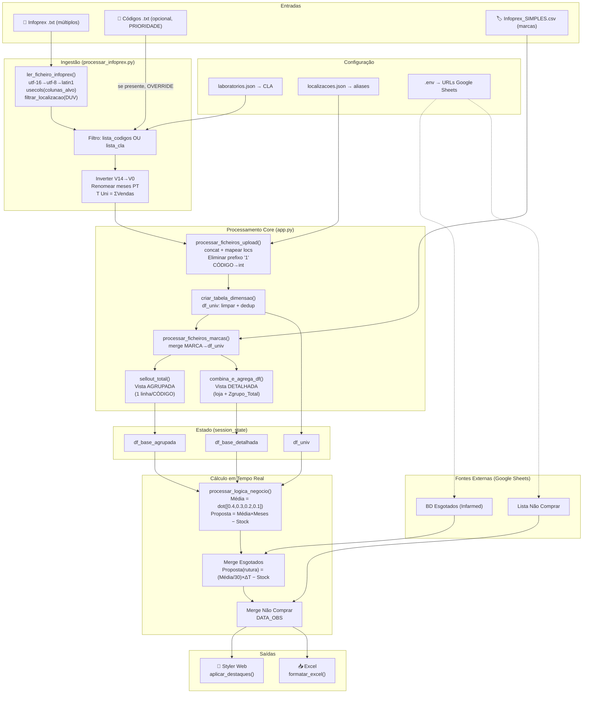

# PRD — Orders Master Infoprex (Reverse Engineering — DeepSeek)

> **Engenharia reversa por análise exaustiva do código-fonte.**
> Foco exclusivo: **Sell Out / Encomendas**. Redistribuição de Stocks totalmente excluída.
> Código-alvo: `app.py` (1049 linhas), `processar_infoprex.py` (172 linhas), configs.

---

## 1. Resumo Executivo

O **Orders Master Infoprex** é uma aplicação Streamlit que consome exportações `.txt` do módulo Infoprex do Sifarma — ficheiros tab-separated com vendas mensais de produtos por farmácia — e gera propostas de encomenda consolidadas. O pipeline integra: (a) parsing robusto de 3 encodings, (b) filtragem por laboratório (CLA) ou lista explícita de códigos, (c) normalização de designações e agregação multi-farmácia, (d) cálculo de média ponderada decrescente `[0.4, 0.3, 0.2, 0.1]` sobre 4 meses, (e) fusão com bases externas (esgotados Infarmed, lista colaborativa "não comprar"), e (f) exportação Excel com formatação condicional paritária ao ecrã.

A arquitectura separa rigorosamente a **agregação pesada** (I/O + `groupby` + `merge` — executada só ao premir o botão "Processar") dos **cálculos reactivos** (média, proposta, filtro marcas — recalculados a cada interacção sobre DataFrames em `session_state`). Isto produz uma experiência quasi-instantânea apesar de ficheiros de input com dezenas de MB. O sistema foi concebido para uso interno numa rede de múltiplas farmácias, tipicamente com 3-5 lojas e portefólios de centenas a milhares de CNPs.

---

## 2. Objectivos do Produto

1. **Consolidar vendas multi-loja** num único artefacto analítico, eliminando o trabalho manual de abrir 4+ ficheiros em Excel separados.
2. **Filtrar portefólio** por laboratório (via mapeamento CLA em JSON) ou por lista de CNPs (ficheiro `.txt`), com a lista TXT a ter prioridade absoluta.
3. **Calcular proposta quantitativa** de encomenda baseada em média ponderada de vendas e stock actual, ajustável pelo utilizador em número de meses de cobertura.
4. **Ajustar proposta para produtos em rutura** usando a base oficial do Infarmed — substitui a fórmula base por uma proporcional ao tempo até reposição prevista.
5. **Sinalizar visualmente** produtos a não comprar (roxo) e validades curtas (laranja) — tanto na UI como no Excel.
6. **Manter toda a configuração de negócio** (laboratórios, farmácias) em ficheiros JSON editáveis sem programação.
7. **Exportar com fidelidade visual** — o Excel descarregado é um espelho exacto da tabela no ecrã.

---

## 3. Âmbito e Exclusões

### Dentro de Âmbito
- Leitura e pré-processamento de ficheiros Infoprex `.txt` (`processar_infoprex.py`).
- Pipeline de agregação, proposta e exportação (`app.py`, excluindo a tab de redistribuição).
- Integrações Google Sheets (BD Esgotados, Produtos Não Comprar).
- Filtro dinâmico por marca via CSVs opcionais.
- Formatação condicional dupla (Styler HTML + openpyxl Excel).

### Fora de Âmbito (Exclusão Estrita)
Toda a componente de **Redistribuição Inteligente de Stocks** está excluída deste documento — não será mencionada novamente. Isto abrange `stockreorder.py`, `motor_redistribuicao.py`, `redistribuicao_v2.py` e o separador `tab_redistribuicao` (`app.py` linhas 969-1045).

---

## 4. Arquitectura do Sistema

### 4.1 Diagrama de Fluxo de Dados



### 4.2 Componentes e Ficheiros

| Ficheiro | Função | Linhas | Dependências |
|---|---|---|---|
| `app.py` | Orquestração Streamlit: UI, sidebar, agregação, lógica negócio, formatação, exportação Excel | 1049 | `streamlit`, `pandas`, `openpyxl`, `processar_infoprex` |
| `processar_infoprex.py` | Parser de ficheiros Infoprex: encoding fallback, filtragem DUV, inversão cronológica, renomeação dinâmica de meses | 172 | `pandas` |
| `laboratorios.json` | Dicionário `{NomeLab → [códigos CLA]}` — 35 laboratórios | 36 | — |
| `localizacoes.json` | Dicionário `{termo_busca → alias_curto}` — 4 farmácias | 6 | — |
| `.env` | `DATABASE_URL` e `GOOGLE_SHEETS` (URLs públicas das sheets) | 3 | — |

### 4.3 Dependências Externas

- **Python packages:** `streamlit`, `pandas`, `openpyxl`, `python-dotenv`, `unicodedata` (stdlib), `json`, `os`, `io`, `datetime`.
- **Google Sheets (2 URLs):** acedidas via `pd.read_excel(URL)` — formato `pub?output=xlsx`.
- **Ficheiros de utilizador:** `.txt` Infoprex (tab-separated), `.txt` de códigos, `.csv` Infoprex Simples (separador `;`).

---

## 5. Pipeline de Ingestão de Dados

### 5.1 Leitura de Ficheiros Infoprex (.txt)

Cada ficheiro é uma exportação tab-separated do Sifarma contendo as vendas de **uma única farmácia** ao longo de até 15 meses. A leitura usa `pd.read_csv(filepath, sep='\t', …)` com a chave `usecols` para carregar apenas as colunas estritamente necessárias (`processar_infoprex.py` linhas 73-91).

**Colunas carregadas:** 10 colunas base (`CPR`, `NOM`, `LOCALIZACAO`, `SAC`, `PVP`, `PCU`, `DUC`, `DTVAL`, `CLA`, `DUV`) + 15 colunas de vendas (`V0` a `V14`). As restantes colunas do export Infoprex (tipicamente 30+) são descartadas pelo parser.

### 5.2 Estratégia de Encoding

O sistema tenta três codificações em cascata (`processar_infoprex.py` linhas 80-91):

1. **`utf-16`** — primeiro alvo, por ser o encoding nativo dos exports do Windows/Sifarma.
2. **`utf-8`** — fallback para ficheiros re-exportados ou editados.
3. **`latin1`** — último recurso para ficheiros legacy.

Se nenhuma funcionar, é lançada `ValueError` com a mensagem "Codificação não suportada ou ficheiro corrompido." — esta excepção é capturada a montante (`processar_ficheiros_upload`, linha 252) e transformada em `st.error` amigável.

### 5.3 Optimização de Memória — usecols

O código define um `lambda` para `usecols` que filtra colunas ao nível do parser C do Pandas (`processar_infoprex.py` linhas 73-77):

```python
colunas_alvo = ['CPR','NOM','LOCALIZACAO','SAC','PVP','PCU','DUC','DTVAL','CLA','DUV'] \
             + [f'V{i}' for i in range(15)]
usecols_func = lambda x: x in colunas_alvo
```

**Impacto:** um ficheiro de 30-40 MB com 50+ colunas é reduzido a ~15-20 MB em RAM só com as colunas úteis. Multiplicado por 4 farmácias, a diferença pode ser a aplicação caber em 2 GB vs. 8 GB.

### 5.4 Filtragem de Localização (DUV)

Um ficheiro Infoprex pode conter resíduos de outras localizações. O sistema identifica a farmácia "dona" do ficheiro através da data de venda mais recente (`filtrar_localizacao`, linhas 9-35):

1. Converte `DUV` para datetime `format='%d/%m/%Y'`, `errors='coerce'`.
2. Calcula `data_mais_recente = df['DUV'].max()`.
3. Localiza a `localizacao_alvo` = `LOCALIZACAO` da primeira linha com `DUV == data_mais_recente`.
4. Filtra `df[df['LOCALIZACAO'] == localizacao_alvo]`.
5. Se não houver datas válidas (`pd.isna(data_mais_recente)`), devolve a DataFrame original sem filtrar (comportamento defensivo).

A `data_max` retornada é essencial para a renomeação dinâmica de meses (§5.6). A coluna `DUV` é consumida aqui e **não aparece na DataFrame final** (não está em `colunas_base`).

### 5.5 Inversão Cronológica de Meses

O Infoprex exporta `V0` = mês mais recente, `V14` = mês mais antigo. Para leitura humana natural, as colunas são invertidas (`processar_infoprex.py` linhas 124-130):

```python
vendas_invertidas = vendas_presentes[::-1]  # [V14, V13, ..., V1, V0]
df_filtrada = df_filtrada[base_presentes + vendas_invertidas]
```

Após a inversão, a coluna mais à esquerda é a venda mais antiga e a imediatamente anterior a `T Uni` é a mais recente.

### 5.6 Renomeação Dinâmica para Meses Portugueses

As colunas `V0..V14` são renomeadas com abreviaturas de mês em português (`JAN`, `FEV`, `MAR`, …, `DEZ`), calculadas a partir da `data_max` (`processar_infoprex.py` linhas 4-7, 145-170):

```python
MESES_PT = {1:'JAN', 2:'FEV', 3:'MAR', ..., 12:'DEZ'}
mes_alvo = data_max - pd.DateOffset(months=i)
nome_mes = MESES_PT[mes_alvo.month]
```

**Exemplo** com `data_max = 15/04/2026`: `V0→ABR`, `V1→MAR`, `V2→FEV`, …, `V14→FEV`.

### 5.7 Tratamento de Meses Duplicados

Com 15 meses de histórico, colisões são inevitáveis. O sistema replica a convenção nativa do Pandas (`processar_infoprex.py` linhas 146-168): a primeira aparição de cada mês fica com nome puro (`ABR`), as subsequentes recebem sufixo numérico (`ABR.1`, `ABR.2`). Isto garante compatibilidade com PyArrow (backend do Streamlit para serialização).

### 5.8 Cálculo de T Uni

```python
df_filtrada['T Uni'] = df_filtrada[vendas_presentes].sum(axis=1)
```
(`processar_infoprex.py` linha 133)

**T Uni** = soma de todas as 15 colunas de vendas. É a âncora posicional de toda a lógica de negócio (o código indexa-a para calcular a janela de 4 meses — ver §10.3). É também critério do filtro anti-zombies (§7.5) e limite visual da formatação roxa (§12.2).

### 5.9 Renomeação de Colunas Base

Após T Uni, aplica-se o mapeamento (`processar_infoprex.py` linhas 136-142):

| Infoprex | Sistema | Significado |
|---|---|---|
| `CPR` | `CÓDIGO` | CNP (Código Nacional do Produto) |
| `NOM` | `DESIGNAÇÃO` | Nome comercial |
| `SAC` | `STOCK` | Stock Actual em Casa |
| `PCU` | `P.CUSTO` | Preço de Custo Unitário |

`PVP`, `DUC` (Data Última Compra), `DTVAL` (Data Validade), `CLA`, `LOCALIZACAO` mantêm o nome original.

---

## 6. Ficheiros de Configuração

### 6.1 laboratorios.json

Dicionário plano com 35 laboratórios. Cada entrada mapeia `"NomeLab" → ["código_CLA1", "código_CLA2", …]`. Carregado por `carregar_laboratorios(mtime)` (`app.py` linhas 170-184) com invalidação automática por timestamp do ficheiro.

**Características notáveis:**
- CLAs alfanuméricos (`21E`, `40K`, `75A`, `38K`, `50N`, etc.) — o filtro compara-os como strings lowercase.
- Duplicados silenciosos: Elanco tem `"4629"` duas vezes; KRKA tem `"75A"` duas vezes.
- Sobreposições: Cooper e Mylan partilham `"1416"`.
- Nomes com underscore: `Jaba_OTC`.

### 6.2 localizacoes.json

Dicionário `{termo_busca: alias_curto}` com 4 entradas. Aplicado por `mapear_localizacao()` (`app.py` linhas 52-64) que faz **match por substring** case-insensitive no nome original e força o resultado em **Title Case**:

```python
nome_lower = nome.lower()
for chave, valor in dict_locs.items():
    if chave.lower() in nome_lower:
        return valor.title()
```

**Consequências:** o match por substring pode causar falsos positivos (ex: `"ilha"` bate em `"Vilha"`). O `.title()` força a capitalização independentemente do que está no JSON (ex: `"colmeias"` → `"Colmeias"`). Aplicada tanto no processamento base como na lista Não Comprar.

### 6.3 .env

Duas variáveis carregadas por `load_dotenv()` (`app.py` linha 17):

| Variável | Destino | Função |
|---|---|---|
| `DATABASE_URL` | `obter_base_dados_esgotados()` | URL pública Google Sheet dos esgotados Infarmed |
| `GOOGLE_SHEETS` | `load_produtos_nao_comprar()` | URL pública Google Sheet dos produtos a não comprar |

Se ausentes, as funções correspondentes devolvem DataFrames vazios (e `DATABASE_URL` emite `st.sidebar.warning`).

---

## 7. Sistema de Filtragem Multi-Nível

### 7.1 Prioridade Máxima: Ficheiro TXT de Códigos

**Upload:** `st.file_uploader` na sidebar com `key="upload_txt_codigos"` (`app.py` linhas 660-661).

**Extracção:** `extrair_codigos_txt()` (`processar_infoprex.py` linhas 37-61) — lê linhas uma a uma, aceita apenas linhas que sejam **estritamente dígitos** (`isdigit()`). Cabeçalhos como `"CNP"` e linhas vazias são automaticamente ignorados.

**Aplicação no parser:** se a lista não estiver vazia, filtra a DataFrame por `CPR.isin(lista_codigos_str)` (`processar_infoprex.py` linhas 103-106). A verificação é case-insensitive com `.strip().lower()`.

**Regra de precedência:** `if lista_codigos … elif lista_cla …` — o ramo dos códigos ocupa o `if`, tornando o filtro por CLA inalcançável quando um TXT está carregado. Esta propriedade é comunicada ao utilizador em dois locais: legenda sidebar e expander de documentação.

### 7.2 Filtro por Laboratório (CLA)

**Selecção:** `st.multiselect` populado com as chaves ordenadas de `laboratorios.json` (`app.py` linha 650).

**Expansão dos CLAs:** `processar_ficheiros_upload` (linhas 234-237) coleta todos os códigos CLA dos laboratórios seleccionados via `lista_cla.extend(_dicionario_labs.get(lab, []))`. O `.get(lab, [])` tolera silenciosamente laboratórios que não existem no dicionário.

**Aplicação:** `df['CLA'].astype(str).str.strip().str.lower().isin(lista_cla_str)` — comparação por string, case-insensitive.

### 7.3 Eliminação de Códigos Locais (Prefixo "1")

Após o `concat` multi-ficheiro e o mapeamento de localizações, todos os códigos começados por `"1"` são removidos (`app.py` linhas 267-269):

```python
mask_local = df_final['CÓDIGO'].astype(str).str.strip().str.startswith('1')
df_final = df_final[~mask_local].copy()
```

**Justificação:** na convenção farmacêutica portuguesa, CNPs começados por `1` são códigos internos atribuídos pela farmácia a artigos não-registados nacionalmente — não devem entrar em propostas de encomenda.

### 7.4 Conversão de CÓDIGO para Inteiro

Após a remoção dos códigos locais, o sistema tenta converter `CÓDIGO` para `int` (`app.py` linhas 275-287):

1. `pd.to_numeric('CÓDIGO', errors='coerce')` → coluna `CÓDIGO_NUM`.
2. Linhas com `NaN` (não-numéricas) são identificadas e os seus códigos originais são colectados em `codigos_invalidos`.
3. As linhas inválidas são removidas.
4. `df_final['CÓDIGO'] = df_final['CÓDIGO_NUM'].astype(int)`.
5. `CÓDIGO_NUM` é descartada.

Os códigos inválidos são apresentados ao utilizador como warning amarelo (§14.8).

### 7.5 Filtro Anti-Zombies

Aplicado em dois momentos:

**Nível 1 — nos motores de agregação** (`sellout_total` linha 300, `combina_e_agrega_df` linha 355):
```python
filtro = (STOCK != 0) | (T Uni != 0)
```
Remove produtos sem stock E sem vendas — zombies completos que não justificam análise.

**Nível 2 — pós-agregação detalhada** (`remover_linhas_sem_vendas_e_stock`, linhas 406-413): identifica códigos cuja linha `Zgrupo_Total` tem `STOCK=0 AND T Uni=0` e remove **todas** as linhas desse código (incluindo as das farmácias individuais). Isto captura casos de zombies parciais (stock residual numa loja, zero vendas na rede toda).

---

## 8. Motor de Agregação

### 8.1 Tabela Dimensão (Master List)

`criar_tabela_dimensao()` (`app.py` linhas 145-160) produz a fonte canónica `(CÓDIGO → DESIGNAÇÃO)`:

1. Extrai `['CÓDIGO', 'DESIGNAÇÃO']`.
2. Aplica `limpar_designacao()` a cada nome.
3. `drop_duplicates(subset=['CÓDIGO'], keep='first')` — fica com a primeira ocorrência.
4. Resultado: `df_univ` (tabela dimensão com 1 linha por CNP único).

### 8.2 Limpeza de Designações

`limpar_designacao()` (`app.py` linhas 133-142):
- **Remoção de acentos:** decomposição Unicode NFD + filtragem de categoria `Mn` (nonspacing marks). `"ÁçúcaR"` → `"AcucaR"`.
- **Remoção de asteriscos** (`*`) — marcador Sifarma de particularidades.
- **Title Case:** `.strip().title()` — `"ben-u-ron 500mg"` → `"Ben-U-Ron 500Mg"`.

### 8.3 Vista Agrupada — `sellout_total()`

(`app.py` linhas 298-350) — uma linha por código para todo o grupo.

**Pipeline:**
1. Filtro anti-zombies.
2. Define `colunas_nao_somar` (8 colunas de metadata).
3. `groupby('CÓDIGO')[resto].sum()`.
4. `PVP_Médio` = `groupby('CÓDIGO')['PVP'].mean().round(2)`.
5. `P.CUSTO_Médio` = `groupby('CÓDIGO')['P.CUSTO'].mean().round(2)`.
6. Merge com `df_univ` para acoplar designação limpa.
7. Renomeia `PVP→PVP_Médio`, `P.CUSTO→P.CUSTO_Médio`.
8. Reordena: `CÓDIGO, DESIGNAÇÃO, PVP_Médio, P.CUSTO_Médio, …meses, T Uni, STOCK, …`.
9. Ordena por `[DESIGNAÇÃO, CÓDIGO]` ascendente.

**Colunas perdidas:** `LOCALIZACAO`, `DUC`, `DTVAL`, `CLA` — não sobrevivem ao `groupby(sum)` e não são reintroduzidas.

### 8.4 Vista Detalhada — `combina_e_agrega_df()`

(`app.py` linhas 353-403) — preserva linhas por farmácia E adiciona linha `Zgrupo_Total` por código.

**Pipeline:**
1. Filtro anti-zombies.
2. Agregação idêntica a §8.3 (passos 2-5).
3. `grouped_df['LOCALIZACAO'] = 'Zgrupo_Total'` — força o rótulo de grupo.
4. Remove `DESIGNAÇÃO` da original, faz `concat(original, grouped_df)`.
5. Merge com `df_univ` para repor designações limpas.
6. Reordena colunas: `CÓDIGO, DESIGNAÇÃO, LOCALIZACAO, …`.
7. Ordena: `[DESIGNAÇÃO, CÓDIGO, LOCALIZACAO]` ascendente.

**Porquê o prefixo `Z`:** puro truque de ordenação — como a ordenação é alfabética ascendente, `Z*` cai sempre depois de qualquer nome de farmácia real, garantindo que a linha de total aparece em último lugar dentro de cada grupo `(DESIGNAÇÃO, CÓDIGO)`.

### 8.5 Médias de PVP e P.CUSTO

Ambos os motores calculam **média aritmética simples** (não ponderada por volume):
```python
pvp_medio_df  = df.groupby('CÓDIGO')['PVP'].mean().round(2)
pcusto_medio_df = df.groupby('CÓDIGO')['P.CUSTO'].mean().round(2)
```

Uma farmácia que vende 10 unidades pesa o mesmo que uma que vende 10.000 no cálculo do preço médio. Para PVP o impacto é negligenciável (preços são tabelados); para P.CUSTO pode mascarar descontos negociados por volume.

**Assimetria de renomeação:** na vista agrupada, `sellout_total` renomeia `PVP→PVP_Médio` e `P.CUSTO→P.CUSTO_Médio` internamente. Na vista detalhada, `combina_e_agrega_df` **não** faz esta renomeação — é feita a posteriori em `main()` (linha 823-824): `df_detalhada.rename(columns={'PVP': 'PVP_Médio'})`. A coluna `P.CUSTO` mantém o nome original na vista detalhada.

### 8.6 Reordenação de Colunas

**Agrupada** (linhas 336-344): insere `DESIGNAÇÃO` em posição 1, `PVP_Médio` em 2, `P.CUSTO_Médio` em 3.

**Detalhada** (linhas 395-400): insere `DESIGNAÇÃO` em posição 1 (o restante mantém a ordem pós-merge).

### 8.7 Ordenação Estrita

| Vista | Colunas de ordenação | Direcção |
|---|---|---|
| Agrupada | `['DESIGNAÇÃO', 'CÓDIGO']` | Ascendente |
| Detalhada | `['DESIGNAÇÃO', 'CÓDIGO', 'LOCALIZACAO']` | Ascendente |

A ordenação é executada **antes** de qualquer cálculo de proposta — a ordem visual reflecte a hierarquia designativa, independente do valor calculado.

---

## 9. Sistema de Marcas (Filtro Dinâmico)

### 9.1 Ingestão de CSVs

`processar_ficheiros_marcas()` (`app.py` linhas 187-221), chamada dentro do handler de processamento (linha 807).

**Características:**
- Múltiplos ficheiros via `accept_multiple_files=True`.
- `usecols=['COD', 'MARCA']` — só carrega estas duas colunas.
- Separador `;` (CSV europeu).
- `on_bad_lines='skip'` — tolerância a linhas malformadas.
- Limpeza: strip, substituição de vazios/NaN/None por `pd.NA`, `dropna`, conversão COD→int, dedup por COD.

### 9.2 Merge com Tabela Dimensão

(`app.py` linhas 807-814):
```python
if not df_marcas.empty:
    df_univ = pd.merge(df_univ, df_marcas, left_on='CÓDIGO', right_on='COD', how='left')
    df_univ.drop(columns=['COD'], inplace=True)
else:
    df_univ['MARCA'] = pd.NA
```

A coluna `MARCA` é sempre criada (garantia de schema). Left join: produtos sem correspondência ficam `MARCA=NaN`.

### 9.3 Isolamento Matemático — Drop Preventivo

**Ordem crítica** (`app.py` linhas 918-923):
1. Aplica filtro: `df[df['MARCA'].isin(marcas_selecionadas)]`.
2. **Drop imediato:** `df.drop(columns=['MARCA'])`.
3. Só depois: procura de `idx_tuni`, cálculo de proposta, renderização.

Se a `MARCA` permanecesse, deslocaria `T Uni` uma posição para a direita e os offsets negativos `idx_tuni - N` apontariam para a coluna errada — bug catastrófico silencioso.

### 9.4 Widget com Key Dinâmica

```python
multiselect_key = "marcas_multiselect"
if st.session_state.last_labs:
    multiselect_key += "_" + "_".join(st.session_state.last_labs)
```
(`app.py` linhas 863-865)

**Propósito:** o Streamlit persiste o estado de widgets pela `key`. Ao trocar de laboratório, as marcas seleccionadas anteriormente (inexistentes no novo portefólio) permaneceriam "fantasma". A key dinâmica força o widget a reinicializar com estado limpo.

**Default:** todas as marcas seleccionadas (`default=marcas_disponiveis`) — o filtro começa "transparente".

### 9.5 Opções Extraídas da df_base_agrupada

(`app.py` linhas 855-860):
```python
marcas_disponiveis = st.session_state.df_base_agrupada['MARCA'].dropna().unique().tolist()
```

**Decisão arquitectural:** usar `df_base_agrupada` (já filtrada por labs/codigos/anti-zombies) em vez de `df_univ` (master list completa). Garante que o dropdown só mostra marcas com produtos activos e visíveis, evitando o cenário "seleccionei uma marca e a tabela ficou vazia".

---

## 10. Lógica de Cálculo de Propostas

Concentrada em `processar_logica_negocio()` (`app.py` linhas 451-524). Executa a cada rerun sobre DataFrames em `session_state`.

### 10.1 Média Ponderada

**Fórmula:**

$$
\text{Media} = \sum_{i=1}^{4} w_i \cdot V_i \qquad w = [0.4,\ 0.3,\ 0.2,\ 0.1]
$$

**Implementação:** `df['Media'] = df[cols_selecionadas].dot(pesos)` (`app.py` linha 458). O `.dot()` é vectorizado — cada linha recebe o produto escalar dos 4 meses × 4 pesos numa única operação.

**Propriedades:** pesos decrescentes (mês mais recente 4× o mais antigo), soma = 1.0, hardcoded no callsite (`app.py` linha 944).

### 10.2 Toggle do Mês de Referência

**Widget:** `st.toggle("Média Ponderada com Base no mês ANTERIOR?")` (`app.py` linha 878).

**Indexação** (`app.py` linhas 928-933):
```python
idx_tuni = colunas_totais.index('T Uni')
if anterior:   indices = [idx_tuni-2, idx_tuni-3, idx_tuni-4, idx_tuni-5]
else:          indices = [idx_tuni-1, idx_tuni-2, idx_tuni-3, idx_tuni-4]
```

| Toggle | Janela | Interpretação de negócio |
|---|---|---|
| OFF | Meses `[T Uni -1 .. -4]` | Inclui o mês mais recente exportado (mês "actual") |
| ON | Meses `[T Uni -2 .. -5]` | Ignora o mês actual (vendas incompletas), usa os 4 meses anteriores completos |

### 10.3 Indexação Relativa — Porquê Nunca por Nome

O código **nunca** referencia meses pelo nome (`"ABR"`, `"MAI"`). Usa sempre `colunas_totais.index('T Uni')` com offsets negativos. Motivo: os nomes são dinâmicos (§5.6) e dependem da `DUV` máxima do ficheiro. Usar strings obrigaria a recomputar nomes; usar posição é invariante.

**Dependência crítica:** isto só funciona se **todas** as colunas entre `T Uni - 5` e `T Uni - 1` forem colunas de vendas. É por isso que o drop de `MARCA` (§9.3) tem de ocorrer **antes** de encontrar `idx_tuni`.

### 10.4 Proposta Base

**Fórmula:**

$$
\text{Proposta} = \text{round}\left(\text{Media} \cdot \text{Meses} - \text{STOCK}\right) \in \mathbb{Z}
$$

(`app.py` linha 459-460): `df['Proposta'] = (df['Media'] * valor_previsao - df['STOCK']).round(0).astype(int)`.

**Interpretação:** `Media × Meses` = consumo estimado no horizonte. Subtrai-se o stock actual. `Proposta > 0` → comprar. `Proposta ≤ 0` → stock actual cobre ou excede a previsão. O sistema **não faz clamp a zero** — valores negativos são preservados.

### 10.5 Proposta com Rutura

Quando o produto está na BD de esgotados, a fórmula é substituída:

$$
\text{Proposta}_{\text{rutura}} = \text{round}\left(\frac{\text{Media}}{30} \cdot \Delta T - \text{STOCK}\right) \in \mathbb{Z}
$$

**onde** $\Delta T = (\text{Data\_Prevista\_Reposição} - \text{Hoje}).\text{days}$

(`calcular_proposta_esgotados`, `app.py` linhas 431-438):
```python
mask = df[col_timedelta].notna()
df.loc[mask, col_proposta] = (
    (df.loc[mask, col_media] / 30) * df.loc[mask, col_timedelta] - df.loc[mask, col_stock]
).round(0).astype(int)
```

**Só sobrescreve** linhas com `TimeDelta` não-nulo (i.e., produtos que efectivamente estão na lista de esgotados). `Media/30` assume mês de 30 dias para obter vendas diárias.

**Edge cases:** `ΔT < 0` (reposição já passou) → proposta baixa/negativa (comportamento passivo — não há clamp). `ΔT` muito pequeno → proposta ≈ `−STOCK`.

### 10.6 Slider de Meses a Prever

**Widget:** `st.number_input` (não um slider HTML — é input numérico) (`app.py` linhas 905-908):
```python
st.number_input(label="Meses a prever", label_visibility="collapsed",
                min_value=1.0, max_value=4.0, value=1.0, step=0.1, format="%.1f",
                key="input_meses_encomenda")
```

**Parâmetros reais:** `min=1.0`, `max=4.0`, `step=0.1`, `default=1.0`. Feedback visual: `st.write(f"A Preparar encomenda para {valor:.1f} Meses")`.

---

## 11. Integrações Externas

### 11.1 BD de Esgotados (Infarmed)

`obter_base_dados_esgotados()` (`app.py` linhas 71-104). Cache: `@st.cache_data(ttl=3600)`.

**Colunas consumidas da sheet:**
`Número de registo`, `Nome do medicamento`, `Data de início de rutura`, `Data prevista para reposição`, `TimeDelta`, `Data da Consulta`.

**Transformações:**
1. `Número de registo → str` (para merge).
2. `TimeDelta` original → `pd.to_numeric` (histórico, será sobrescrito).
3. `Data da Consulta` → extrai `[:10]` do primeiro valor para exibição no banner.
4. **Recalcula TimeDelta:** substitui o valor da sheet por `(Data_Prevista_Reposição − hoje).days` — garante actualidade independente de quando a sheet foi preenchida.
5. Formata datas após merge em `processar_logica_negocio`: `DIR` e `DPR` em formato `'%d-%m-%Y'`. Coluna `TimeDelta` é **descartada** pós-cálculo.

### 11.2 Lista de Produtos a Não Comprar

`load_produtos_nao_comprar(_dict_locs)` (`app.py` linhas 107-126). Cache: `@st.cache_data(ttl=3600)`.

**Schema esperado:** `CNP` (código), `FARMACIA` (nome da loja), `DATA` (data `%d-%m-%Y`).

**Pipeline:**
1. Carrega via `pd.read_excel(GOOGLE_SHEETS)`.
2. Aplica `mapear_localizacao` a `FARMACIA` para alinhar com os aliases.
3. Converte `CNP→str`, `DATA→datetime`.
4. Ordena `[CNP, FARMACIA, DATA]` descendente em DATA, `drop_duplicates(CNP+FARMACIA, keep='first')` — fica a linha mais recente para cada par código-loja.

**Merge duplo em `processar_logica_negocio`** (linhas 499-517):

| Vista | Colunas de merge left | right | Resultado |
|---|---|---|---|
| Agrupada (`agrupado=True`) | `CÓDIGO_STR` | `CNP` (dedup por CNP, DATA mais recente) | O produto aparece marcado "não comprar" se **alguma** farmácia o tiver marcado |
| Detalhada (`agrupado=False`) | `[CÓDIGO_STR, LOCALIZACAO]` | `[CNP, FARMACIA]` | O marcador respeita a granularidade da loja |

Após o merge, `DATA` é renomeada para `DATA_OBS`. Colunas auxiliares (`CNP`, `FARMACIA`, `CÓDIGO_STR`) são removidas.

---

## 12. Regras de Formatação Visual

Duas implementações paralelas mas equivalentes: `aplicar_destaques()` (Styler/HTML, linhas 527-561) e `formatar_excel()` (openpyxl, linhas 564-632).

### Tabela-Resumo

| # | Condição | Cor Fundo | Cor Texto | Bold | Âmbito | Prioridade |
|---|---|---|---|---|---|---|
| 1 | `LOCALIZACAO` ∈ `{ZGrupo_Total, Zgrupo_Total}` | `#000000` | `#FFFFFF` | Sim | **Linha inteira** | Máxima (`return` imediato no Styler / `continue` no Excel) |
| 2 | `DATA_OBS ≠ NaN` | `#E6D5F5` roxo claro | `#000000` | Não | Da coluna 1 até `T Uni` **inclusive** | 2ª |
| 3 | `DIR ≠ NaN` | `#FF0000` vermelho | `#FFFFFF` | Sim | Apenas célula `Proposta` | 3ª |
| 4 | `DTVAL` com `(validade − hoje) ≤ 4 meses` | `#FFA500` laranja | `#000000` | Sim | Apenas célula `DTVAL` | 4ª |

### 12.1 Linha Zgrupo_Total

Styler: `return ['background-color: black; font-weight: bold; color: white'] * len(linha)` (linha 531).

Excel: itera por todas as células da linha (`for cell in row:`) aplicando `font_total` (bold #FFFFFF) + `fill_total` (#000000), depois `continue` para saltar as restantes regras (linhas 596-600).

Nota: ambas as implementações aceitam duas grafias (`Zgrupo_Total` e `ZGrupo_Total`) embora o código gere apenas a primeira.

### 12.2 Produtos Não Comprar

**Âmbito preciso:** colunas da posição 1 até `T Uni` (índice Python → `range(idx_t_uni + 1)` no Styler, `range(1, col_t_uni + 1)` no Excel). As colunas posteriores (`STOCK`, `Proposta`, etc.) ficam com fundo normal — preservam legibilidade.

### 12.3 Produtos em Rutura

**Sinal:** existência de `DIR` (Data de Início de Rutura) não-nula — indica proveniência da BD Esgotados. Apenas a célula `Proposta` é pintada de vermelho.

### 12.4 Validade Próxima

**Parsing:** assume formato `MM/YYYY` (validade por mês/ano). Calcula `diff_meses = (ano − ano_corrente) × 12 + (mês − mês_corrente)`.

Alerta se `diff_meses ≤ 4`. Excepções de parsing são capturadas com `bare except: pass` — sem log.

### 12.5 Paridade Web ↔ Excel

A duplicação de lógica é intencional: Pandas Styler gera CSS para HTML; Excel requer openpyxl. As duas implementações têm de ser mantidas sincronizadas manualmente. Qualquer nova regra de formatação exige edição nos dois locais.

---

## 13. Exportação Excel

### 13.1 Limpeza de Colunas Auxiliares

Antes da exportação, `CLA` é removido via `df_view = df_final.drop(columns=['CLA'], errors='ignore')` (linha 952). `MARCA` já foi removida antes (§9.3).

### 13.2 Pipeline openpyxl

`formatar_excel()` (linhas 564-632):

1. `df.to_excel(BytesIO, index=False)` → serializa dados.
2. `load_workbook(BytesIO)` → reabre para estilização.
3. Define pares `(Font(bold, color), PatternFill(start, end, solid))` para cada regra.
4. Lê cabeçalho (`ws[1]`) para mapear nomes de colunas → índices 1-based.
5. Itera `ws.iter_rows(min_row=2)` aplicando as 4 regras.
6. `wb.save(new BytesIO)` → devolve.

**Limitações:** sem largura automática, sem freeze panes, sem autofiltro, cabeçalhos com estilo default.

### 13.3 Download

`st.download_button(label="Download Excel Encomendas", data=excel_data, file_name='Sell_Out_GRUPO.xlsx', mime="…spreadsheetml.sheet")`. Nome fixo — sem data/hora/laboratório no nome do ficheiro.

---

## 14. Interface de Utilizador

### 14.1 Configuração de Página

`st.set_page_config(page_title="Orders Master Infoprex", page_icon="📦", layout='wide', initial_sidebar_state="expanded")`.

### 14.2 Sidebar — 4 Blocos Hierárquicos

`render_sidebar()` (linhas 639-693):

| # | Bloco | Widget | Tipo | Key |
|---|---|---|---|---|
| 1 | Filtrar por Laboratório | `multiselect` | selecção múltipla | default |
| 2 | Filtrar por Códigos (Prioridade) | `file_uploader` | `.txt` único | `upload_txt_codigos` |
| 3 | Dados Base (Infoprex) | `file_uploader` | `.txt` múltiplos | `uploader_infoprex` |
| 4 | Base de Marcas (Opcional) | `file_uploader` | `.csv` múltiplos | `uploader_marcas` |

+ `st.sidebar.divider()` entre 2 e 3. Botão "🚀 Processar Dados" no fim (`type="primary", width='stretch'`).

### 14.3 Banner da Data de Consulta

Bloco HTML com gradiente (`#e0f7fa→#f1f8e9`), ícone 🗓️, exibe `data_consulta` (valor da coluna `Data da Consulta` da sheet, truncado a 10 chars). Fallback: `"Não foi possível carregar a INFO"`.

### 14.4 Expander de Documentação

`st.expander` com explicação dos formatos, workflow passo-a-passo, e referência aos ficheiros JSON editáveis. Usa emojis como cabeçalhos visuais (📂, ⚙️, 🔄).

### 14.5 Expander de Códigos CLA

Mostra os códigos CLA correspondentes a cada laboratório seleccionado. Se nenhum lab seleccionado, mostra `st.info`.

### 14.6 Toggle de Vista

`st.toggle("Ver Detalhe de Sell Out?")`. OFF → `df_base_agrupada`. ON → `df_base_detalhada`. O valor é passado para `processar_logica_negocio(agrupado=not on)` — controla o modo de merge com a lista Não Comprar.

### 14.7 Detecção de Filtros Obsoletos

Compara `last_labs` / `last_txt_name` (guardados no último "Processar Dados") com os valores actuais da sidebar. Se diferirem, mostra `st.warning` amarelo informando que os dados estão desactualizados — **não bloqueia** a visualização.

### 14.8 Exibição de Erros e Avisos

| Origem | Tipo | Conteúdo |
|---|---|---|
| `ler_ficheiro_infoprex` → encoding inválido | `st.error` | "Ficheiro corrompido ou encoding não suportado" |
| `ler_ficheiro_infoprex` → sem CPR/DUV | `st.error` | "Verifique se não carregou o ficheiro errado no local do Infoprex" |
| Códigos não-inteiros | `st.warning` | Lista dos códigos descartados |
| Zero ficheiros Infoprex | `st.sidebar.error` | "Por favor, carregue pelo menos um ficheiro Infoprex" |
| Erro integração esgotados | `st.warning` | Mensagem genérica com `str(e)` |
| Erro integração não comprar | `st.warning` | Idem |

---

## 15. Gestão de Estado

### 15.1 Variáveis em session_state

Inicializadas em `main()` (linhas 765-777):

| Chave | Tipo | Propósito |
|---|---|---|
| `df_base_agrupada` | DataFrame | Vista agrupada pré-computada |
| `df_base_detalhada` | DataFrame | Vista detalhada + Zgrupo_Total |
| `df_univ` | DataFrame | Tabela dimensão com designações e marcas |
| `last_labs` | list\|None | Laboratórios do último processamento |
| `last_txt_name` | str\|None | Nome do TXT usado no último processamento |
| `erros_ficheiros` | list[str] | Mensagens de erro da ingestão |
| `codigos_invalidos` | list[str] | Códigos descartados na conversão |

### 15.2 Desacoplamento Agregação ↔ Cálculo

| Fase | Gatilho | Custo | Persistência |
|---|---|---|---|
| Agregação base | Botão "Processar Dados" | Alto (I/O + groupby + merge) | `session_state` |
| Cálculo reactivo | Qualquer widget | Baixo (`.dot()` + merges em RAM) | Efêmero (recriado cada rerun) |

### 15.3 Estratégia de Cache

| Função | TTL | show_spinner | Invalidação |
|---|---|---|---|
| `carregar_localizacoes` | ∞ | default | Só restart |
| `carregar_laboratorios(mtime)` | ∞ | default | Por `mtime` do ficheiro |
| `obter_base_dados_esgotados` | 3600s | "🔄 A carregar..." | Tempo |
| `load_produtos_nao_comprar(_dict_locs)` | 3600s | "🔄 A carregar..." | Tempo |
| `processar_ficheiros_marcas` | ∞ | False | Por hash do ficheiro |
| `processar_ficheiros_upload` | ∞ | False | Por hash dos argumentos |

Parâmetros com prefixo `_` (ex: `_dict_locs`) são excluídos da chave de hashing (dicionários não são hashable).

### 15.4 Invalidação por mtime

`carregar_laboratorios(get_file_modified_time('laboratorios.json'))` — cada alteração ao ficheiro altera o timestamp → novo `mtime` → cache miss → recarga. `localizacoes.json` **não** tem este mecanismo.

---

## 16. Performance e Limites

### 16.1 styler.render.max_elements

`pd.set_option("styler.render.max_elements", 1000000)` (linha 32). Default do Pandas é 262.144. Com 3000 produtos × 5 farms × 20 colunas = 300.000 células, o default seria ultrapassado.

### 16.2 usecols no Parser

Já documentado (§5.3). Em números: ficheiros de 30-40 MB com 50+ colunas → ~50% de redução em memória só com `usecols`.

### 16.3 Carga com Múltiplas Farmácias

Ficheiros de exemplo no repo: `Guia.txt` (39 MB), `Ilha.txt` (26 MB), `Colmeias.txt` (27 MB), `Souto.txt` (29 MB). Com 4 farmácias, o parse sequencial carrega ~120 MB antes da filtragem. O uso de `usecols` + filtro precoce (CLA/códigos dentro do parser) reduz isto para <1% do volume original na fase de agregação.

---

## 17. Tratamento de Erros

### 17.1 Validação Estrutural

`processar_infoprex.py` linha 94: se `CPR` ou `DUV` ausentes → `ValueError` com mensagem orientadora. Capturado em `processar_ficheiros_upload` (linha 252) e adicionado a `erros_ficheiros`.

### 17.2 Fallback de Encoding

3 tentativas (§5.2). Última falha → `ValueError`.

### 17.3 Try/Except por Ficheiro

```python
for ficheiro in ficheiros:
    try: ... except ValueError: ... except Exception: ...
```
(`app.py` linhas 246-256). Um ficheiro corrompido **não aborta** os outros.

### 17.4 Erros Amigáveis vs. Silenciosos

| Categoria | Exemplos | Tratamento |
|---|---|---|
| Amigáveis | Encoding inválido, CPR/DUV ausentes, códigos não-int | `st.error` / `st.warning` |
| Silenciosos | Parsing de `DTVAL` falha, Google Sheet offline | `except: pass` / DataFrame vazio |

Os bare excepts nas funções de formatação (linhas 558-559, 626-627) mascaram bugs reais — se o formato de `DTVAL` mudar, o alerta laranja desaparece sem qualquer aviso.

---

## 18. Análise Crítica — O que está BEM ✅

1. **Arquitectura de desacoplamento.** A separação agregação-pesada-once / cálculo-reactivo-sempre é a decisão mais impactante do sistema. Sem ela, cada slider causaria 30 segundos de I/O.

2. **`usecols` com lambda em ambos os parsers.** Reduz footprint de memória em ~50% e previne `KeyError` em ficheiros com schema ligeiramente diferente.

3. **Fallback de encoding em 3 camadas.** Cobre praticamente todos os cenários reais de export do Sifarma. A ordem `utf-16→utf-8→latin1` está correcta (por frequência de ocorrência).

4. **Filtro aplicado dentro do parser (antes do concat).** Optimização genuína — filtrar por CLA/códigos enquanto o ficheiro é lido reduz a DataFrame em 99% antes de qualquer operação pesada.

5. **Isolamento da coluna MARCA.** O padrão "filtrar → drop imediato → procurar `T Uni`" é elegante e previne uma classe inteira de bugs posicionais. Documentação em `gemini.MD` reforça a intencionalidade.

6. **Chave dinâmica no multiselect de marcas.** Solução precisa para o problema de "estado fantasma" do Streamlit — bem documentada, bem implementada.

7. **Opções do dropdown extraídas da DataFrame filtrada (não da master).** Decisão de UX refinada: só aparecem marcas que produzem resultados.

8. **Indexação posicional por `T Uni` (nunca por nome).** Invariante crítico face à natureza dinâmica dos nomes de meses. A alternativa (procurar strings) seria frágil.

9. **Invalidação de cache `laboratorios.json` por `mtime`.** Padrão avançado e correcto — permite edição hot do ficheiro de configuração.

10. **Paridade Styler ↔ openpyxl.** Apesar da duplicação, garante que o utilizador vê exactamente o que descarrega.

11. **Granularidade por ficheiro nos try/except.** Um export corrompido não bloqueia o processamento das restantes farmácias — crucial em ambiente multi-loja.

12. **Recálculo dinâmico do `TimeDelta`.** Substituir o valor cacheado da sheet por `(DPR − hoje).days` é matematicamente correcto e mantém a fórmula rutura actualizada.

13. **Configuração em JSON.** Ficheiros `laboratorios.json` e `localizacoes.json` permitem ao pessoal de negócio manter o sistema sem abrir código Python.

14. **Mensagens de erro contextualizadas.** "Verifique se não carregou o ficheiro errado no local do Infoprex" é muito mais útil que um stack trace.

15. **Auto-limpeza de colunas auxiliares.** `CLA`, `MARCA`, `CÓDIGO_STR`, `CÓDIGO_NUM`, `CNP`, `FARMACIA`, `TimeDelta`, `Número de registo` — todas removidas antes da renderização/exportação. O utilizador nunca vê poluição técnica.

---

## 19. Análise Crítica — Lacunas e Fragilidades ⚠️

1. **Zero cobertura de testes.** Existe pasta `tests/` mas nenhum teste visível no repositório. Cálculos críticos (filtro anti-zombies, fórmula rutura, indexação posicional) sem fixtures de regressão.

2. **Código duplicado entre `sellout_total` e `combina_e_agrega_df`.** ~70% das linhas são idênticas. Alterar uma regra exige editar duas funções — risco constante de divergência.

3. **Média de P.CUSTO não é ponderada por volume.** Farmácia A (10.000 unidades) pesa o mesmo que farmácia B (50 unidades). Pode mascarar acordos comerciais.

4. **`laboratorios.json` com duplicados.** Elanco: `"4629"` 2×; KRKA: `"75A"` 2×. Inofensivos mas indiciam ausência de validação de schema.

5. **Sobreposição de CLAs entre laboratórios.** Cooper e Mylan partilham `"1416"`. Sem regra de tie-breaking documentada.

6. **`localizacoes.json` sem invalidação por `mtime`.** Ao contrário de `laboratorios.json`, editar `localizacoes.json` exige restart.

7. **Match por substring em `mapear_localizacao`.** A chave `"ilha"` bate em qualquer nome que contenha estas 4 letras. Bastava um `word boundary` ou `^$`.

8. **`bare except: pass` em duas funções.** Parsing de `DTVAL` (linhas 558 e 626) — se o formato mudar, perde-se o alerta laranja sem qualquer aviso.

9. **Nome do Excel fixo.** `Sell_Out_GRUPO.xlsx` não incorpora data nem parâmetros do filtro. Downloads sucessivos são indistinguíveis.

10. **Slider de meses limitado a 4.0.** Muitos cenários farmacêuticos justificam valores superiores (sazonalidade, compras promocionais). Limite arbitrário.

11. **Toggle "ANTERIOR" sem protecção para produtos recentes.** Se um produto tem <5 meses de vendas, `idx_tuni - 5` aponta para metadata — resultado corrompido.

12. **Sem logging estruturado.** `print()` em produção; `LOG_ERRO.txt` no repositório não está ligado ao código.

13. **Secrets em `.env` no directório.** As URLs das Google Sheets expõem dados completos. Deveriam estar em `.streamlit/secrets.toml` ou vault.

14. **Dependências externas voláteis sem versioning.** As Google Sheets podem mudar de schema a qualquer momento, partindo a integração sem aviso.

15. **Sem constantes centralizadas.** Strings mágicas (`'Zgrupo_Total'`, `'CÓDIGO'`, `'T Uni'`, `'DATA_OBS'`) espalhadas por dezenas de linhas. Refactors de renomeação são arriscados.

16. **Acoplamento forte entre UI e lógica de negócio.** Tudo num só ficheiro `app.py` de 1049 linhas. Impossível testar a lógica sem levantar Streamlit.

17. **Sem audit trail.** Não há registo de quem executou que processamento, com que filtros, produzindo que resultados — relevante em contexto farmacêutico regulado.

18. **Sem validação de PVP/P.CUSTO.** Valores negativos ou zero passam para a média sem verificação.

19. **Sem indicador de versão na UI.** Nenhuma constante `__version__`, nenhum changelog visível. Troubleshooting depende de inspecção manual do código.

20. **Assimetria de renomeação PVP_Médio.** `sellout_total` renomeia `PVP→PVP_Médio` e `P.CUSTO→P.CUSTO_Médio`; `combina_e_agrega_df` renomeia só `PVP→PVP_Médio` (e a posteriori). `P.CUSTO` fica com nome diferente nas duas vistas.

21. **Cache de `processar_ficheiros_upload` pode ser frágil.** Streamlit hasha `UploadedFile` objects pela identidade — reuploads do mesmo ficheiro podem ou não invalidar a cache.

22. **Dados reais no repositório.** `Guia.txt`, `Colmeias.txt`, `Souto.txt`, `Ilha.txt` (total ~120 MB) contêm dados comerciais de farmácias reais. Risco de exposição.

---

## 20. Roadmap de Evolução — Versão 2.0 🚀

### 20.1 Melhorias de Arquitectura

**20.1.1 Package de domínio puro**
- **Problema Actual:** 1049 linhas monolíticas em `app.py` — lógica de negócio, UI e I/O entrelaçados.
- **Solução Proposta:** Extrair `ingestion.py`, `aggregation.py`, `business.py`, `formatting.py` como package `orders_master/`. `app.py` fica como thin Streamlit wrapper.
- **Impacto Esperado:** Testabilidade unitária, reutilização noutros contextos (CLI, API), separação clara de responsabilidades.
- **Prioridade:** **P1**.

**20.1.2 Módulo `constants.py`**
- **Problema Actual:** Strings mágicas dispersas (`'CÓDIGO'`, `'Zgrupo_Total'`, `'T Uni'`).
- **Solução Proposta:** `class Col: CODIGO = 'CÓDIGO'; T_UNI = 'T Uni'` e `GRUPO_LABEL = 'Grupo'`.
- **Impacto Esperado:** Refactors de renomeação seguros, autocomplete IDE, zero duplicação de literais.
- **Prioridade:** **P1**.

**20.1.3 Unificar motores de agregação**
- **Problema Actual:** `sellout_total` e `combina_e_agrega_df` com 70% de código comum.
- **Solução Proposta:** Função base `_build_aggregate(df)` + parâmetro `include_detail: bool`.
- **Impacto Esperado:** ~40% menos código, zero divergência entre vistas.
- **Prioridade:** **P1**.

### 20.2 Melhorias de Lógica de Negócio

**20.2.1 Média ponderada de P.CUSTO por vendas**
- **Problema Actual:** Média aritmética simples ignora volumes de venda.
- **Solução Proposta:** `P.CUSTO_Médio = Σ(pcusto_i × vendas_i) / Σvendas_i` com fallback para média simples se denominador zero.
- **Impacto Esperado:** Custo total mais representativo, melhor suporte a análises de margem.
- **Prioridade:** **P2**.

**20.2.2 Guard para toggle ANTERIOR em produtos novos**
- **Problema Actual:** `idx_tuni - 5` pode apontar para coluna de metadata se o produto tem <5 meses de vendas.
- **Solução Proposta:** Verificar `num_meses_com_dados >= 5`; desabilitar toggle ou fazer fallback.
- **Impacto Esperado:** Zero propostas corrompidas para produtos recém-lançados.
- **Prioridade:** **P1**.

**20.2.3 Clamp configurável da proposta**
- **Problema Actual:** Propostas negativas mantidas sem distinção visual.
- **Solução Proposta:** Toggle "Ocultar propostas ≤ 0" ou "Realçar excessos a amarelo".
- **Impacto Esperado:** Distinção clara entre "comprar" e "excesso de stock".
- **Prioridade:** **P3**.

**20.2.4 Pesos configuráveis da média**
- **Problema Actual:** `[0.4, 0.3, 0.2, 0.1]` hardcoded.
- **Solução Proposta:** UI com presets ("Agressivo", "Conservador", "Custom") + validação Σ = 1.0.
- **Impacto Esperado:** Adaptação a estratégias sazonais vs. recorrentes sem tocar código.
- **Prioridade:** **P2**.

**20.2.5 Validação de PVP/P.CUSTO**
- **Problema Actual:** Valores ≤ 0 passam sem verificação.
- **Solução Proposta:** Se `P.CUSTO ≤ 0` ou `PVP < P.CUSTO`, ícone de aviso + exclusão da média.
- **Impacto Esperado:** Previne contaminação de cálculos por erros de export.
- **Prioridade:** **P2**.

### 20.3 Melhorias de UI/UX

**20.3.1 Nome descritivo do Excel**
- **Problema Actual:** `Sell_Out_GRUPO.xlsx` fixo.
- **Solução Proposta:** `Sell_Out_{Labs}_{YYYYMMDD-HHMM}.xlsx`.
- **Impacto Esperado:** Histórico navegável, sem sobrescritas acidentais.
- **Prioridade:** **P2**.

**20.3.2 Banner de contexto activo**
- **Problema Actual:** Filtros espalhados (labs no sidebar, toggle e slider algures no meio).
- **Solução Proposta:** Banner resumo: "📊 127 produtos de [Mylan, Teva] · 4 farmácias · JAN-ABR · Previsão 2.5 meses".
- **Impacto Esperado:** Compreensão imediata do estado actual sem scroll.
- **Prioridade:** **P2**.

**20.3.3 Exportação de sessão**
- **Problema Actual:** Cada execução é efémera — sem rasto.
- **Solução Proposta:** Botão "Exportar Sessão" → ZIP com `inputs.txt` + `output.xlsx` + `params.json`.
- **Impacto Esperado:** Auditoria e reprodutibilidade ao alcance de um clique.
- **Prioridade:** **P3**.

**20.3.4 Indicador de versão na UI**
- **Problema Actual:** Impossível saber versão activa sem inspeccionar código.
- **Solução Proposta:** Rodapé `v2.0.3 (a1b2c3d)`.
- **Impacto Esperado:** Troubleshooting e suporte muito mais rápidos.
- **Prioridade:** **P3**.

### 20.4 Melhorias de Performance

**20.4.1 Parsing paralelo de ficheiros Infoprex**
- **Problema Actual:** `for ficheiro in ficheiros` — sequencial.
- **Solução Proposta:** `ProcessPoolExecutor` com `N = min(cpu_count, len(files))`.
- **Impacto Esperado:** ~3× speedup na ingestão com 4 ficheiros.
- **Prioridade:** **P2**.

**20.4.2 Substituir `.apply(limpar_designacao)` por vectorizado**
- **Problema Actual:** `.apply` executa loop Python.
- **Solução Proposta:** `.str.normalize('NFD').str.encode('ascii','ignore').str.decode('utf-8')` encadeado.
- **Impacto Esperado:** 5-10× speedup no pré-processamento de designações.
- **Prioridade:** **P3**.

### 20.5 Melhorias de Testabilidade e CI/CD

**20.5.1 Bateria de testes unitários**
- **Problema Actual:** Zero cobertura.
- **Solução Proposta:** `pytest` fixtures com datasets sintéticos minimalistas (5 CNPs × 2 lojas × 15 meses) cobrindo: anti-zombies, inversão, fórmula base, rutura, merge dúplice não-comprar, renomeação em fronteira de ano.
- **Impacto Esperado:** Refactors tornam-se seguros; regressões detectadas em PR.
- **Prioridade:** **P1**.

**20.5.2 Pipeline CI (GitHub Actions)**
- **Problema Actual:** Sem automação.
- **Solução Proposta:** `ruff` + `mypy` + `pytest --cov` + build. Exigir PASS para merge.
- **Impacto Esperado:** Qualidade imposta por máquina.
- **Prioridade:** **P1**.

**20.5.3 Gerador de dados sintéticos**
- **Problema Actual:** Dados reais no repo (~120 MB de ficheiros sensíveis).
- **Solução Proposta:** `generate_synthetic.py` que produz datasets Gaussianamente realistas mas anonimizados.
- **Impacto Esperado:** Demos e testes sem risco de exposição de dados comerciais.
- **Prioridade:** **P2**.

### 20.6 Melhorias de Segurança e Configuração

**20.6.1 Mover secrets para `st.secrets`**
- **Problema Actual:** `.env` no directório do projecto.
- **Solução Proposta:** `.streamlit/secrets.toml` (gitignored) ou vault externo em deploy.
- **Impacto Esperado:** Eliminação do risco de commit acidental.
- **Prioridade:** **P1**.

**20.6.2 Validação de schema dos JSONs**
- **Problema Actual:** Edição livre, duplicados silenciosos.
- **Solução Proposta:** `jsonschema` no arranque + CLI `python -m validate_config`.
- **Impacto Esperado:** Detecção precoce de erros de edição manual.
- **Prioridade:** **P2**.

**20.6.3 Invalidação `localizacoes.json` por `mtime`**
- **Problema Actual:** Consistente com `laboratorios.json`.
- **Solução Proposta:** Aplicar `get_file_modified_time` também a `carregar_localizacoes`.
- **Impacto Esperado:** Edição hot sem restart.
- **Prioridade:** **P2**.

**20.6.4 Logging estruturado**
- **Problema Actual:** `print()` em produção.
- **Solução Proposta:** `logging` com handler rotativo + stream + session UUID.
- **Impacto Esperado:** Debug post-mortem, audit trail implícito.
- **Prioridade:** **P2**.

**20.6.5 Substituir bare excepts por logging**
- **Problema Actual:** Bugs mascarados na formatação `DTVAL`.
- **Solução Proposta:** `except (ValueError, IndexError) as e: logger.debug(f"DTVAL parse: {e}")`.
- **Impacto Esperado:** Bugs silenciosos tornam-se rastreáveis.
- **Prioridade:** **P1**.

### 20.7 Substituição `Zgrupo_Total` → `Grupo`

#### Objectivo
O rótulo `Zgrupo_Total` é um artefacto técnico (prefixo `Z` força última posição na ordenação alfabética). Visualmente, `Grupo` seria mais profissional.

#### Análise de Viabilidade: Totalmente Viável

A estratégia é simples e segura: manter o literal interno `'Zgrupo_Total'` durante toda a cadeia de processamento (agregação, ordenação, filtro anti-zombies), e **substituir por `'Grupo'` apenas no último passo antes de renderização e exportação**. A ordenação já cimentou as posições nessa altura — a renomeação é cosmética.

#### Passos de Implementação

**1. Definir constante** no futuro `constants.py`:
```python
GRUPO_INTERNO = 'Zgrupo_Total'   # pipeline interno
GRUPO_DISPLAY = 'Grupo'          # UI e Excel
```

**2. `combina_e_agrega_df()` — sem alterações.** Continua a gerar `'Zgrupo_Total'`.

**3. Criar função de vista final:**
```python
def aplicar_rotulo_grupo(df: pd.DataFrame) -> pd.DataFrame:
    df = df.copy()
    if 'LOCALIZACAO' in df.columns:
        df['LOCALIZACAO'] = df['LOCALIZACAO'].replace({GRUPO_INTERNO: GRUPO_DISPLAY})
    return df
```

**4. Inserir chamada em `main()` após a lógica de negócio e antes da renderização:**
```python
df_final = processar_logica_negocio(...)
df_final = aplicar_rotulo_grupo(df_final)
df_view = df_final.drop(columns=['CLA'], errors='ignore')
```

**5. Actualizar verificações de formatação:**

| Local | Alteração |
|---|---|
| `aplicar_destaques` (linha 530) | Adicionar `GRUPO_DISPLAY` à lista: `if localizacao in ['ZGrupo_Total', 'Zgrupo_Total', GRUPO_DISPLAY]:` |
| `formatar_excel` (linha 596) | Idem |
| `remover_linhas_sem_vendas_e_stock` (linha 408) | **Não alterar** — corre antes da renomeação, durante pipeline interno |

**6. Tratamento do filtro de marcas:**
O filtro actual (`df['MARCA'].isin(marcas_selecionadas)`) elimina a linha Grupo porque esta tem `MARCA=NaN`. Se a renomeação ocorrer **antes** do filtro (passo 4), a linha Grupo desaparece. Solução: aplicar o filtro de marcas **antes** da renomeação, ou incluir `| df['LOCALIZACAO'] == GRUPO_INTERNO` na condição. A primeira é mais limpa.

**7. Testes de regressão:**
- Confirmar que a última linha de cada bloco `(DESIGNAÇÃO, CÓDIGO)` continua a ser a do grupo.
- Confirmar que fundo preto/bold aplica no ecrã e Excel.
- Confirmar que o filtro de marcas não remove a linha grupo.

#### Alternativa (mais robusta, P3)
Adicionar coluna `_sort_order` (0 = detalhe, 1 = grupo) e ordenar por ela. Isto desacopla completamente o nome do rótulo do mecanismo de posicionamento. Vantagem: o rótulo pode ser literalmente qualquer string; desvantagem: uma coluna extra que tem de ser removida.

#### Prioridade: **P2**

---

*Fim do documento PRD — Orders Master Infoprex.*

*Engenharia reversa completa sobre `app.py`, `processar_infoprex.py`, `laboratorios.json`, `localizacoes.json` e `.env`. Cada afirmação rastreável a ficheiro/função/linha. Componente de redistribuição de stocks totalmente excluída (§3).*


